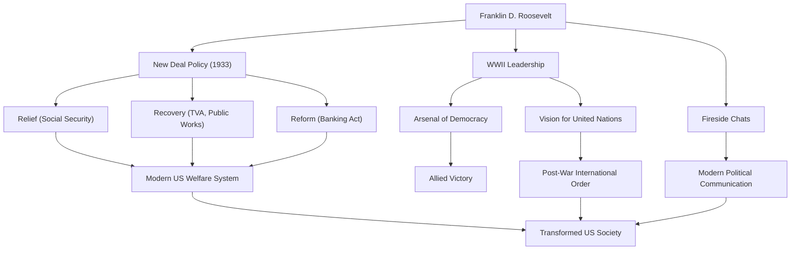

Franklin Delano Roosevelt (FDR) fut le 32e président des États-Unis et l'un des dirigeants les plus influents de l'histoire du XXe siècle. Il a guidé la nation à travers les crises sans précédent de la Grande Dépression et de la Seconde Guerre mondiale, et il est le seul président de l'histoire des États-Unis à avoir été élu pour quatre mandats. Plongeons dans sa vie, sa philosophie politique et son impact durable sur le monde moderne.

## Une éducation privilégiée et une épreuve soudaine

Né en 1882 dans une famille riche et éminente de Hyde Park, à New York, Roosevelt a étudié à l'Université Harvard et à la faculté de droit de Columbia, entamant ainsi un parcours d'élite. Il a épousé Eleanor Roosevelt, la nièce du 26e président Theodore Roosevelt, et a gravi les échelons politiques avec constance. Élu au Sénat de l'État de New York en 1910, il a ensuite occupé le poste de secrétaire adjoint à la Marine, et en 1920, il a été désigné candidat démocrate à la vice-présidence.

Cependant, en 1921, à l'âge de 39 ans, il fait face à une épreuve qui change radicalement sa vie. Il contracte la polio (paralysie infantile) et devient paralysé des membres inférieurs. Forcé de vivre en fauteuil roulant, Roosevelt fait preuve d'un esprit indomptable dans cette situation désespérée. Tout en se consacrant à sa rééducation, la souffrance causée par la maladie lui apporte une profonde empathie pour la douleur des autres. Cette empathie deviendra le cœur de sa future posture politique.

## La politique du « New Deal » et le défi de la Grande Dépression

Lors de l'élection présidentielle de 1932, Roosevelt fait campagne sur des politiques destinées à « l'homme oublié » (forgotten man), battant le président sortant Herbert Hoover. À l'époque, l'Amérique était plongée dans les profondeurs de la Grande Dépression déclenchée par le krach de Wall Street de 1929 ; le taux de chômage avait atteint 25 % et les citoyens étaient plongés dans un profond désespoir.

Ses paroles fortes lors de son discours d'investiture, « La seule chose que nous ayons à craindre, c'est la crainte elle-même », ont redonné un immense espoir au peuple. Au cours de la période connue sous le nom de « Cent Jours », il a immédiatement fait adopter une série de lois historiques, notamment la stabilisation des opérations bancaires, la loi sur l'ajustement agricole (AAA) et la loi sur le redressement industriel national (NIRA). Ce fut la politique du « New Deal » (Nouvelle Donne).

Le New Deal a marqué une rupture avec les politiques économiques de laissez-faire antérieures, ouvrant la voie à une intervention active du gouvernement dans l'économie. Les projets massifs de travaux publics menés par la Tennessee Valley Authority (TVA) ont créé des emplois, et l'adoption de la loi sur la sécurité sociale a jeté les bases du système de protection sociale américain moderne. Articulée autour des « Trois R » (Relief, Recovery, and Reform - Soulagement, Relance, Réforme), cette politique a fondamentalement transformé la structure de la société américaine.

## La Seconde Guerre mondiale et « l'Arsenal de la démocratie »

À mi-chemin du redressement de la Grande Dépression, le monde est à nouveau englouti par les flammes de la guerre. Face au déclenchement de la Seconde Guerre mondiale en Europe, les États-Unis ont d'abord maintenu une position isolationniste, mais Roosevelt a pris pleinement conscience de la menace du fascisme. Positionnant l'Amérique comme « l'Arsenal de la démocratie », il a fait adopter la loi Prêt-Bail (Lend-Lease) pour soutenir la Grande-Bretagne et d'autres alliés.

Lorsque les États-Unis sont entrés en guerre à la suite de l'attaque de Pearl Harbor en 1941, Roosevelt a fait preuve d'un leadership redoutable. Doté d'une perspicacité politique exceptionnelle, il a réorienté la production nationale vers les besoins militaires et a élaboré un grand dessein pour mener les forces alliées à la victoire. Enchaînant les rencontres au sommet avec Churchill (Royaume-Uni) et Staline (URSS), il s'est consacré à la vision d'un ordre international d'après-guerre, à savoir la création des Nations Unies.

## Sa philosophie et son héritage pour la postérité

La philosophie politique de Roosevelt était ancrée dans le pragmatisme et un profond humanisme. Non lié par l'idéologie, il recherchait des solutions souples et pratiques aux défis auxquels il était confronté. De plus, ses « Causeries au coin du feu » (Fireside Chats) à la radio ont créé une nouvelle forme de communication politique où le président s'adressait directement à chaque citoyen, forgeant un lien fort avec le public.

Le 12 avril 1945, alors que la victoire dans la Seconde Guerre mondiale était imminente, Roosevelt meurt subitement d'une hémorragie cérébrale. Cependant, l'héritage qu'il a laissé derrière lui est incommensurable.

Le renforcement de l'autorité présidentielle qu'il a instauré, l'implication du gouvernement fédéral dans l'économie et le système de sécurité sociale constituent le fondement du système politique et économique américain moderne. De plus, l'idéal de coopération multilatérale par l'intermédiaire des Nations Unies a formé le cadre de l'ordre international d'après-guerre.

Bien que son mandat ait comporté à la fois des mérites et des démérites (y compris des taches comme l'internement des Américains d'origine japonaise), Franklin D. Roosevelt reste aujourd'hui hautement reconnu comme un géant qui a redonné espoir au peuple pendant des crises sans précédent, a reconstruit la nation et a profondément influencé le cours de l'histoire mondiale.

### Les réalisations et l'impact de Franklin D. Roosevelt

