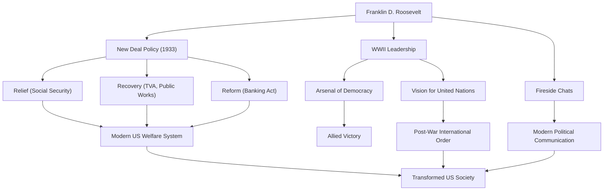

फ़्रैंकलिन डेलानो रूज़वेल्ट (FDR) संयुक्त राज्य अमेरिका के 32वें राष्ट्रपति और 20वीं सदी के इतिहास के सबसे प्रभावशाली नेताओं में से एक थे। उन्होंने महामंदी और द्वितीय विश्व युद्ध के अभूतपूर्व संकटों से राष्ट्र का मार्गदर्शन किया, और अमेरिकी इतिहास में चार बार चुने जाने वाले एकमात्र राष्ट्रपति हैं। आइए उनके जीवन, राजनीतिक दर्शन और आधुनिक दुनिया पर उनके स्थायी प्रभाव का गहराई से अध्ययन करें।

## एक विशेषाधिकार प्राप्त पालन-पोषण और अचानक एक परीक्षा

1882 में हाइड पार्क, न्यूयॉर्क के एक धनी और प्रमुख परिवार में जन्मे, रूज़वेल्ट ने हार्वर्ड विश्वविद्यालय और कोलंबिया लॉ स्कूल में पढ़ाई की, और एक विशिष्ट वर्ग के रूप में अपना मार्ग शुरू किया। उन्होंने 26वें राष्ट्रपति थियोडोर रूज़वेल्ट की भतीजी एलेनोर रूज़वेल्ट से शादी की, और राजनीतिक सीढ़ी पर लगातार चढ़ते गए। वह 1910 में न्यूयॉर्क राज्य सीनेट के लिए चुने गए, बाद में नौसेना के सहायक सचिव के रूप में कार्य किया, और 1920 में डेमोक्रेटिक उपराष्ट्रपति पद के उम्मीदवार के रूप में नामित हुए।

हालांकि, 1921 में, 39 वर्ष की आयु में, उन्हें एक ऐसी परीक्षा का सामना करना पड़ा जिसने उनके जीवन को काफी हद तक बदल दिया। उन्हें पोलियो (शिशु पक्षाघात) हो गया और वे कमर के नीचे से लकवाग्रस्त हो गए। व्हीलचेयर में जीवन व्यतीत करने के लिए मजबूर, रूज़वेल्ट ने इस हताश स्थिति में भी अपनी अदम्य भावना का प्रदर्शन किया। पुनर्वास के प्रति खुद को समर्पित करने के साथ-साथ, बीमारी के कारण होने वाले कष्ट ने उनमें दूसरों के दर्द के प्रति गहरी सहानुभूति पैदा की। यही सहानुभूति उनके बाद के राजनीतिक दृष्टिकोण का मूल बन गई।

## "न्यू डील" (New Deal) नीति और महामंदी की चुनौती

1932 के राष्ट्रपति चुनाव में, रूज़वेल्ट ने "भूल गए लोगों" (forgotten man) के लिए नीतियों पर अभियान चलाया, और तत्कालीन राष्ट्रपति हर्बर्ट हूवर को हराकर राष्ट्रपति बने। उस समय, अमेरिका 1929 के वॉल स्ट्रीट क्रैश से उत्पन्न महामंदी की गहराई में था; बेरोजगारी दर 25% तक पहुंच गई थी, और नागरिक गहरी निराशा में थे।

उनके उद्घाटन भाषण के शक्तिशाली शब्दों, "हमें केवल एक ही चीज से डरना है, और वह है खुद डर," ने लोगों को अपार आशा दी। "प्रथम सौ दिन" के रूप में जानी जाने वाली अवधि के दौरान, उन्होंने तुरंत ऐतिहासिक कानूनों की झड़ी लगा दी, जिसमें बैंकिंग संचालन का स्थिरीकरण, कृषि समायोजन अधिनियम (AAA), और राष्ट्रीय औद्योगिक रिकवरी अधिनियम (NIRA) शामिल थे। यह "न्यू डील" (New Deal) नीति थी।

न्यू डील नीति पिछली अहस्तक्षेप (laissez-faire) आर्थिक नीतियों से हट गई, जिसने अर्थव्यवस्था में सक्रिय सरकारी हस्तक्षेप का मार्ग प्रशस्त किया। टेनेसी वैली अथॉरिटी (TVA) द्वारा बड़े पैमाने पर सार्वजनिक निर्माण परियोजनाओं ने नौकरियां पैदा कीं, और सामाजिक सुरक्षा अधिनियम (Social Security Act) के अधिनियमन ने आधुनिक अमेरिकी कल्याण प्रणाली की नींव रखी। "राहत, रिकवरी और सुधार" (Relief, Recovery, and Reform) के "तीन आर" (Three Rs) पर केंद्रित इस नीति ने अमेरिकी समाज की संरचना को मौलिक रूप से बदल दिया।

## द्वितीय विश्व युद्ध और "लोकतंत्र का शस्त्रागार"

महामंदी से उबरने के बीच ही दुनिया एक बार फिर युद्ध की लपटों में घिर गई। यूरोप में द्वितीय विश्व युद्ध छिड़ने के जवाब में, संयुक्त राज्य अमेरिका ने शुरू में अलगाववादी रुख अपनाया, लेकिन रूज़वेल्ट ने फासीवाद के खतरे को तीव्रता से पहचाना। अमेरिका को "लोकतंत्र के शस्त्रागार" (Arsenal of Democracy) के रूप में स्थापित करते हुए, उन्होंने ब्रिटेन और अन्य सहयोगियों का समर्थन करने के लिए लेंड-लीज़ एक्ट (Lend-Lease Act) लागू किया।

1941 में पर्ल हार्बर पर हमले के बाद जब अमेरिका ने युद्ध में प्रवेश किया, तो रूज़वेल्ट ने एक मजबूत नेतृत्व का प्रदर्शन किया। अपनी उत्कृष्ट राजनीतिक सूझबूझ के साथ, उन्होंने सैन्य जरूरतों की ओर घरेलू उत्पादन को निर्देशित किया और मित्र राष्ट्रों को जीत की ओर ले जाने के लिए एक शानदार रूपरेखा तैयार की। चर्चिल (यूके) और स्टालिन (यूएसएसआर) के साथ बार-बार शिखर बैठकें करते हुए, उन्होंने युद्ध के बाद की अंतर्राष्ट्रीय व्यवस्था की दृष्टि, अर्थात् संयुक्त राष्ट्र (United Nations) की स्थापना के लिए खुद को समर्पित कर दिया।

## उनका दर्शन और आने वाली पीढ़ियों के लिए विरासत

रूज़वेल्ट का राजनीतिक दर्शन व्यावहारिकता और गहरे मानवतावाद में निहित था। विचारधारा से बंधे बिना, उन्होंने अपने सामने आने वाली चुनौतियों के लचीले और व्यावहारिक समाधान मांगे। इसके अलावा, रेडियो पर उनकी "फायरसाइड चैट्स" (Fireside Chats) ने राजनीतिक संचार का एक नया रूप बनाया जहां राष्ट्रपति ने प्रत्येक नागरिक से सीधे बात की, जिससे जनता के साथ एक मजबूत बंधन बना।

12 अप्रैल, 1945 को, द्वितीय विश्व युद्ध में जीत से ठीक पहले, रूज़वेल्ट की सेरेब्रल हेमरेज से अचानक मृत्यु हो गई। हालाँकि, उन्होंने जो विरासत छोड़ी वह अथाह है।

उनके द्वारा स्थापित राष्ट्रपति अधिकार का सुदृढ़ीकरण, अर्थव्यवस्था में संघीय सरकार की भागीदारी, और सामाजिक सुरक्षा प्रणाली आधुनिक अमेरिकी राजनीतिक और आर्थिक प्रणाली का आधार बनाती है। इसके अलावा, संयुक्त राष्ट्र के माध्यम से बहुपक्षीय सहयोग के आदर्श ने युद्ध के बाद के अंतर्राष्ट्रीय व्यवस्था की रूपरेखा तैयार की।

यद्यपि उनके कार्यकाल के कुछ गुण और दोष दोनों थे (जापानी अमेरिकियों की नजरबंदी जैसे कलंक सहित), फिर भी फ़्रैंकलिन डी. रूज़वेल्ट को आज भी एक ऐसे दिग्गज के रूप में बहुत सराहा जाता है, जिसने अभूतपूर्व संकटों के दौरान लोगों को आशा दी, राष्ट्र का पुनर्निर्माण किया, और विश्व इतिहास के पाठ्यक्रम को महत्वपूर्ण रूप से आगे बढ़ाया।

### फ़्रैंकलिन डी. रूज़वेल्ट की उपलब्धियां और प्रभाव

