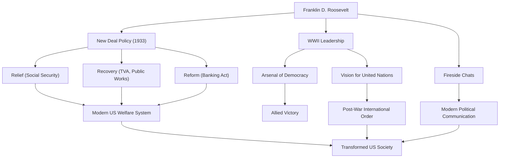

Franklin Delano Roosevelt (FDR) adalah Presiden Amerika Serikat ke-32 dan salah satu pemimpin paling berpengaruh dalam sejarah abad ke-20. Ia membimbing bangsa tersebut melewati krisis yang belum pernah terjadi sebelumnya dari Depresi Hebat dan Perang Dunia II, dan merupakan satu-satunya presiden dalam sejarah AS yang terpilih untuk empat masa jabatan. Mari kita selidiki lebih dalam tentang kehidupannya, filosofi politiknya, dan dampak abadi yang diberikannya pada dunia modern.

## Pendidikan Istimewa dan Cobaan Mendadak

Lahir pada tahun 1882 dalam keluarga kaya dan terkemuka di Hyde Park, New York, Roosevelt belajar di Universitas Harvard dan Sekolah Hukum Columbia, memulai jalannya sebagai seorang elit. Ia menikah dengan Eleanor Roosevelt, keponakan dari Presiden ke-26 Theodore Roosevelt, dan terus mendaki tangga politik. Ia terpilih menjadi anggota Senat Negara Bagian New York pada tahun 1910, kemudian menjabat sebagai Asisten Sekretaris Angkatan Laut, dan pada tahun 1920 dicalonkan sebagai kandidat wakil presiden dari Partai Demokrat.

Namun, pada tahun 1921, pada usia 39 tahun, ia menghadapi cobaan yang secara drastis mengubah hidupnya. Ia tertular polio (kelumpuhan anak) dan lumpuh dari pinggang ke bawah. Terpaksa hidup di kursi roda, Roosevelt menunjukkan semangat pantang menyerah dalam situasi putus asa ini. Seiring dengan mendedikasikan dirinya pada rehabilitasi, penderitaan yang disebabkan oleh penyakit tersebut memberinya empati mendalam terhadap rasa sakit orang lain. Empati ini akan menjadi inti dari pendirian politiknya di kemudian hari.

## Kebijakan "Kesepakatan Baru" dan Tantangan Depresi Hebat

Dalam pemilihan presiden 1932, Roosevelt berkampanye tentang kebijakan untuk "manusia yang terlupakan" (forgotten man), mengalahkan petahana Herbert Hoover untuk menjadi presiden. Pada saat itu, Amerika berada dalam kedalaman Depresi Hebat yang dipicu oleh jatuhnya Wall Street 1929; tingkat pengangguran telah mencapai 25%, dan warga negara berada dalam keputusasaan yang mendalam.

Kata-katanya yang kuat dalam pidato pelantikannya, "Satu-satunya hal yang harus kita takuti adalah ketakutan itu sendiri," memberikan harapan besar kepada rakyat. Selama periode yang dikenal sebagai "Seratus Hari," ia segera memberlakukan serangkaian undang-undang bersejarah, termasuk stabilisasi operasi perbankan, Undang-Undang Penyesuaian Pertanian (AAA), dan Undang-Undang Pemulihan Industri Nasional (NIRA). Ini adalah kebijakan "Kesepakatan Baru" (New Deal).

Kebijakan New Deal beralih dari kebijakan ekonomi laissez-faire sebelumnya, membuka jalan bagi intervensi pemerintah yang aktif dalam perekonomian. Proyek pekerjaan umum besar-besaran oleh Otoritas Lembah Tennessee (TVA) menciptakan lapangan kerja, dan pemberlakuan Undang-Undang Jaminan Sosial meletakkan dasar bagi sistem kesejahteraan Amerika modern. Berpusat di sekitar "Tiga R" yaitu "Relief, Recovery, and Reform" (Bantuan, Pemulihan, dan Reformasi), kebijakan ini secara mendasar mengubah struktur masyarakat Amerika.

## Perang Dunia II dan "Gudang Demokrasi"

Di tengah pemulihan dari Depresi Hebat, dunia sekali lagi dilanda kobaran api perang. Menanggapi pecahnya Perang Dunia II di Eropa, Amerika Serikat pada awalnya mempertahankan sikap isolasionis, tetapi Roosevelt dengan tajam menyadari ancaman fasisme. Memposisikan Amerika sebagai "Gudang Senjata Demokrasi," ia memberlakukan Undang-Undang Pinjam-Sewa (Lend-Lease Act) untuk mendukung Inggris dan sekutu lainnya.

Ketika AS memasuki perang menyusul serangan di Pearl Harbor pada tahun 1941, Roosevelt menunjukkan kepemimpinan yang tangguh. Dengan ketajaman politik yang luar biasa, ia mengarahkan produksi domestik menuju kebutuhan militer dan menguraikan desain besar untuk memimpin Blok Sekutu menuju kemenangan. Dengan mengadakan pertemuan puncak berulang kali dengan Churchill (Inggris) dan Stalin (Uni Soviet), ia mendedikasikan dirinya pada visi tatanan internasional pascaperang, yaitu pembentukan Perserikatan Bangsa-Bangsa.

## Filosofi dan Warisannya untuk Anak Cucu

Filosofi politik Roosevelt berakar pada pragmatisme dan humanisme yang mendalam. Tidak terikat oleh ideologi, ia mencari solusi yang fleksibel dan praktis untuk tantangan yang dihadapinya. Selain itu, "Obrolan Api Unggun" (Fireside Chats) di radio menciptakan bentuk baru komunikasi politik di mana presiden berbicara langsung dengan setiap warga negara, membangun ikatan yang kuat dengan publik.

Pada 12 April 1945, dengan kemenangan dalam Perang Dunia II yang sudah di depan mata, Roosevelt meninggal mendadak karena pendarahan otak. Namun, warisan yang ditinggalkannya tak terukur besarnya.

Penguatan otoritas kepresidenan yang ia dirikan, keterlibatan pemerintah federal dalam perekonomian, dan sistem jaminan sosial membentuk dasar sistem politik dan ekonomi Amerika modern. Selain itu, cita-cita kerja sama multilateral melalui Perserikatan Bangsa-Bangsa membentuk kerangka tatanan internasional pascaperang.

Meskipun masa jabatannya memiliki 공 dan 과 (termasuk noda seperti pengasingan orang Amerika keturunan Jepang), Franklin D. Roosevelt tetap sangat dihormati hingga hari ini sebagai raksasa yang memberikan harapan kepada rakyat selama krisis yang belum pernah terjadi sebelumnya, membangun kembali bangsa, dan secara signifikan mengubah arah sejarah dunia.

### Pencapaian dan Dampak Franklin D. Roosevelt

