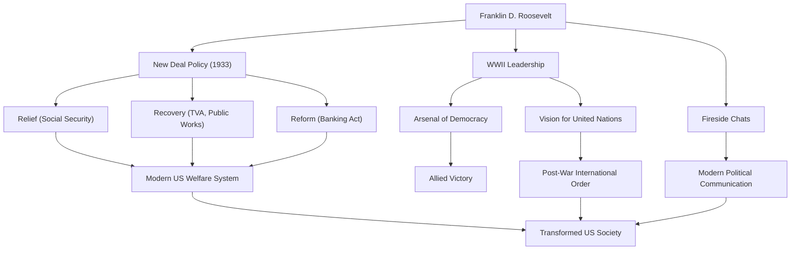

프랭클린 델러노 루스벨트(Franklin Delano Roosevelt, 통칭 FDR)는 미국의 제32대 대통령이자 20세기 역사에서 가장 영향력 있는 지도자 중 한 명입니다. 그는 대공황과 제2차 세계대전이라는 미국이 직면한 전례 없는 위기 속에서 국가를 이끌었으며, 미국 역사상 유일하게 4선에 성공한 대통령이기도 합니다. 그의 생애, 정치 철학, 그리고 현대에까지 이어지는 그의 영향력에 대해 깊이 파헤쳐 보겠습니다.

## 유복한 성장 배경과 갑작스러운 시련

1882년 뉴욕주 하이드파크의 부유한 명문가에서 태어난 루스벨트는 하버드 대학교와 콜롬비아 대학교 로스쿨에서 수학하며 엘리트로서의 길을 걷기 시작했습니다. 제26대 대통령 시어도어 루스벨트의 조카인 엘리너 루스벨트와 결혼하여 정계로의 계단을 순조롭게 올라갔습니다. 1910년 뉴욕주 상원의원에 당선되었고, 이후 해군 차관보를 역임했으며, 1920년에는 민주당의 부통령 후보로 지명되었습니다.

그러나 1921년, 39세의 나이에 그의 인생을 크게 바꿔놓을 시련이 찾아옵니다. 소아마비에 감염되어 하반신 마비가 된 것입니다. 휠체어 생활을 피할 수 없게 된 루스벨트였지만, 이 절망적인 상황 속에서 그는 특유의 불굴의 정신을 발휘합니다. 재활에 매진함과 동시에, 질병으로 인한 고통은 그에게 타인의 아픔에 대한 깊은 공감을 가져다주었습니다. 이 공감 능력은 훗날 그의 정치적 입장의 핵심이 됩니다.

## '뉴딜 정책'과 대공황에 대한 도전

1932년 대통령 선거에서 루스벨트는 '잊혀진 사람들(forgotten man)'을 위한 정책을 내세우며 현직 후버 대통령을 꺾고 당선되었습니다. 당시 미국은 1929년 월스트리트 대폭락으로 촉발된 세계 대공황의 밑바닥에 있었고, 실업률은 25%에 달했으며 국민들은 깊은 절망 속에 있었습니다.

취임 연설에서의 "우리가 두려워해야 할 유일한 것은 두려움 그 자체입니다(The only thing we have to fear is fear itself)"라는 강력한 메시지는 국민들에게 큰 희망을 주었습니다. 그는 즉시 '백일 의회'라고 불리는 기간 동안 은행 업무의 안정화, 농업조정법(AAA), 전국산업부흥법(NIRA) 등 수많은 획기적인 법안을 잇달아 통과시켰습니다. 이것이 바로 '뉴딜(New Deal)' 정책입니다.

뉴딜 정책은 그전까지의 자유방임주의적 경제 정책에서 전환하여, 정부가 적극적으로 경제에 개입하는 길을 열었습니다. 테네시강 유역 개발 공사(TVA)를 통한 대규모 공공사업은 일자리를 창출했고, 사회보장법의 제정은 현대 미국 복지 제도의 초석을 다졌습니다. '구제(Relief), 부흥(Recovery), 개혁(Reform)'이라는 3R을 기둥으로 하는 이 정책은 미국 사회의 구조를 근본적으로 변화시켰습니다.

## 제2차 세계대전과 '민주주의의 병기창'

대공황으로부터의 회복이 반쯤 이루어졌을 무렵, 세계는 다시 전쟁의 화마에 휩싸입니다. 유럽에서 제2차 세계대전이 발발하자 초기 미국은 고립주의적 입장을 취했지만, 루스벨트는 파시즘의 위협을 강하게 인식하고 있었습니다. 그는 미국을 '민주주의의 병기창(Arsenal of Democracy)'으로 규정하고, 무기대여법(Lend-Lease Act)을 제정하여 영국 등을 지원했습니다.

1941년 진주만 공습을 계기로 미국이 참전하게 되자 루스벨트는 강력한 리더십을 발휘합니다. 탁월한 정치적 수완으로 국내 생산 체제를 군수 산업으로 전환하고, 연합국을 승리로 이끌기 위한 큰 그림을 그렸습니다. 처칠(영국), 스탈린(소련)과의 거듭된 정상회담을 통해 전후 국제 질서의 구상, 즉 국제연합(UN) 창설을 위해 진력했습니다.

## 그의 철학과 후세에 남긴 유산

루스벨트의 정치 철학은 실용주의와 깊은 휴머니즘에 뿌리를 두고 있었습니다. 그는 이데올로기에 얽매이지 않고 당면한 과제에 대해 유연하고 실천적인 해결책을 모색했습니다. 또한, 라디오를 통한 '노변담화(Fireside Chats)'는 대통령이 국민 한 사람 한 사람에게 직접 이야기하는 새로운 정치 커뮤니케이션 방식을 만들어내며 국민들과 강력한 유대감을 형성했습니다.

1945년 4월 12일, 제2차 세계대전의 승리를 목전에 두고 루스벨트는 뇌출혈로 급서했습니다. 그러나 그가 남긴 유산은 실로 헤아릴 수 없습니다.

그가 구축한 대통령부 권한 강화, 연방정부의 경제 개입, 그리고 사회보장제도는 현대 미국 정치 및 경제 시스템의 기반이 되었습니다. 또한 국제연합을 통한 다자간 협조의 이념은 전후 국제 질서의 골격을 형성했습니다.

비록 명암이 존재하지만(일본계 미국인 강제 수용 등의 오점 포함), 프랭클린 D. 루스벨트는 전례 없는 위기 속에서 국민에게 희망을 주고 국가를 재건하며 세계 역사의 흐름을 크게 바꾼 거인으로서 오늘날까지도 높이 평가받고 있습니다.

### 프랭클린 D. 루스벨트의 업적과 영향

