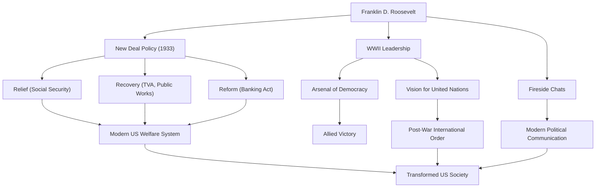

フランクリン・デラノ・ルーズベルト（Franklin Delano Roosevelt、通称FDR）は、アメリカ合衆国の第32代大統領であり、20世紀の歴史において最も影響力のある指導者の一人です。大恐慌と第二次世界大戦という、アメリカ合衆国が直面した未曾有の危機において国を導き、歴代で唯一、4選を果たした大統領でもあります。彼の生涯、政治哲学、そして現代にまで続くその影響について深く掘り下げてみましょう。

## 恵まれた生い立ちと突然の試練

1882年、ニューヨーク州ハイドパークの裕福な名家に生まれたルーズベルトは、ハーバード大学、コロンビア大学ロースクールで学び、エリートとしての道を歩み始めました。第26代大統領セオドア・ルーズベルトの姪であるエレノア・ルーズベルトと結婚し、政界への階段を順調に駆け上がります。1910年にニューヨーク州上院議員に当選、その後海軍次官を務め、1920年には民主党の副大統領候補に指名されました。

しかし1921年、39歳の時に彼の人生を大きく変える試練が訪れます。ポリオ（急性灰白髄炎）に感染し、下半身麻痺となったのです。車椅子生活を余儀なくされたルーズベルトでしたが、この絶望的な状況下で彼は持ち前の不屈の精神を発揮します。リハビリテーションに励むとともに、病気による苦悩は彼に他者の痛みに対する深い共感をもたらしました。この共感力は、後の彼の政治姿勢の核となります。

## 「ニューディール政策」と大恐慌への挑戦

1932年の大統領選挙において、ルーズベルトは「忘れられた人々（forgotten man）」のための政策を掲げ、現職のフーヴァーを破って大統領に当選します。当時のアメリカは1929年のウォール街大暴落に端を発した世界恐慌のどん底にあり、失業率は25％に達し、国民は深い絶望の中にありました。

就任演説での「私たちが恐れるべき唯一のものは、恐れそのものである（The only thing we have to fear is fear itself）」という力強い言葉は、国民に大きな希望を与えました。彼は直ちに「百日議会」と呼ばれる期間に、銀行業務の安定化、農業調整法（AAA）、全国産業復興法（NIRA）など、数々の画期的な法案を矢継ぎ早に成立させました。これが「ニューディール（新規まき直し）」政策です。

ニューディール政策は、それまでの自由放任主義的な経済政策から転換し、政府が積極的に経済に介入する道を開きました。テネシー川流域開発公社（TVA）による大規模な公共事業は雇用を創出し、社会保障法の制定は現代アメリカの福祉制度の礎を築きました。「救済（Relief）、回復（Recovery）、改革（Reform）」の3つのRを柱とするこの政策は、アメリカ社会の構造を根本から変革したのです。

## 第二次世界大戦と「民主主義の兵器廠」

大恐慌からの回復半ばにして、世界は再び戦火に巻き込まれます。ヨーロッパでの第二次世界大戦勃発に対し、当初アメリカは孤立主義的な立場をとっていましたが、ルーズベルトはファシズムの脅威を強く認識していました。彼はアメリカを「民主主義の兵器廠（Arsenal of Democracy）」と位置づけ、レンドリース法（武器貸与法）を成立させてイギリスなどを支援しました。

1941年の真珠湾攻撃を機にアメリカが参戦すると、ルーズベルトは強大なリーダーシップを発揮します。卓越した政治的手腕で国内の生産体制を軍需に振り向け、連合国を勝利へと導くためのグランドデザインを描きました。チャーチル（イギリス）やスターリン（ソ連）との首脳会談を重ね、戦後の国際秩序の構想、すなわち国際連合の設立に向けて尽力しました。

## 彼の哲学と後世への遺産

ルーズベルトの政治哲学は、プラグマティズムと深いヒューマニズムに根ざしていました。彼はイデオロギーに縛られることなく、直面する課題に対して柔軟かつ実践的な解決策を模索しました。また、ラジオを通じた「炉辺談話（Fireside Chats）」は、大統領が国民一人ひとりに直接語りかけるという新しい政治コミュニケーションの形を生み出し、国民との強い絆を築きました。

1945年4月12日、第二次世界大戦の勝利を目前にしてルーズベルトは脳卒中で急逝しました。しかし、彼が残した遺産は計り知れません。

彼が構築した大統領府の権限強化、連邦政府による経済への関与、そして社会保障制度は、現代アメリカの政治経済システムの基盤となっています。また、国際連合を通じた多国間協調の理念は、戦後の国際秩序の骨格を形成しました。

功罪両面（日系人収容などの汚点も含む）はありますが、フランクリン・D・ルーズベルトは、未曾有の危機において国民に希望を与え、国家を再建し、世界の歴史を大きく動かした巨人として、今もなお高く評価され続けています。

### フランクリン・D・ルーズベルトの功績と影響

