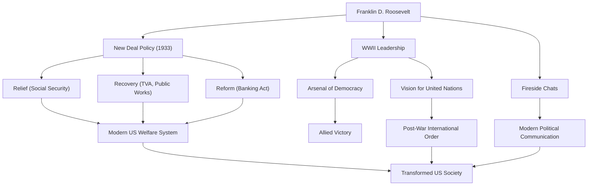

Franklin Delano Roosevelt (FDR) foi o 32º Presidente dos Estados Unidos e um dos líderes mais influentes da história do século XX. Ele guiou a nação através das crises sem precedentes da Grande Depressão e da Segunda Guerra Mundial, e é o único presidente na história dos EUA a ser eleito para quatro mandatos. Vamos aprofundar em sua vida, filosofia política e seu impacto duradouro no mundo moderno.

## Uma educação privilegiada e uma provação repentina

Nascido em 1882 em uma família rica e proeminente em Hyde Park, Nova York, Roosevelt estudou na Universidade de Harvard e na Escola de Direito de Columbia, começando seu caminho como membro da elite. Ele se casou com Eleanor Roosevelt, sobrinha do 26º Presidente Theodore Roosevelt, e subiu de forma constante na escada política. Foi eleito para o Senado do Estado de Nova York em 1910, serviu mais tarde como Secretário Adjunto da Marinha, e em 1920 foi nomeado como candidato democrata à vice-presidência.

No entanto, em 1921, aos 39 anos de idade, ele enfrentou uma provação que mudou drasticamente sua vida. Ele contraiu poliomielite (paralisia infantil) e ficou paralisado da cintura para baixo. Forçado a viver em uma cadeira de rodas, Roosevelt demonstrou seu espírito indomável inerente nesta situação desesperadora. Junto com sua dedicação à reabilitação, o sofrimento causado pela doença trouxe-lhe uma profunda empatia pela dor dos outros. Esta empatia se tornaria o núcleo de sua postura política posterior.

## A política do "New Deal" e o desafio da Grande Depressão

Na eleição presidencial de 1932, Roosevelt fez campanha com políticas para o "homem esquecido" (forgotten man), derrotando o então presidente Herbert Hoover para se tornar presidente. Naquela época, a América estava nas profundezas da Grande Depressão desencadeada pelo colapso de Wall Street em 1929; a taxa de desemprego havia atingido 25%, e os cidadãos estavam em profundo desespero.

Suas poderosas palavras em seu discurso de posse, "A única coisa que devemos temer é o próprio medo", deram imensa esperança ao povo. Durante o período conhecido como os "Cem Dias", ele promulgou imediatamente uma enxurrada de leis históricas, incluindo a estabilização das operações bancárias, a Lei de Ajuste Agrícola (AAA) e a Lei de Recuperação Industrial Nacional (NIRA). Esta foi a política do "New Deal" (Novo Acordo).

A política do New Deal afastou-se das políticas econômicas de laissez-faire anteriores, abrindo caminho para uma intervenção governamental ativa na economia. Projetos massivos de obras públicas pela Autoridade do Vale do Tennessee (TVA) criaram empregos, e a promulgação da Lei de Seguridade Social lançou as bases do moderno sistema de bem-estar social americano. Centrada nos "Três Rs" de "Alívio, Recuperação e Reforma", esta política transformou fundamentalmente a estrutura da sociedade americana.

## A Segunda Guerra Mundial e o "Arsenal da Democracia"

No meio do caminho da recuperação da Grande Depressão, o mundo foi mais uma vez engolfado pelas chamas da guerra. Em resposta à eclosão da Segunda Guerra Mundial na Europa, os Estados Unidos inicialmente mantiveram uma postura isolacionista, mas Roosevelt reconheceu agudamente a ameaça do fascismo. Posicionando a América como o "Arsenal da Democracia", ele promulgou a Lei de Empréstimo e Arrendamento para apoiar a Grã-Bretanha e outros aliados.

Quando os EUA entraram na guerra após o ataque a Pearl Harbor em 1941, Roosevelt demonstrou uma liderança formidável. Com excepcional perspicácia política, ele direcionou a produção nacional para as necessidades militares e delineou um grande projeto para liderar as Potências Aliadas à vitória. Realizando repetidas reuniões de cúpula com Churchill (Reino Unido) e Stalin (URSS), ele dedicou-se à visão de uma ordem internacional pós-guerra, ou seja, o estabelecimento das Nações Unidas.

## Sua filosofia e legado para a posteridade

A filosofia política de Roosevelt estava enraizada no pragmatismo e no humanismo profundo. Não limitado pela ideologia, ele buscou soluções flexíveis e práticas para os desafios que enfrentava. Além disso, suas "Conversas ao Pé da Lareira" (Fireside Chats) pelo rádio criaram uma nova forma de comunicação política onde o presidente falava diretamente com cada cidadão, construindo um forte vínculo com o público.

Em 12 de abril de 1945, com a vitória na Segunda Guerra Mundial iminente, Roosevelt morreu repentinamente de uma hemorragia cerebral. No entanto, o legado que ele deixou para trás é imensurável.

O fortalecimento da autoridade presidencial que ele estabeleceu, o envolvimento do governo federal na economia e o sistema de seguridade social formam a base do moderno sistema político e econômico americano. Além disso, o ideal de cooperação multilateral através das Nações Unidas formou a estrutura da ordem internacional pós-guerra.

Embora seu mandato tenha tido tanto méritos quanto deméritos (incluindo manchas como o internamento de nipo-americanos), Franklin D. Roosevelt continua sendo altamente aclamado hoje como um gigante que deu esperança ao povo durante crises sem precedentes, reconstruiu a nação e moveu significativamente o curso da história mundial.

### As conquistas e o impacto de Franklin D. Roosevelt

