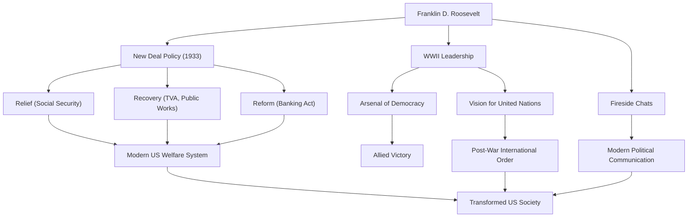

Франклин Делано Рузвельт (ФДР) был 32-м президентом Соединенных Штатов и одним из самых влиятельных лидеров в истории 20-го века. Он провел нацию через беспрецедентные кризисы Великой депрессии и Второй мировой войны и является единственным президентом в истории США, избиравшимся на четыре срока. Давайте глубоко погрузимся в его жизнь, политическую философию и его неизгладимое влияние на современный мир.

## Привилегированное воспитание и внезапное испытание

Родившийся в 1882 году в богатой и видной семье в Гайд-парке, штат Нью-Йорк, Рузвельт учился в Гарвардском университете и на юридическом факультете Колумбийского университета, начав свой путь в качестве представителя элиты. Он женился на Элеоноре Рузвельт, племяннице 26-го президента Теодора Рузвельта, и неуклонно поднимался по политической лестнице. Он был избран в Сенат штата Нью-Йорк в 1910 году, позже занимал пост помощника министра ВМС, а в 1920 году был выдвинут кандидатом в вице-президенты от Демократической партии.

Однако в 1921 году, в возрасте 39 лет, он столкнулся с испытанием, которое кардинально изменило его жизнь. Он заразился полиомиелитом (детским параличом) и был парализован ниже пояса. Вынужденный жить в инвалидном кресле, Рузвельт продемонстрировал свойственный ему неукротимый дух в этой отчаянной ситуации. Наряду с посвящением себя реабилитации, страдания, вызванные болезнью, принесли ему глубокое сочувствие к боли других. Это сочувствие станет ядром его будущей политической позиции.

## Политика «Нового курса» и вызов Великой депрессии

На президентских выборах 1932 года Рузвельт вел кампанию, опираясь на политику для «забытого человека» (forgotten man), победив действующего президента Герберта Гувера. В то время Америка находилась в глубине Великой депрессии, вызванной крахом Уолл-стрит 1929 года; уровень безработицы достиг 25%, и граждане пребывали в глубоком отчаянии.

Его сильные слова в инаугурационной речи: «Единственное, чего нам следует бояться, — это самого страха», дали огромную надежду людям. В период, известный как «Первые сто дней», он немедленно ввел в действие шквал эпохальных законов, включая стабилизацию банковских операций, Закон о регулировании сельского хозяйства (AAA) и Закон о восстановлении национальной промышленности (NIRA). Это была политика «Нового курса» (New Deal).

Политика «Нового курса» отошла от прежней экономической политики laissez-faire (невмешательства), проложив путь к активному государственному вмешательству в экономику. Масштабные проекты общественных работ Управления ресурсами бассейна реки Теннесси (TVA) создали рабочие места, а принятие Закона о социальном обеспечении заложило основу современной американской системы социального обеспечения. Сосредоточенная вокруг «Трех Р» — «Помощь, Восстановление и Реформы» (Relief, Recovery, and Reform), эта политика коренным образом изменила структуру американского общества.

## Вторая мировая война и «Арсенал демократии»

На полпути восстановления после Великой депрессии мир снова оказался охвачен пламенем войны. В ответ на начало Второй мировой войны в Европе США первоначально придерживались изоляционистской позиции, но Рузвельт остро осознавал угрозу фашизма. Позиционируя Америку как «Арсенал демократии», он ввел в действие Закон о ленд-лизе для поддержки Великобритании и других союзников.

Когда США вступили в войну после нападения на Перл-Харбор в 1941 году, Рузвельт продемонстрировал выдающееся лидерство. Обладая блестящей политической проницательностью, он направил внутреннее производство на военные нужды и наметил грандиозный план, чтобы привести союзные державы к победе. Проводя неоднократные встречи на высшем уровне с Черчиллем (Великобритания) и Сталиным (СССР), он посвятил себя видению послевоенного международного порядка, а именно созданию Организации Объединенных Наций.

## Его философия и наследие для потомков

Политическая философия Рузвельта коренилась в прагматизме и глубоком гуманизме. Не скованный идеологией, он искал гибкие и практичные решения проблем, с которыми сталкивался. Более того, его «Беседы у камина» (Fireside Chats) по радио создали новую форму политической коммуникации, когда президент обращался напрямую к каждому гражданину, выстраивая прочную связь с общественностью.

12 апреля 1945 года, в преддверии победы во Второй мировой войне, Рузвельт скоропостижно скончался от кровоизлияния в мозг. Однако оставленное им наследие безмерно.

Усиление президентской власти, которое он установил, участие федерального правительства в экономике и система социального обеспечения составляют основу современной американской политической и экономической системы. Кроме того, идеал многостороннего сотрудничества через ООН сформировал рамки послевоенного международного порядка.

Хотя его пребывание в должности имело как достоинства, так и недостатки (включая такие пятна, как интернирование американцев японского происхождения), Франклин Д. Рузвельт по-прежнему высоко ценится сегодня как гигант, который дал людям надежду во время беспрецедентных кризисов, восстановил нацию и значительно повлиял на ход мировой истории.

### Достижения и влияние Франклина Д. Рузвельта

