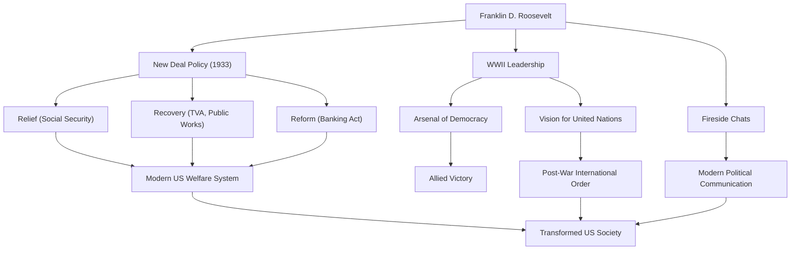

富兰克林·德拉诺·罗斯福（Franklin Delano Roosevelt，简称FDR）是美国第32任总统，也是20世纪历史上最具影响力的领导人之一。他在美国面临大萧条和第二次世界大战的空前危机中领导了国家，并且是美国历史上唯一一位连任四届的总统。让我们深入探讨他的一生、政治哲学以及对现代的深远影响。

## 优越的出身与突如其来的考验

1882年，罗斯福出生于纽约州海德公园的一个富裕名门望族。他先后就读于哈佛大学和哥伦比亚大学法学院，开启了精英之路。他与第26任总统西奥多·罗斯福的侄女埃莉诺·罗斯福结婚，并在政界稳步晋升。1910年他当选为纽约州参议员，之后担任海军助理部长，并于1920年被提名为民主党副总统候选人。

然而在1921年，39岁的他面临了一场彻底改变其人生的考验。他感染了脊髓灰质炎（小儿麻痹症），导致下半身瘫痪。被迫在轮椅上度过余生的罗斯福，在这种绝望的境地下展现了他与生俱来的不屈精神。在致力于康复的同时，疾病带来的痛苦使他对别人的苦难产生了深深的共鸣。这种共情能力成为了他后来政治立场的基石。

## “新政”政策与挑战大萧条

在1932年的总统选举中，罗斯福以为了“被遗忘的人（forgotten man）”的政策为口号，击败现任总统胡佛，当选为美国总统。当时的美国正处于由1929年华尔街股灾引发的世界经济大萧条的谷底，失业率高达25%，国民深陷绝望之中。

他在就职演说中那句铿锵有力的话——“我们唯一需要恐惧的就是恐惧本身”，给予了民众极大的希望。在被称为“百日新政”的时期内，他立即通过了一系列具有里程碑意义的法案，包括稳定银行业务、《农业调整法》（AAA）和《全国工业复兴法》（NIRA）等。这就是“新政”政策。

新政政策彻底改变了以往自由放任的经济政策，开辟了政府积极干预经济的道路。田纳西流域管理局（TVA）的大规模公共工程创造了就业机会，而《社会保障法》的颁布则奠定了现代美国福利制度的基础。这项以“救济（Relief）、复兴（Recovery）、改革（Reform）”三个R为核心的政策，从根本上改变了美国社会的结构。

## 第二次世界大战与“民主的兵工厂”

在大萧条复苏到一半时，世界再次被卷入战火。面对欧洲爆发的第二次世界大战，美国最初采取孤立主义立场，但罗斯福敏锐地认识到了法西斯主义的威胁。他将美国定位为“民主的兵工厂（Arsenal of Democracy）”，通过了《租借法案》以支持英国等盟国。

1941年珍珠港事件爆发，美国参战后，罗斯福展现出了强大的领导力。他凭借卓越的政治手腕，将国内生产体制转向军需，并描绘了引领同盟国走向胜利的宏伟蓝图。通过与丘吉尔（英国）和斯大林（苏联）的多次首脑会谈，他致力于构筑战后的国际秩序，即成立联合国。

## 他的哲学与留给后世的遗产

罗斯福的政治哲学根植于实用主义和深刻的人道主义。他不被意识形态所束缚，对所面临的课题寻求灵活且务实的解决方案。此外，他通过广播进行的“炉边谈话（Fireside Chats）”开创了总统直接与每一位国民对话的政治沟通新形式，与民众建立了牢固的纽带。

1945年4月12日，就在第二次世界大战胜利在望之际，罗斯福因脑溢血猝然离世。然而，他留下的遗产是不可估量的。

他所确立的总统权力的强化、联邦政府对经济的干预以及社会保障制度，构成了现代美国政治经济体系的基础。此外，通过联合国实现多边协调的理念，也构成了战后国际秩序的骨架。

尽管他功过参半（包括拘禁日裔美国人等污点），但富兰克林·D·罗斯福作为在空前危机中给予国民希望、重建国家并极大推动世界历史进程的伟人，至今仍受到高度评价。

### 富兰克林·D·罗斯福的功绩与影响

