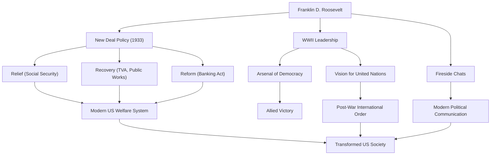

富蘭克林·德拉諾·羅斯福（Franklin Delano Roosevelt，簡稱FDR）是美國第32任總統，也是20世紀歷史上最具影響力的領導人之一。他在美國面臨大蕭條和第二次世界大戰的空前危機中領導了國家，並且是美國歷史上唯一一位連任四屆的總統。讓我們深入探討他的一生、政治哲學以及對現代的深遠影響。

## 優越的出身與突如其來的考驗

1882年，羅斯福出生於紐約州海德公園的一個富裕名門望族。他先後就讀於哈佛大學和哥倫比亞大學法學院，開啟了精英之路。他與第26任總統西奧多·羅斯福的姪女愛蓮娜·羅斯福結婚，並在政界穩步晉升。1910年他當選為紐約州參議員，之後擔任海軍助理部長，並於1920年被提名為民主黨副總統候選人。

然而在1921年，39歲的他面臨了一場徹底改變其人生的考驗。他感染了脊髓灰質炎（小兒麻痺症），導致下半身癱瘓。被迫在輪椅上度過餘生的羅斯福，在這種絕望的境地下展現了他與生俱來的不屈精神。在致力於復健的同時，疾病帶來的痛苦使他對別人的苦難產生了深深的共鳴。這種共情能力成為了他後來政治立場的基石。

## 「新政」政策與挑戰大蕭條

在1932年的總統選舉中，羅斯福以為了「被遺忘的人（forgotten man）」的政策為口號，擊敗現任總統胡佛，當選為美國總統。當時的美國正處於由1929年華爾街股災引發的世界經濟大蕭條的谷底，失業率高達25%，國民深陷絕望之中。

他在就職演說中那句鏗鏘有力的話——「我們唯一需要恐懼的就是恐懼本身」，給予了民眾極大的希望。在被稱為「百日新政」的時期內，他立即通過了一系列具有里程碑意義的法案，包括穩定銀行業務、《農業調整法》（AAA）和《全國工業復興法》（NIRA）等。這就是「新政」政策。

新政政策徹底改變了以往自由放任的經濟政策，開闢了政府積極干預經濟的道路。田納西流域管理局（TVA）的大規模公共工程創造了就業機會，而《社會保障法》的頒布則奠定了現代美國福利制度的基礎。這項以「救濟（Relief）、復興（Recovery）、改革（Reform）」三個R為核心的政策，從根本上改變了美國社會的結構。

## 第二次世界大戰與「民主的兵工廠」

在大蕭條復甦到一半時，世界再次被捲入戰火。面對歐洲爆發的第二次世界大戰，美國最初採取孤立主義立場，但羅斯福敏銳地認識到了法西斯主義的威脅。他將美國定位為「民主的兵工廠（Arsenal of Democracy）」，通過了《租借法案》以支持英國等盟國。

1941年珍珠港事件爆發，美國參戰後，羅斯福展現出了強大的領導力。他憑藉卓越的政治手腕，將國內生產體制轉向軍需，並描繪了引領同盟國走向勝利的宏偉藍圖。通過與邱吉爾（英國）和史達林（蘇聯）的多次首腦會談，他致力於構築戰後的國際秩序，即成立聯合國。

## 他的哲學與留給後世的遺產

羅斯福的政治哲學根植於實用主義和深刻的人道主義。他不被意識形態所束縛，對所面臨的課題尋求靈活且務實的解決方案。此外，他通過廣播進行的「爐邊談話（Fireside Chats）」開創了總統直接與每一位國民對話的政治溝通新形式，與民眾建立了牢固的紐帶。

1945年4月12日，就在第二次世界大戰勝利在望之際，羅斯福因腦溢血猝然離世。然而，他留下的遺產是不可估量的。

他所確立的總統權力的強化、聯邦政府對經濟的干預以及社會保障制度，構成了現代美國政治經濟體系的基礎。此外，通過聯合國實現多邊協調的理念，也構成了戰後國際秩序的骨架。

儘管他功過參半（包括拘禁日裔美國人等污點），但富蘭克林·D·羅斯福作為在空前危機中給予國民希望、重建國家並極大推動世界歷史進程的偉人，至今仍受到高度評價。

### 富蘭克林·D·羅斯福的功績與影響

