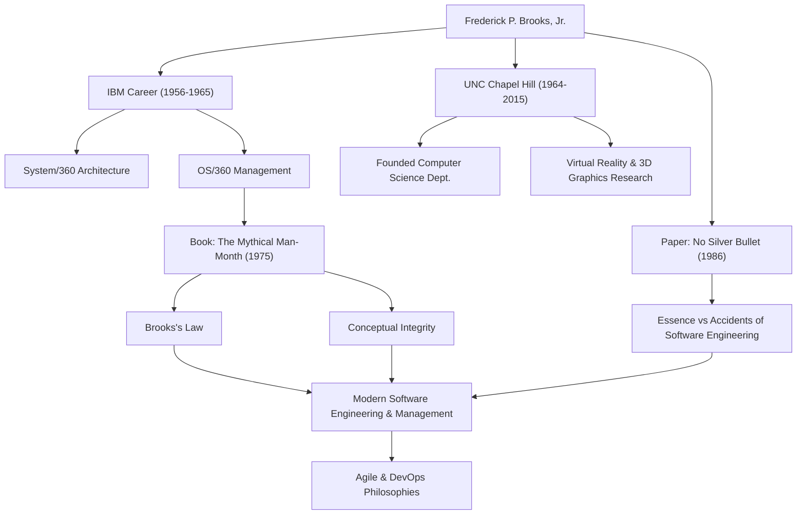

من المحتمل أن أي شخص يشارك في تطوير البرمجيات قد سمع القاعدة: "إضافة قوى عاملة إلى مشروع برمجي متأخر يجعله يتأخر أكثر." يُعرف هذا باسم "قانون بروكس" وهو أحد أشهر الأمثال في هندسة البرمجيات. الرجل الذي اقترح هذا القانون كان فريدريك بي بروكس جونيور، عملاق في علوم الكمبيوتر ومدير مشاريع أسطوري.

يتعمق هذا المقال في حياة بروكس، وفلسفته العميقة، والتأثير الدائم الذي لا يزال يتركه على تطوير البرمجيات الحديثة.

## الموهبة الاستثنائية والتحدي في IBM

ولد فريدريك بروكس في عام 1931 في ولاية كارولينا الشمالية بالولايات المتحدة الأمريكية. أظهر اهتمامًا قويًا بالرياضيات والعلوم منذ صغره، ودرس الفيزياء في جامعة ديوك وحصل لاحقًا على درجة الدكتوراه في الرياضيات التطبيقية في جامعة هارفارد تحت إشراف هوارد أيكن.

عند انضمامه إلى IBM في عام 1956، سرعان ما أظهر بروكس مواهبه. كانت أكبر نقطة تحول في حياته المهنية هي تطوير عائلة "System/360"، وهو مشروع ضخم راهنت عليه IBM بمستقبلها. بعد العمل كمدير لهندسة الأجهزة، تم تعيين بروكس مديرًا لمشروع تطوير "OS/360"، نظام تشغيل البرمجيات.

كان OS/360 مشروعًا ذا نطاق وتعقيد غير مسبوقين في تطوير البرمجيات في ذلك الوقت. على الرغم من آلاف شهور العمل من الجهد والميزانية الضخمة، تأخر الجدول الزمني، وعانى الفريق من العديد من الأخطاء. قاد بروكس هذا المشروع الصعب إلى إصداره بعد الكثير من المشقة، لكن التجارب المريرة والتأملات العميقة من هذا الوقت ستؤدي إلى أعظم مساهماته في هندسة البرمجيات.

## "شهر الرجل الأسطوري" وقانون بروكس

بناءً على تجاربه في IBM، نُشرت تحفته الفنية "The Mythical Man-Month" (شهر الرجل الأسطوري) في عام 1975. هذا الكتاب عبارة عن مجموعة من المقالات الثاقبة حول إدارة مشاريع البرمجيات ولا يزال يمثل كتابًا مقدسًا يقرأه المهندسون والمديرون في جميع أنحاء العالم اليوم.

كان في هذا الكتاب اقتراح "قانون بروكس" المذكور أعلاه. وأشار إلى أن تطوير البرمجيات، على عكس حفر حفرة أو الطلاء، لا يمكن إنهاؤه بشكل أسرع ببساطة عن طريق إضافة المزيد من الأشخاص. تؤدي إضافة المطورين إلى تكبد تكلفة تدريب الأعضاء الجدد وتتسبب في انفجار مسارات الاتصال، مما يؤدي في النهاية إلى تأخير المشروع بأكمله - وهي حقيقة غير بديهية في الإدارة تم التقاطها ببراعة بواسطة هذا القانون.

كما شرح الصعوبة الكامنة في تطوير البرمجيات من منظور "النزاهة المفاهيمية". وجادل بأنه يجب بناء نظام على فلسفة تصميم واحدة ومتسقة، ولتحقيق ذلك، يجب أن يُعهد بالتصميم إلى عدد صغير من "المهندسين المعماريين" الممتازين. هذا مفهوم رائد يبشر بأهمية هندسة البرمجيات اليوم.

## لا توجد رصاصة فضية (No Silver Bullet)

في عام 1986، نشر بروكس ورقة بحثية ضخمة أخرى بعنوان "No Silver Bullet - Essence and Accidents of Software Engineering" (لا توجد رصاصة فضية - جوهر وعوارض هندسة البرمجيات).

في هذه الورقة، صنف صعوبات تطوير البرمجيات إلى "الجوهر" و "العوارض". وأكد أن تطور لغات البرمجة وتحسين الأدوات لا يمكن أن يحل سوى الصعوبات العرضية، ولا توجد "رصاصة فضية" سحرية يمكنها حل الصعوبات الأساسية على الفور مثل التعقيد والتوافق وقابلية التغيير وعدم الرؤية للمشاكل التي يجب على البرمجيات حلها.

قدمت هذه الحجة منظورًا واقعيًا ورصينًا للغاية لصناعة تكنولوجيا المعلومات المعرضة لوضع توقعات مفرطة على التقنيات والأدوات الجديدة. رؤيته بأن تطوير البرمجيات سيظل دائمًا مسعى بشريًا فكريًا وشاقًا لم تتلاشى على الإطلاق، حتى في عصر اليوم من التطوير الرشيق (Agile) المنتشر و DevOps.

## المساهمات في الأوساط الأكاديمية والإرث

بعد مغادرة IBM في عام 1964، أسس بروكس قسم علوم الكمبيوتر في جامعته الأم، جامعة نورث كارولينا في تشابل هيل (UNC)، حيث قام بالتدريس كأستاذ لسنوات عديدة. هناك، قاد أبحاثًا رائدة ليس فقط في هندسة البرمجيات ولكن أيضًا في رسومات الكمبيوتر والواقع الافتراضي (VR)، ورعى العديد من الأفراد الموهوبين. على وجه الخصوص، كان لأبحاثه حول أنظمة تصور ومعالجة الهياكل الجزيئية في شكل ثلاثي الأبعاد للتصور العلمي تأثير هائل على مجالات مثل الكيمياء الحيوية.

في عام 1999، حصل على "جائزة تورينج"، التي غالبًا ما تُعتبر جائزة نوبل في علوم الكمبيوتر، تقديرًا لمساهماته الرائدة في هندسة الكمبيوتر وأنظمة التشغيل وهندسة البرمجيات.

## ارتباط الإنجازات والتأثيرات

يوضح الرسم البياني التالي العلاقة بين مسيرة بروكس المهنية والتأثير الذي تركه على الأجيال القادمة.

## خاتمة

توفي فريدريك بروكس في عام 2022 عن عمر يناهز 91 عامًا. ومع ذلك، فإن الكلمات والأفكار التي تركها وراءه لا تزال بمثابة بوصلة لمهندسي البرمجيات اليوم.

ما بشر به لم يكن مجرد نظرية تكنولوجية. كانت نظرة ثاقبة عالمية في "الحدود البشرية" التي تواجهها عند بناء أنظمة معقدة و "طبيعة التنظيم والتصميم" اللازمة للتغلب عليها. تعلمنا كلماته "لا توجد رصاصة فضية" أهمية الجهد المطرد والتفكير العميق. بالنسبة لكل من يشارك في البرمجيات، فإن الدروس التي يمكن تعلمها من مسار بروكس لن تستنفد أبدًا.
