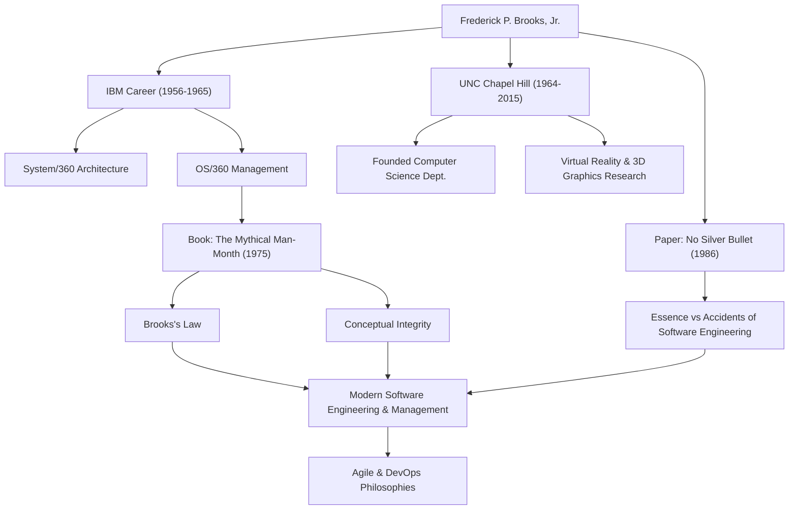

Jeder, der in der Softwareentwicklung tätig ist, hat wahrscheinlich schon einmal die Regel gehört: "Das Hinzufügen von Arbeitskräften zu einem verspäteten Softwareprojekt verzögert es noch weiter." Dies ist als "Brooks'sches Gesetz" bekannt und ist eine der berühmtesten Maximen in der Softwaretechnik. Der Mann, der dieses Gesetz vorschlug, war Frederick P. Brooks, Jr., ein Gigant der Informatik und ein legendärer Projektmanager.

Dieser Artikel taucht tief in das Leben von Brooks, seine tiefgründige Philosophie und den nachhaltigen Einfluss ein, den er bis heute auf die moderne Softwareentwicklung hat.

## Außergewöhnliches Talent und die IBM-Herausforderung

Frederick Brooks wurde 1931 in North Carolina, USA, geboren. Er zeigte schon früh ein starkes Interesse an Mathematik und Naturwissenschaften, studierte Physik an der Duke University und promovierte später in angewandter Mathematik an der Harvard University unter der Leitung von Howard Aiken.

Als Brooks 1956 zu IBM kam, stellte er seine Talente schnell unter Beweis. Der größte Wendepunkt in seiner Karriere war die Entwicklung der "System/360"-Familie, ein massives Projekt, auf das IBM seine Zukunft setzte. Nachdem Brooks als Manager der Hardwarearchitektur tätig war, wurde er zum Projektmanager für die Entwicklung von "OS/360", dem Software-Betriebssystem, ernannt.

OS/360 war zu dieser Zeit ein Projekt von beispielloser Größenordnung und Komplexität in der Softwareentwicklung. Trotz tausender Personenmonate an Aufwand und einem massiven Budget verzögerte sich der Zeitplan und das Team wurde von zahlreichen Fehlern geplagt. Brooks führte dieses schwierige Projekt nach vielen Strapazen zu seiner Veröffentlichung, aber die bitteren Erfahrungen und tiefen Reflexionen aus dieser Zeit sollten zu seinen größten Beiträgen zum Software Engineering führen.

## "Das Software-Paradoxon" (The Mythical Man-Month) und das Brooks'sche Gesetz

Basierend auf seinen Erfahrungen bei IBM erschien 1975 sein Meisterwerk "The Mythical Man-Month" (im Deutschen oft als Das Software-Paradoxon übersetzt). Dieses Buch ist eine Sammlung aufschlussreicher Essays über Software-Projektmanagement und bleibt auch heute noch eine Bibel, die von Ingenieuren und Managern weltweit gelesen wird.

In diesem Buch wurde das besagte "Brooks'sche Gesetz" vorgeschlagen. Er wies darauf hin, dass die Softwareentwicklung im Gegensatz zum Graben eines Lochs oder zum Streichen nicht einfach schneller abgeschlossen werden kann, indem man mehr Personen hinzufügt. Das Hinzufügen von Entwicklern verursacht Kosten für die Schulung neuer Mitglieder und führt zu einer Explosion der Kommunikationswege, was letztendlich das gesamte Projekt verzögert - eine kontraintuitive Wahrheit im Management, die durch dieses Gesetz brillant erfasst wurde.

Er erklärte auch die inhärente Schwierigkeit der Softwareentwicklung aus der Perspektive der "konzeptionellen Integrität". Er argumentierte, dass ein System auf einer einzigen, konsistenten Designphilosophie aufgebaut sein muss, und um dies zu erreichen, sollte das Design einer kleinen Anzahl exzellenter "Architekten" anvertraut werden. Dies ist ein bahnbrechendes Konzept, das die Bedeutung der heutigen Softwarearchitektur predigt.

## Keine Silberkugel (No Silver Bullet)

Im Jahr 1986 veröffentlichte Brooks eine weitere monumentale Arbeit: "No Silver Bullet - Essence and Accidents of Software Engineering".

In diesem Aufsatz kategorisierte er die Schwierigkeiten der Softwareentwicklung in "Essenz" (wesentliche Schwierigkeiten) und "Akzidenzien" (zufällige Schwierigkeiten). Er behauptete, dass die Evolution der Programmiersprachen und die Verbesserung der Werkzeuge nur zufällige Schwierigkeiten lösen können und es keine magische "Silberkugel" gibt, die wesentliche Schwierigkeiten wie die Komplexität, Konformität, Änderbarkeit und Unsichtbarkeit der Probleme, die Software lösen muss, sofort lösen kann.

Dieses Argument lieferte einer IT-Branche, die dazu neigt, übermäßige Erwartungen an neue Technologien und Tools zu stellen, eine äußerst realistische und ernüchternde Perspektive. Seine Erkenntnis, dass die Softwareentwicklung immer ein intellektuelles und mühsames menschliches Unterfangen bleiben wird, hat auch im heutigen Zeitalter der weit verbreiteten agilen Entwicklung und DevOps überhaupt nicht an Bedeutung verloren.

## Beiträge zur Wissenschaft und Vermächtnis

Nach seinem Ausscheiden bei IBM im Jahr 1964 gründete Brooks die Abteilung für Informatik an seiner Alma Mater, der University of North Carolina at Chapel Hill (UNC), wo er viele Jahre lang als Professor lehrte. Dort leitete er Pionierforschung nicht nur im Software Engineering, sondern auch in den Bereichen Computergrafik und Virtual Reality (VR) und förderte viele talentierte Personen. Insbesondere seine Forschungen zu Systemen zur Visualisierung und Manipulation molekularer Strukturen in 3D für die wissenschaftliche Visualisierung hatten massive Auswirkungen auf Bereiche wie die Biochemie.

1999 wurde er mit dem "Turing Award" ausgezeichnet, der oft als Nobelpreis der Informatik angesehen wird, in Anerkennung seiner bahnbrechenden Beiträge zur Computerarchitektur, zu Betriebssystemen und zum Software Engineering.

## Korrelation von Errungenschaften und Auswirkungen

Das folgende Diagramm veranschaulicht die Verbindung zwischen Brooks' Karriere und dem Einfluss, den er auf zukünftige Generationen hinterlassen hat.

## Fazit

Frederick Brooks verstarb 2022 im Alter von 91 Jahren. Die Worte und Ideen, die er hinterließ, dienen Softwareentwicklern jedoch auch heute noch als Kompass.

Was er predigte, war keine bloße technologische Theorie. Es war ein universeller Einblick in die "menschlichen Grenzen", mit denen man beim Aufbau komplexer Systeme konfrontiert ist, und die "Art von Organisation und Design", die erforderlich sind, um diese zu überwinden. Seine Worte "No Silver Bullet" lehren uns die Bedeutung von stetiger Anstrengung und tiefem Nachdenken. Für jeden, der mit Software zu tun hat, werden die Lektionen, die man aus dem Werdegang von Brooks lernen kann, niemals erschöpft sein.
