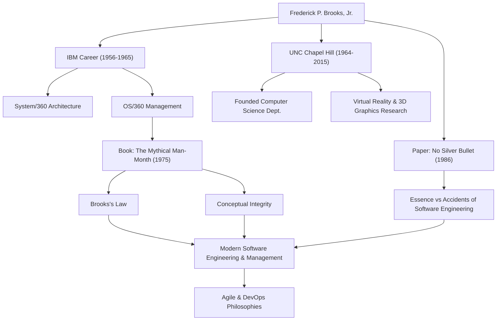

Anyone involved in software development has likely heard the rule: "Adding manpower to a late software project makes it later." This is known as "Brooks's Law" and is one of the most famous maxims in software engineering. The man who proposed this law was Frederick P. Brooks, Jr., a giant in computer science and a legendary project manager.

This article delves deep into the life of Brooks, his profound philosophy, and the lasting impact he continues to have on modern software development.

## Exceptional Talent and the IBM Challenge

Frederick Brooks was born in 1931 in North Carolina, USA. Showing a strong interest in math and science from a young age, he studied physics at Duke University and later earned a Ph.D. in applied mathematics at Harvard University under the guidance of Howard Aiken.

Joining IBM in 1956, Brooks quickly showcased his talents. The biggest turning point in his career was the development of the "System/360" family, a massive project on which IBM staked its future. After serving as the manager of hardware architecture, Brooks was appointed project manager for the development of "OS/360," the software operating system.

OS/360 was a project of unprecedented scale and complexity in software development at the time. Despite thousands of man-months of effort and a massive budget, the schedule was delayed, and the team was plagued by numerous bugs. Brooks led this difficult project to its release after much hardship, but the bitter experiences and deep reflections from this time would lead to his greatest contributions to software engineering.

## "The Mythical Man-Month" and Brooks's Law

Based on his experiences at IBM, his masterpiece "The Mythical Man-Month" was published in 1975. This book is a collection of insightful essays on software project management and remains a bible read by engineers and managers worldwide today.

It was in this book that the aforementioned "Brooks's Law" was proposed. He pointed out that software development, unlike digging a hole or painting, cannot simply be finished faster by adding more people. Adding developers incurs the cost of training new members and causes communication paths to explode, which ultimately delays the entire project—a counterintuitive truth in management brilliantly captured by this law.

He also explained the inherent difficulty of software development from the perspective of "Conceptual Integrity." He argued that a system must be built on a single, consistent design philosophy, and to achieve this, the design should be entrusted to a small number of excellent "architects." This is a pioneering concept that preaches the importance of today's software architecture.

## No Silver Bullet

In 1986, Brooks published another monumental paper, "No Silver Bullet - Essence and Accidents of Software Engineering."

In this paper, he categorized the difficulties of software development into "Essence" and "Accidents." He asserted that the evolution of programming languages and the improvement of tools can only solve accidental difficulties, and there is no magic "silver bullet" that can instantly solve the essential difficulties such as complexity, conformity, changeability, and invisibility of the problems software must solve.

This argument provided a highly realistic and sobering perspective to an IT industry prone to placing excessive expectations on new technologies and tools. His insight that software development will always remain an intellectual and gritty human endeavor has not faded at all, even in today's era of widespread Agile development and DevOps.

## Contributions to Academia and Legacy

After leaving IBM in 1964, Brooks founded the Department of Computer Science at his alma mater, the University of North Carolina at Chapel Hill (UNC), where he taught as a professor for many years. There, he led pioneering research not only in software engineering but also in computer graphics and virtual reality (VR), nurturing many talented individuals. In particular, his research on systems to visualize and manipulate molecular structures in 3D for scientific visualization had a massive impact on fields like biochemistry.

In 1999, he was awarded the "Turing Award," often considered the Nobel Prize of computer science, in recognition of his groundbreaking contributions to computer architecture, operating systems, and software engineering.

## Correlation of Achievements and Impacts

The following diagram illustrates the connection between Brooks's career and the impact he left on future generations.

## Conclusion

Frederick Brooks passed away in 2022 at the age of 91. However, the words and ideas he left behind continue to serve as a compass for software engineers today.

What he preached was not mere technological theory. It was a universal insight into the "human limits" faced when building complex systems and the "nature of organization and design" needed to overcome them. His words "No Silver Bullet" teach us the importance of steady effort and deep thought. For everyone involved in software, the lessons to be learned from Brooks's trajectory will never be exhausted.
