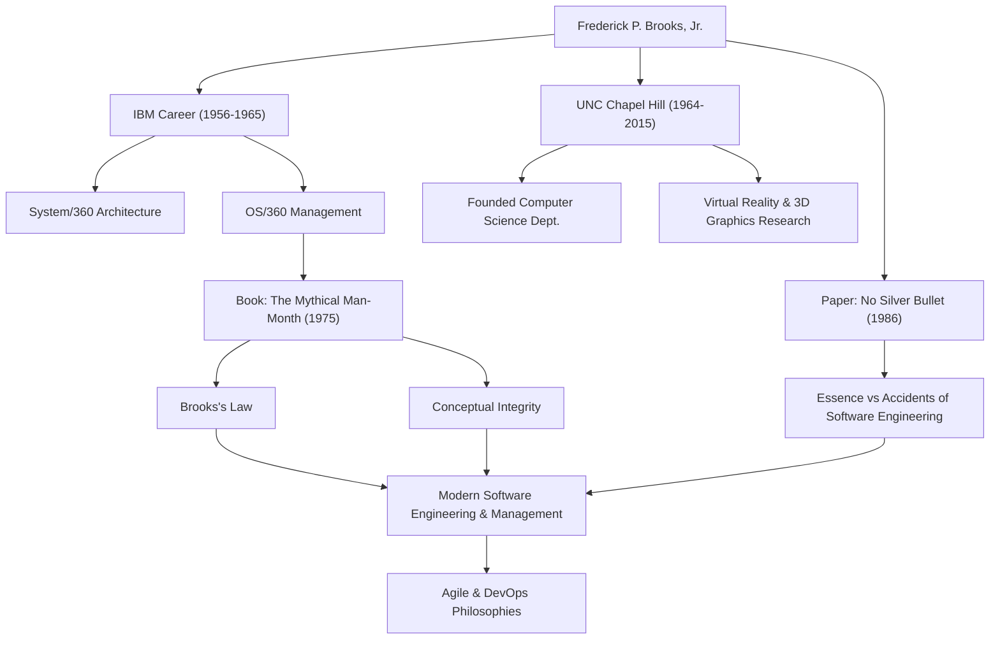

Cualquiera involucrado en el desarrollo de software probablemente ha escuchado la regla: "Añadir mano de obra a un proyecto de software retrasado lo retrasa aún más". Esto se conoce como la "Ley de Brooks" y es una de las máximas más famosas en la ingeniería de software. El hombre que propuso esta ley fue Frederick P. Brooks, Jr., un gigante de la informática y un legendario gerente de proyectos.

Este artículo profundiza en la vida de Brooks, su profunda filosofía y el impacto duradero que sigue teniendo en el desarrollo de software moderno.

## Talento Excepcional y el Desafío en IBM

Frederick Brooks nació en 1931 en Carolina del Norte, Estados Unidos. Mostrando un gran interés por las matemáticas y la ciencia desde joven, estudió física en la Universidad de Duke y luego obtuvo un doctorado en matemáticas aplicadas en la Universidad de Harvard bajo la guía de Howard Aiken.

Al unirse a IBM en 1956, Brooks rápidamente demostró su talento. El mayor punto de inflexión en su carrera fue el desarrollo de la familia "System/360", un proyecto masivo en el que IBM se jugaba su futuro. Después de desempeñarse como gerente de arquitectura de hardware, Brooks fue nombrado gerente de proyectos para el desarrollo de "OS/360", el sistema operativo de software.

OS/360 fue un proyecto de una escala y complejidad sin precedentes en el desarrollo de software en ese momento. A pesar de los miles de meses-hombre de esfuerzo y un presupuesto masivo, el cronograma se retrasó y el equipo estuvo plagado de numerosos errores. Brooks lideró este difícil proyecto hasta su lanzamiento tras muchas dificultades, pero las amargas experiencias y profundas reflexiones de esta época conducirían a sus mayores contribuciones a la ingeniería de software.

## "El Mítico Hombre-Mes" y la Ley de Brooks

Basado en sus experiencias en IBM, su obra maestra "El Mítico Hombre-Mes" se publicó en 1975. Este libro es una colección de ensayos reveladores sobre la gestión de proyectos de software y sigue siendo una biblia leída por ingenieros y gerentes de todo el mundo en la actualidad.

Fue en este libro donde se propuso la mencionada "Ley de Brooks". Señaló que el desarrollo de software, a diferencia de cavar un hoyo o pintar, no puede terminarse simplemente más rápido agregando más personas. Añadir desarrolladores incurre en el costo de capacitar a nuevos miembros y provoca que las vías de comunicación exploten, lo que en última instancia retrasa todo el proyecto: una verdad contraintuitiva en la gestión brillantemente capturada por esta ley.

También explicó la dificultad inherente al desarrollo de software desde la perspectiva de la "Integridad Conceptual". Argumentó que un sistema debe construirse sobre una única filosofía de diseño coherente y, para lograrlo, el diseño debe confiarse a un pequeño número de "arquitectos" excelentes. Este es un concepto pionero que predica la importancia de la arquitectura de software de hoy.

## No Hay Bala de Plata (No Silver Bullet)

En 1986, Brooks publicó otro documento monumental, "No hay bala de plata - Esencia y accidentes de la ingeniería de software".

En este artículo, categorizó las dificultades del desarrollo de software en "Esencia" y "Accidentes". Afirmó que la evolución de los lenguajes de programación y la mejora de las herramientas solo pueden resolver las dificultades accidentales, y que no existe una "bala de plata" mágica que pueda resolver instantáneamente las dificultades esenciales, como la complejidad, la conformidad, la mutabilidad y la invisibilidad de los problemas que el software debe resolver.

Este argumento proporcionó una perspectiva muy realista y sobria a una industria de TI propensa a depositar expectativas excesivas en las nuevas tecnologías y herramientas. Su visión de que el desarrollo de software siempre seguirá siendo un esfuerzo humano intelectual y arduo no se ha desvanecido en absoluto, ni siquiera en la era actual de adopción generalizada de metodologías Ágiles y DevOps.

## Contribuciones a la Academia y Legado

Después de dejar IBM en 1964, Brooks fundó el Departamento de Ciencias de la Computación en su alma mater, la Universidad de Carolina del Norte en Chapel Hill (UNC), donde enseñó como profesor durante muchos años. Allí, lideró investigaciones pioneras no solo en ingeniería de software, sino también en gráficos por computadora y realidad virtual (VR), cultivando a muchos talentos. En particular, su investigación en sistemas para visualizar y manipular estructuras moleculares en 3D para la visualización científica tuvo un impacto masivo en campos como la bioquímica.

En 1999, fue galardonado con el "Premio Turing", a menudo considerado el Premio Nobel de la informática, en reconocimiento a sus contribuciones innovadoras a la arquitectura de computadoras, sistemas operativos e ingeniería de software.

## Correlación de Logros e Impactos

El siguiente diagrama ilustra la conexión entre la carrera de Brooks y el impacto que dejó en las generaciones futuras.

## Conclusión

Frederick Brooks falleció en 2022 a la edad de 91 años. Sin embargo, las palabras e ideas que dejó siguen sirviendo de brújula para los ingenieros de software de hoy.

Lo que predicaba no era mera teoría tecnológica. Era una visión universal de los "límites humanos" a los que nos enfrentamos al construir sistemas complejos y de la "naturaleza de la organización y el diseño" necesarios para superarlos. Sus palabras "No hay bala de plata" nos enseñan la importancia del esfuerzo constante y la reflexión profunda. Para todos los involucrados en el software, las lecciones que se pueden aprender de la trayectoria de Brooks nunca se agotarán.
