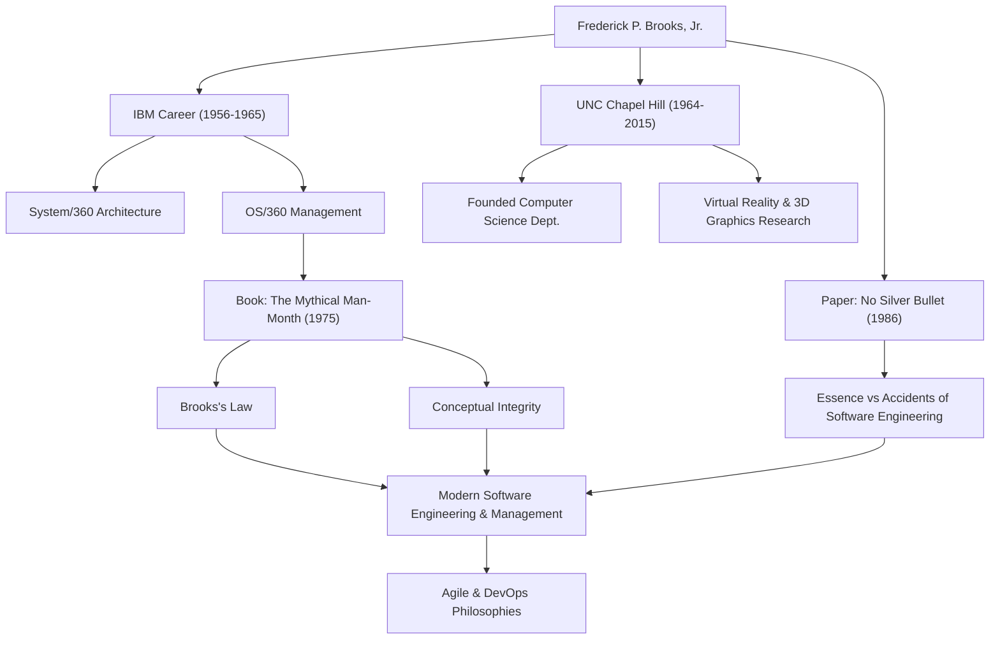

Quiconque participe au développement de logiciels a probablement entendu la règle : « Ajouter de la main-d'œuvre à un projet logiciel en retard le retarde encore plus. » Ceci est connu sous le nom de « Loi de Brooks » et constitue l'une des maximes les plus célèbres du génie logiciel. L'homme qui a proposé cette loi était Frederick P. Brooks, Jr., un géant de l'informatique et un chef de projet légendaire.

Cet article plonge au cœur de la vie de Brooks, de sa philosophie profonde et de l'impact durable qu'il continue d'avoir sur le développement de logiciels moderne.

## Talent exceptionnel et le défi chez IBM

Frederick Brooks est né en 1931 en Caroline du Nord, aux États-Unis. Montrant un fort intérêt pour les mathématiques et les sciences dès son plus jeune âge, il a étudié la physique à l'Université Duke, puis a obtenu un doctorat en mathématiques appliquées à l'Université de Harvard sous la direction de Howard Aiken.

En rejoignant IBM en 1956, Brooks a rapidement mis en valeur ses talents. Le plus grand tournant de sa carrière a été le développement de la famille « System/360 », un projet massif sur lequel IBM a misé son avenir. Après avoir occupé le poste de responsable de l'architecture matérielle, Brooks a été nommé chef de projet pour le développement de « OS/360 », le système d'exploitation logiciel.

OS/360 était un projet d'une ampleur et d'une complexité sans précédent dans le développement de logiciels à l'époque. Malgré des milliers de mois-homme d'efforts et un budget colossal, le calendrier a pris du retard et l'équipe a été en proie à de nombreux bogues. Brooks a dirigé ce projet difficile jusqu'à sa sortie après de nombreuses épreuves, mais les expériences amères et les réflexions profondes de cette époque allaient conduire à ses plus grandes contributions au génie logiciel.

## « Le Mythe du mois-homme » et la loi de Brooks

Basé sur ses expériences chez IBM, son chef-d'œuvre « Le Mythe du mois-homme » a été publié en 1975. Ce livre est un recueil d'essais perspicaces sur la gestion de projets logiciels et reste aujourd'hui une bible lue par les ingénieurs et les gestionnaires du monde entier.

C'est dans ce livre que la fameuse « Loi de Brooks » a été proposée. Il a souligné que le développement de logiciels, contrairement au fait de creuser un trou ou de peindre, ne peut pas être terminé plus rapidement simplement en ajoutant plus de personnes. L'ajout de développeurs entraîne des coûts de formation pour les nouveaux membres et provoque une explosion des voies de communication, ce qui finit par retarder l'ensemble du projet : une vérité contre-intuitive en gestion brillamment capturée par cette loi.

Il a également expliqué la difficulté inhérente au développement de logiciels du point de vue de l'« intégrité conceptuelle ». Il a fait valoir qu'un système doit être construit sur une seule et même philosophie de conception cohérente et, pour y parvenir, la conception doit être confiée à un petit nombre d'« architectes » d'excellence. Il s'agit d'un concept pionnier qui prêche l'importance de l'architecture logicielle d'aujourd'hui.

## Pas de balle en argent (No Silver Bullet)

En 1986, Brooks a publié un autre article monumental, « No Silver Bullet - Essence and Accidents of Software Engineering » (Pas de balle en argent - Essence et accidents du génie logiciel).

Dans cet article, il a catégorisé les difficultés du développement de logiciels en « Essence » et « Accidents ». Il a affirmé que l'évolution des langages de programmation et l'amélioration des outils ne peuvent résoudre que les difficultés accidentelles, et qu'il n'existe pas de « balle en argent » magique capable de résoudre instantanément les difficultés essentielles telles que la complexité, la conformité, la mutabilité et l'invisibilité des problèmes que les logiciels doivent résoudre.

Cet argument a fourni une perspective très réaliste et sobre à une industrie informatique encline à placer des attentes excessives dans les nouvelles technologies et les nouveaux outils. Sa vision selon laquelle le développement de logiciels restera toujours un effort humain intellectuel et laborieux n'a pas du tout pâli, même à l'ère actuelle d'adoption généralisée des méthodes Agiles et de DevOps.

## Contributions au monde universitaire et héritage

Après avoir quitté IBM en 1964, Brooks a fondé le département d'informatique de son alma mater, l'Université de Caroline du Nord à Chapel Hill (UNC), où il a enseigné en tant que professeur pendant de nombreuses années. Là, il a mené des recherches pionnières non seulement en génie logiciel, mais aussi en infographie et en réalité virtuelle (VR), formant de nombreux talents. En particulier, ses recherches sur les systèmes de visualisation et de manipulation des structures moléculaires en 3D pour la visualisation scientifique ont eu un impact massif sur des domaines tels que la biochimie.

En 1999, il a reçu le « Prix Turing », souvent considéré comme le prix Nobel de l'informatique, en reconnaissance de ses contributions révolutionnaires à l'architecture informatique, aux systèmes d'exploitation et au génie logiciel.

## Corrélation des réalisations et des impacts

Le diagramme suivant illustre le lien entre la carrière de Brooks et l'impact qu'il a laissé sur les générations futures.

## Conclusion

Frederick Brooks est décédé en 2022 à l'âge de 91 ans. Cependant, les mots et les idées qu'il a laissés continuent de servir de boussole aux ingénieurs logiciels d'aujourd'hui.

Ce qu'il prêchait n'était pas une simple théorie technologique. Il s'agissait d'une vision universelle des « limites humaines » auxquelles on est confronté lors de la création de systèmes complexes et de la « nature de l'organisation et de la conception » nécessaires pour les surmonter. Ses mots « Pas de balle en argent » nous apprennent l'importance de l'effort constant et de la réflexion profonde. Pour tous ceux qui travaillent dans le domaine des logiciels, les leçons à tirer du parcours de Brooks ne seront jamais épuisées.
