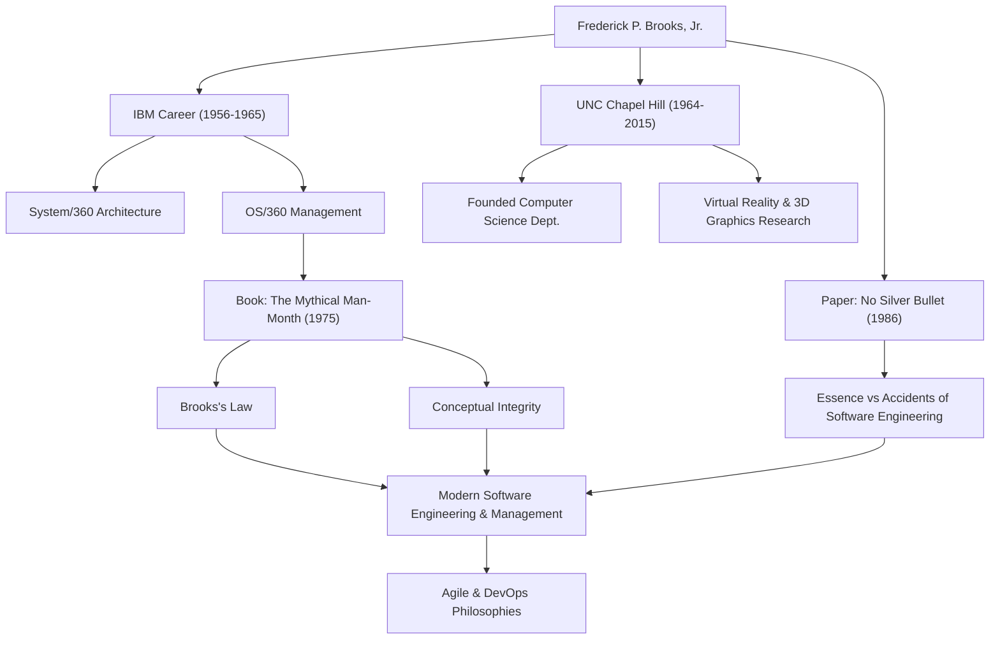

सॉफ्टवेयर विकास से जुड़े किसी भी व्यक्ति ने शायद यह नियम सुना होगा: "एक देर से चल रहे सॉफ्टवेयर प्रोजेक्ट में जनशक्ति जोड़ना उसे और भी देर कर देता है।" इसे "ब्रूक्स के नियम" के रूप में जाना जाता है और यह सॉफ्टवेयर इंजीनियरिंग में सबसे प्रसिद्ध कहावतों में से एक है। इस नियम का प्रस्ताव देने वाले व्यक्ति फ्रेडरिक पी. ब्रूक्स, जूनियर थे, जो कंप्यूटर विज्ञान के दिग्गज और एक महान प्रोजेक्ट मैनेजर थे।

यह लेख ब्रूक्स के जीवन, उनके गहन दर्शन और आधुनिक सॉफ्टवेयर विकास पर उनके निरंतर प्रभाव के बारे में गहराई से बताता है।

## असाधारण प्रतिभा और IBM में चुनौती

फ्रेडरिक ब्रूक्स का जन्म 1931 में अमेरिका के उत्तरी कैरोलिना में हुआ था। कम उम्र से ही गणित और विज्ञान में गहरी रुचि दिखाते हुए, उन्होंने ड्यूक विश्वविद्यालय में भौतिकी का अध्ययन किया और बाद में हावर्ड ऐकेन के मार्गदर्शन में हार्वर्ड विश्वविद्यालय में अनुप्रयुक्त गणित में पीएचडी की उपाधि प्राप्त की।

1956 में IBM में शामिल होने के बाद, ब्रूक्स ने जल्दी ही अपनी प्रतिभा का प्रदर्शन किया। उनके करियर का सबसे बड़ा मोड़ "सिस्टम/360" परिवार का विकास था, जो एक विशाल प्रोजेक्ट था जिस पर IBM ने अपना भविष्य दांव पर लगा दिया था। हार्डवेयर आर्किटेक्चर के प्रबंधक के रूप में काम करने के बाद, ब्रूक्स को सॉफ्टवेयर ऑपरेटिंग सिस्टम "OS/360" के विकास के लिए प्रोजेक्ट मैनेजर नियुक्त किया गया था।

OS/360 उस समय सॉफ्टवेयर विकास में अभूतपूर्व पैमाने और जटिलता का प्रोजेक्ट था। हजारों मानव-महीनों के प्रयास और भारी बजट के बावजूद, कार्यक्रम में देरी हुई, और टीम कई बगों से ग्रस्त थी। ब्रूक्स ने कई कठिनाइयों के बाद इस कठिन प्रोजेक्ट को इसके रिलीज तक पहुंचाया, लेकिन इस समय के कड़वे अनुभवों और गहरे चिंतन ने सॉफ्टवेयर इंजीनियरिंग में उनके सबसे बड़े योगदान को जन्म दिया।

## "द मिथिकल मैन-मंथ" और ब्रूक्स का नियम

IBM में उनके अनुभवों के आधार पर, उनकी उत्कृष्ट कृति "द मिथिकल मैन-मंथ" 1975 में प्रकाशित हुई थी। यह पुस्तक सॉफ्टवेयर प्रोजेक्ट प्रबंधन पर अंतर्दृष्टिपूर्ण निबंधों का एक संग्रह है और आज भी दुनिया भर में इंजीनियरों और प्रबंधकों द्वारा पढ़ी जाने वाली बाइबिल बनी हुई है।

इसी पुस्तक में उक्त "ब्रूक्स के नियम" का प्रस्ताव रखा गया था। उन्होंने बताया कि सॉफ्टवेयर विकास, एक गड्ढा खोदने या पेंटिंग करने के विपरीत, अधिक लोगों को जोड़कर केवल तेजी से समाप्त नहीं किया जा सकता है। डेवलपर्स को जोड़ने से नए सदस्यों को प्रशिक्षित करने की लागत आती है और संचार पथों में विस्फोट होता है, जिससे अंततः पूरे प्रोजेक्ट में देरी होती है - प्रबंधन में एक प्रति-सहज सत्य जिसे इस नियम द्वारा शानदार ढंग से पकड़ा गया है।

उन्होंने "वैचारिक अखंडता" (Conceptual Integrity) के दृष्टिकोण से सॉफ्टवेयर विकास की अंतर्निहित कठिनाई की भी व्याख्या की। उन्होंने तर्क दिया कि एक प्रणाली को एक ही, सुसंगत डिजाइन दर्शन पर बनाया जाना चाहिए, और इसे प्राप्त करने के लिए, डिजाइन को कम संख्या में उत्कृष्ट "आर्किटेक्ट्स" को सौंपा जाना चाहिए। यह एक अग्रणी अवधारणा है जो आज के सॉफ्टवेयर आर्किटेक्चर के महत्व का उपदेश देती है।

## नो सिल्वर बुलेट (कोई जादुई गोली नहीं)

1986 में, ब्रूक्स ने एक और स्मारकीय पेपर प्रकाशित किया, "नो सिल्वर बुलेट - एसेंस एंड एक्सीडेंट्स ऑफ सॉफ्टवेयर इंजीनियरिंग"।

इस पेपर में, उन्होंने सॉफ्टवेयर विकास की कठिनाइयों को "सार" (Essence) और "दुर्घटनाओं" (Accidents) में वर्गीकृत किया। उन्होंने जोर देकर कहा कि प्रोग्रामिंग भाषाओं के विकास और उपकरणों के सुधार से केवल आकस्मिक कठिनाइयों को हल किया जा सकता है, और कोई जादुई "सिल्वर बुलेट" नहीं है जो तुरंत आवश्यक कठिनाइयों जैसे कि सॉफ्टवेयर द्वारा हल की जाने वाली समस्याओं की जटिलता, अनुरूपता, परिवर्तनशीलता और अदृश्यता को हल कर सके।

इस तर्क ने आईटी उद्योग को एक अत्यधिक यथार्थवादी और शांत दृष्टिकोण प्रदान किया जो नई तकनीकों और उपकरणों पर अत्यधिक उम्मीदें रखने के लिए प्रवण था। उनकी यह अंतर्दृष्टि कि सॉफ्टवेयर विकास हमेशा एक बौद्धिक और कठिन मानवीय प्रयास बना रहेगा, आज के व्यापक चंचल (Agile) विकास और DevOps के युग में भी बिल्कुल कम नहीं हुई है।

## शिक्षा जगत में योगदान और विरासत

1964 में IBM छोड़ने के बाद, ब्रूक्स ने अपने अल्मा मेटर, चैपल हिल में उत्तरी कैरोलिना विश्वविद्यालय (UNC) में कंप्यूटर विज्ञान विभाग की स्थापना की, जहां उन्होंने कई वर्षों तक एक प्रोफेसर के रूप में पढ़ाया। वहां, उन्होंने न केवल सॉफ्टवेयर इंजीनियरिंग में बल्कि कंप्यूटर ग्राफिक्स और वर्चुअल रियलिटी (VR) में भी अग्रणी अनुसंधान का नेतृत्व किया, जिससे कई प्रतिभाशाली व्यक्तियों का पोषण हुआ। विशेष रूप से, वैज्ञानिक दृश्य के लिए 3D में आणविक संरचनाओं की कल्पना और हेरफेर करने के लिए सिस्टम पर उनके शोध का जैव रसायन जैसे क्षेत्रों पर व्यापक प्रभाव पड़ा।

1999 में, उन्हें कंप्यूटर आर्किटेक्चर, ऑपरेटिंग सिस्टम और सॉफ्टवेयर इंजीनियरिंग में उनके अभूतपूर्व योगदान की मान्यता में "ट्यूरिंग अवार्ड" से सम्मानित किया गया, जिसे अक्सर कंप्यूटर विज्ञान का नोबेल पुरस्कार माना जाता है।

## उपलब्धियों और प्रभावों का सहसंबंध

निम्नलिखित आरेख ब्रूक्स के करियर और भविष्य की पीढ़ियों पर उनके द्वारा छोड़े गए प्रभाव के बीच संबंध को दर्शाता है।

## निष्कर्ष

फ्रेडरिक ब्रूक्स का 2022 में 91 वर्ष की आयु में निधन हो गया। हालांकि, उनके द्वारा छोड़े गए शब्द और विचार आज भी सॉफ्टवेयर इंजीनियरों के लिए एक कंपास के रूप में काम करते हैं।

उन्होंने जो उपदेश दिया वह केवल तकनीकी सिद्धांत नहीं था। यह जटिल प्रणालियों के निर्माण के दौरान सामना की जाने वाली "मानवीय सीमाओं" और उन्हें दूर करने के लिए आवश्यक "संगठन और डिजाइन की प्रकृति" में एक सार्वभौमिक अंतर्दृष्टि थी। उनके शब्द "नो सिल्वर बुलेट" हमें निरंतर प्रयास और गहरे विचार के महत्व को सिखाते हैं। सॉफ्टवेयर में शामिल सभी लोगों के लिए, ब्रूक्स के प्रक्षेपवक्र से सीखे जाने वाले सबक कभी समाप्त नहीं होंगे।
