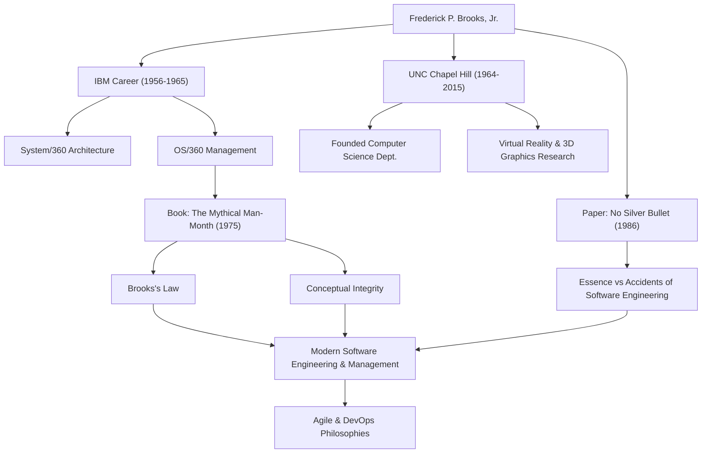

Siapa pun yang terlibat dalam pengembangan perangkat lunak kemungkinan besar pernah mendengar aturan ini: "Menambahkan tenaga kerja ke proyek perangkat lunak yang terlambat hanya akan membuatnya semakin terlambat." Ini dikenal sebagai "Hukum Brooks" dan merupakan salah satu pepatah paling terkenal dalam rekayasa perangkat lunak. Orang yang mengusulkan hukum ini adalah Frederick P. Brooks, Jr., seorang raksasa dalam ilmu komputer dan seorang manajer proyek legendaris.

Artikel ini menggali lebih dalam tentang kehidupan Brooks, filosofinya yang mendalam, dan dampak abadi yang terus ia berikan pada pengembangan perangkat lunak modern.

## Bakat Luar Biasa dan Tantangan di IBM

Frederick Brooks lahir pada tahun 1931 di Carolina Utara, AS. Menunjukkan minat yang kuat pada matematika dan sains sejak usia muda, ia belajar fisika di Universitas Duke dan kemudian meraih gelar Ph.D. dalam matematika terapan di Universitas Harvard di bawah bimbingan Howard Aiken.

Bergabung dengan IBM pada tahun 1956, Brooks dengan cepat memamerkan bakatnya. Titik balik terbesar dalam karirnya adalah pengembangan keluarga "System/360", sebuah proyek besar di mana IBM mempertaruhkan masa depannya. Setelah menjabat sebagai manajer arsitektur perangkat keras, Brooks ditunjuk sebagai manajer proyek untuk pengembangan "OS/360", sistem operasi perangkat lunak.

OS/360 adalah proyek dengan skala dan kompleksitas yang belum pernah terjadi sebelumnya dalam pengembangan perangkat lunak pada masa itu. Meskipun menghabiskan ribuan bulan-orang upaya dan anggaran yang sangat besar, jadwalnya tertunda, dan tim tersebut diganggu oleh banyak bug. Brooks memimpin proyek yang sulit ini hingga rilisnya setelah banyak kesulitan, tetapi pengalaman pahit dan refleksi mendalam dari masa ini akan mengarah pada kontribusi terbesarnya pada rekayasa perangkat lunak.

## "Mitos Bulan-Orang" (The Mythical Man-Month) dan Hukum Brooks

Berdasarkan pengalamannya di IBM, mahakaryanya "The Mythical Man-Month" diterbitkan pada tahun 1975. Buku ini adalah kumpulan esai mendalam tentang manajemen proyek perangkat lunak dan tetap menjadi "alkitab" yang dibaca oleh para insinyur dan manajer di seluruh dunia saat ini.

Di dalam buku inilah "Hukum Brooks" yang disebutkan di atas diusulkan. Ia menunjukkan bahwa pengembangan perangkat lunak, tidak seperti menggali lubang atau mengecat, tidak dapat diselesaikan lebih cepat hanya dengan menambahkan lebih banyak orang. Menambahkan pengembang menimbulkan biaya untuk melatih anggota baru dan menyebabkan jalur komunikasi meledak, yang pada akhirnya menunda seluruh proyek — sebuah kebenaran kontra-intuitif dalam manajemen yang ditangkap dengan cemerlang oleh hukum ini.

Ia juga menjelaskan kesulitan yang melekat dalam pengembangan perangkat lunak dari perspektif "Integritas Konseptual" (Conceptual Integrity). Ia berpendapat bahwa sebuah sistem harus dibangun di atas satu filosofi desain yang konsisten, dan untuk mencapai hal ini, desain tersebut harus dipercayakan kepada sejumlah kecil "arsitek" yang unggul. Ini adalah konsep perintis yang mengajarkan pentingnya arsitektur perangkat lunak masa kini.

## Tidak Ada Peluru Perak (No Silver Bullet)

Pada tahun 1986, Brooks menerbitkan makalah monumental lainnya, "No Silver Bullet - Essence and Accidents of Software Engineering" (Tidak Ada Peluru Perak - Esensi dan Kecelakaan dari Rekayasa Perangkat Lunak).

Dalam makalah ini, ia mengkategorikan kesulitan pengembangan perangkat lunak menjadi "Esensi" (Essence) dan "Kecelakaan" (Accidents). Ia menegaskan bahwa evolusi bahasa pemrograman dan peningkatan alat hanya dapat memecahkan kesulitan yang tidak disengaja (aksidental), dan tidak ada "peluru perak" ajaib yang dapat secara instan memecahkan kesulitan esensial seperti kompleksitas, kesesuaian, perubahan, dan ketidakterlihatan dari masalah yang harus dipecahkan oleh perangkat lunak.

Argumen ini memberikan perspektif yang sangat realistis dan menyadarkan bagi industri TI yang rentan menaruh harapan berlebihan pada teknologi dan alat baru. Wawasannya bahwa pengembangan perangkat lunak akan selalu tetap menjadi upaya intelektual dan kerja keras manusia tidak memudar sama sekali, bahkan di era adopsi pengembangan Agile dan DevOps yang meluas saat ini.

## Kontribusi pada Akademisi dan Warisan

Setelah meninggalkan IBM pada tahun 1964, Brooks mendirikan Departemen Ilmu Komputer di almamaternya, Universitas Carolina Utara di Chapel Hill (UNC), di mana ia mengajar sebagai profesor selama bertahun-tahun. Di sana, ia memimpin penelitian perintis tidak hanya dalam rekayasa perangkat lunak tetapi juga dalam grafik komputer dan realitas virtual (VR), membina banyak individu berbakat. Secara khusus, penelitiannya pada sistem untuk memvisualisasikan dan memanipulasi struktur molekul dalam 3D untuk visualisasi ilmiah berdampak besar pada bidang-bidang seperti biokimia.

Pada tahun 1999, ia dianugerahi "Turing Award", yang sering dianggap sebagai Hadiah Nobel ilmu komputer, sebagai pengakuan atas kontribusinya yang luar biasa pada arsitektur komputer, sistem operasi, dan rekayasa perangkat lunak.

## Korelasi Pencapaian dan Dampak

Diagram berikut mengilustrasikan hubungan antara karir Brooks dan dampak yang ia tinggalkan bagi generasi mendatang.

## Kesimpulan

Frederick Brooks meninggal dunia pada tahun 2022 pada usia 91 tahun. Namun, kata-kata dan ide yang ditinggalkannya terus menjadi kompas bagi para insinyur perangkat lunak saat ini.

Apa yang diajarkannya bukan sekadar teori teknologi. Itu adalah wawasan universal tentang "batasan manusia" yang dihadapi ketika membangun sistem yang kompleks dan "sifat organisasi dan desain" yang diperlukan untuk mengatasinya. Kata-katanya "Tidak Ada Peluru Perak" mengajarkan kita pentingnya upaya yang mantap dan pemikiran yang mendalam. Bagi semua orang yang terlibat dalam perangkat lunak, pelajaran yang dapat dipetik dari lintasan Brooks tidak akan pernah habis.
