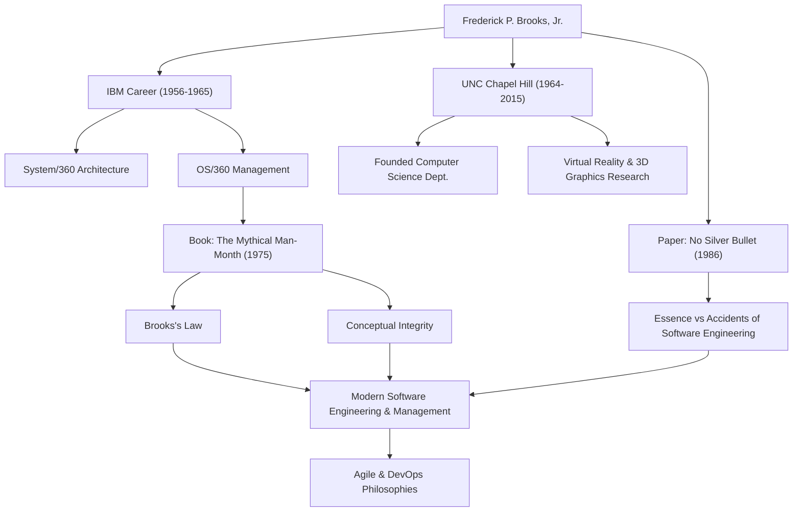

소프트웨어 개발에 참여하는 사람이라면 누구나 한 번쯤 "지연되는 소프트웨어 프로젝트에 인력을 추가하면 프로젝트가 더 지연될 뿐이다"라는 법칙을 들어보았을 것입니다. 이는 '브룩스의 법칙(Brooks's Law)'으로 알려져 있으며, 소프트웨어 공학에서 가장 유명한 격언 중 하나입니다. 이 법칙을 제안한 사람은 컴퓨터 과학의 거장이자 전설적인 프로젝트 관리자인 프레더릭 P. 브룩스 주니어(Frederick P. Brooks, Jr.)입니다.

본 기사에서는 현대 소프트웨어 개발에 계속해서 지대한 영향을 미치고 있는 브룩스의 생애, 그가 남긴 심오한 철학, 그리고 후세에 미친 영향에 대해 깊이 있게 살펴봅니다.

## 뛰어난 재능과 IBM에서의 도전

프레더릭 브룩스는 1931년 미국 노스캐롤라이나주에서 태어났습니다. 어릴 적부터 수학과 과학에 강한 흥미를 보였던 그는 듀크 대학교에서 물리학을 공부한 후, 하버드 대학교에서 하워드 에이컨의 지도 아래 응용 수학 박사 학위를 취득했습니다.

1956년 IBM에 입사한 브룩스는 곧바로 자신의 재능을 꽃피웠습니다. 그의 경력에서 가장 큰 전환점은 IBM이 회사의 명운을 걸고 추진한 거대 프로젝트 'System/360' 제품군의 개발이었습니다. 브룩스는 하드웨어 아키텍처 관리자를 맡은 후, 소프트웨어 운영 체제인 'OS/360'의 개발 책임자(프로젝트 관리자)로 임명됩니다.

OS/360은 당시 소프트웨어 개발로서는 전례 없는 규모와 복잡성을 지닌 프로젝트였습니다. 수천 인월(man-month)의 노력과 막대한 예산이 투입되었지만 일정은 지연되었고, 수많은 버그에 시달렸습니다. 브룩스는 이 어려운 프로젝트를 지휘하여 많은 고생 끝에 출시를 이루어냈지만, 이때의 뼈아픈 경험과 깊은 반성은 훗날 그의 소프트웨어 공학에 대한 가장 큰 공헌을 낳는 계기가 되었습니다.

## 『맨먼스 미신』과 브룩스의 법칙

IBM에서의 경험을 바탕으로 1975년에 출판된 것이 명저 『맨먼스 미신(The Mythical Man-Month)』입니다. 이 책은 소프트웨어 프로젝트 관리에 관한 통찰력으로 가득 찬 에세이 모음집으로, 오늘날에도 전 세계의 엔지니어와 관리자들에게 바이블로 읽히고 있습니다.

이 책에서 제창된 것이 앞서 언급한 '브룩스의 법칙'입니다. 그는 소프트웨어 개발이 구멍을 파거나 페인트를 칠하는 것처럼 단순히 인원을 늘린다고 빨리 끝나는 것이 아니라고 지적했습니다. 개발자를 늘리면 새 멤버를 교육하는 비용이 발생하고 의사소통 경로가 폭발적으로 증가하여 결과적으로 프로젝트 전체가 지연된다는 이 법칙은 경영에서 직관에 반하는 진실을 훌륭하게 짚어냈습니다.

그는 또한 소프트웨어 개발의 본질적인 어려움을 '개념적 일관성(Conceptual Integrity)'의 관점에서 설명했습니다. 시스템은 일관된 하나의 설계 철학을 바탕으로 구축되어야 하며, 이를 위해서는 소수의 뛰어난 '아키텍트'에게 설계를 맡겨야 한다고 주장했습니다. 이는 오늘날 소프트웨어 아키텍처의 중요성을 설파한 선구적인 생각입니다.

## 은탄환은 없다(No Silver Bullet)

1986년, 브룩스는 또 다른 기념비적인 논문 『은탄환은 없다 - 소프트웨어 공학의 본질과 부수성(No Silver Bullet - Essence and Accidents of Software Engineering)』을 발표합니다.

이 논문에서 그는 소프트웨어 개발의 어려움을 '본질적인 어려움(Essence)'과 '부수적인 어려움(Accidents)'으로 분류했습니다. 프로그래밍 언어의 진화나 도구의 개선으로 해결할 수 있는 것은 부수적인 어려움에 불과하며, 소프트웨어가 해결해야 할 문제 자체의 복잡성, 순응성, 변경 가능성, 비가시성과 같은 본질적인 어려움을 마법처럼 단번에 해결해 줄 '은탄환'은 존재하지 않는다고 단언했습니다.

이 주장은 새로운 기술이나 도구에 과도한 기대를 품기 쉬운 IT 업계에 매우 현실적이고 냉정한 시각을 제공했습니다. 소프트웨어 개발은 항상 인간의 지적이고 고된 작업으로 남을 것이라는 그의 통찰은 애자일(Agile) 개발과 DevOps가 보편화된 현대에도 전혀 퇴색되지 않았습니다.

## 학계에 대한 공헌과 후세에 미친 영향

IBM을 퇴사한 후인 1964년, 브룩스는 고향인 노스캐롤라이나 대학교 채플힐(UNC)에 컴퓨터 과학과를 창설하고 오랜 기간 교수로 재직했습니다. 그는 이곳에서 소프트웨어 공학뿐만 아니라 컴퓨터 그래픽스와 가상현실(VR)의 선구적인 연구를 이끌며 많은 우수한 인재를 양성했습니다. 특히 과학적 시각화에서 분자 구조를 3D로 시각화하고 조작하는 시스템 연구는 생화학 등의 분야에 큰 영향을 미쳤습니다.

1999년에는 컴퓨터 아키텍처, 운영 체제 및 소프트웨어 공학에 대한 획기적인 공헌을 인정받아 컴퓨터 과학 분야의 노벨상이라 불리는 '튜링상'을 수상했습니다.

## 업적과 영향의 상관관계

아래 그림은 브룩스의 경력과 그가 후세에 남긴 영향의 연결 고리를 보여줍니다.

## 맺음말

프레더릭 브룩스는 2022년에 91세의 나이로 세상을 떠났습니다. 그러나 그가 남긴 말과 사상은 오늘날에도 여전히 소프트웨어 엔지니어들의 나침반이 되고 있습니다.

그가 설파한 것은 단순한 기술론이 아니었습니다. 인간이 복잡한 시스템을 구축할 때 직면하는 '인간의 한계'와 이를 극복하기 위한 '조직과 설계의 방향'에 대한 보편적인 통찰이었습니다. "은탄환은 없다"는 그의 말은 우리에게 꾸준한 노력과 깊은 사고의 중요성을 가르쳐 줍니다. 소프트웨어에 관여하는 모든 사람에게 브룩스의 발자취에서 배울 점은 앞으로도 결코 마르지 않을 것입니다.
