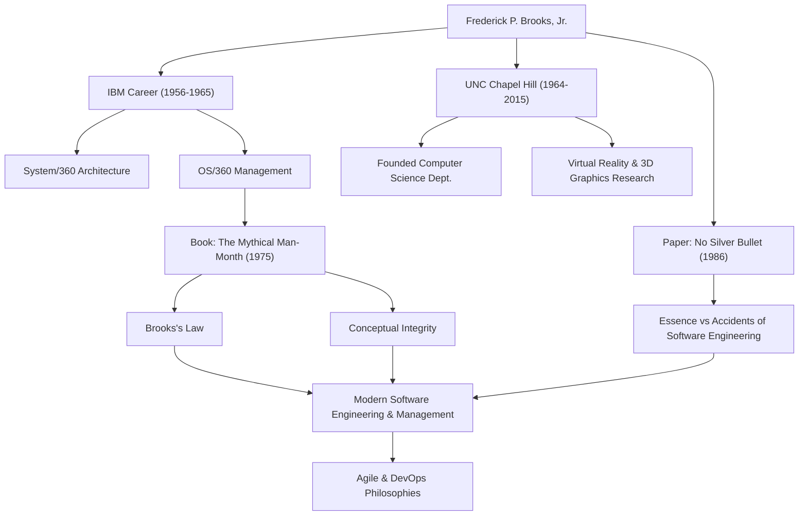

ソフトウェア開発に携わる者であれば、「遅れているソフトウェアプロジェクトへの要員追加は、プロジェクトをさらに遅らせるだけである」という法則を一度は耳にしたことがあるでしょう。これは「ブルックスの法則」として知られ、ソフトウェア工学における最も有名な金言の一つです。この法則を提唱した人物こそ、計算機科学の巨星であり、伝説的なプロジェクトマネージャーであったフレデリック・P・ブルックス・ジュニア（Frederick P. Brooks, Jr.）です。

本記事では、現代のソフトウェア開発にも多大な影響を与え続けるブルックスの生涯、彼の残した深遠な哲学、そして後世への影響について深く掘り下げていきます。

## 類まれなる才能とIBMでの挑戦

フレデリック・ブルックスは1931年、アメリカ合衆国ノースカロライナ州で生まれました。幼い頃から数学や科学に強い関心を示した彼は、デューク大学で物理学を学んだ後、ハーバード大学でハワード・エイケンの指導の下、応用数学の博士号を取得しました。

1956年にIBMに入社したブルックスは、すぐにその才能を開花させます。彼のキャリアにおける最大の転機は、IBMの社運を賭けた巨大プロジェクト「System/360」ファミリーの開発でした。ブルックスはハードウェアアーキテクチャのマネージャーを務めた後、ソフトウェアオペレーティングシステムである「OS/360」の開発責任者（プロジェクトマネージャー）に任命されます。

OS/360は、当時のソフトウェア開発としては前例のない規模と複雑さを持つプロジェクトでした。数千人月の労力がつぎ込まれ、莫大な予算が投じられましたが、スケジュールは遅延し、数多くのバグに悩まされました。ブルックスはこの困難なプロジェクトを指揮し、多大な苦労の末にリリースへとこぎつけましたが、この時の苦い経験と深い反省が、後の彼のソフトウェア工学への最大の貢献を生み出すことになります。

## 『人月の神話』とブルックスの法則

IBMでの経験を基に、1975年に出版されたのが名著『人月の神話（The Mythical Man-Month）』です。この本は、ソフトウェアプロジェクト管理に関する洞察に満ちたエッセイ集であり、現在でも世界中のエンジニアやマネージャーに読まれ続けているバイブルです。

この中で提唱されたのが、前述の「ブルックスの法則」です。ソフトウェア開発は、穴掘りや塗装のように単純に人数を増やせば早く終わるものではないと彼は指摘しました。開発者を増やせば、新メンバーの教育コストがかかり、コミュニケーションの経路が爆発的に増加するため、結果的にプロジェクト全体が遅延してしまうというこの法則は、マネジメントにおける直感に反する真実を見事に突いていました。

彼はまた、ソフトウェア開発の本質的な困難さを「概念の完全性（Conceptual Integrity）」の観点から説明しました。システムは一貫した一つの設計思想に基づいて構築されなければならず、そのためには設計を少数の優れた「アーキテクト」に委ねるべきだと主張しました。これは今日のソフトウェアアーキテクチャの重要性を説いた先駆的な考え方です。

## 銀の弾丸などない（No Silver Bullet）

1986年、ブルックスはもう一つの記念碑的な論文『銀の弾丸などない（No Silver Bullet - Essence and Accidents of Software Engineering）』を発表します。

この論文で彼は、ソフトウェア開発の困難さを「本質的な困難（Essence）」と「偶発的な困難（Accidents）」に分類しました。プログラミング言語の進化やツールの改善によって解消できるのは偶発的な困難に過ぎず、ソフトウェアが解決すべき問題そのものの複雑さ、同調性、変更可能性、不可視性といった本質的な困難を魔法のように一気に解決する「銀の弾丸」は存在しないと断言したのです。

この主張は、新しい技術やツールに過度な期待を抱きがちなIT業界に対して、極めて現実的で冷静な視点を提供しました。ソフトウェア開発は常に人間の知的で泥臭い作業であり続けるという彼の洞察は、アジャイル開発やDevOpsが普及した現代においても全く色褪せていません。

## 学界への貢献と後世への影響

IBMを退社した後の1964年、ブルックスは故郷のノースカロライナ大学チャペルヒル校（UNC）に計算機科学科を創設し、長年にわたり教授として教鞭をとりました。彼はここで、ソフトウェア工学だけでなく、コンピュータグラフィックスやバーチャルリアリティ（VR）の先駆的な研究を牽引し、多くの優秀な人材を育成しました。特に、科学的ビジュアライゼーションにおいて分子構造を3Dで可視化・操作するシステムの研究は、生化学などの分野に大きな影響を与えました。

1999年には、コンピュータアーキテクチャ、オペレーティングシステム、およびソフトウェア工学への画期的な貢献が認められ、計算機科学分野のノーベル賞とされる「チューリング賞」を受賞しています。

## 功績と影響の相関図

以下の図は、ブルックスのキャリアと彼が後世に残した影響の繋がりを示しています。

## 結びとして

フレデリック・ブルックスは、2022年に91歳でこの世を去りました。しかし、彼が残した言葉や思想は、今日もなおソフトウェアエンジニアたちの羅針盤であり続けています。

彼が説いたのは、単なる技術論ではありませんでした。人間が複雑なシステムを構築する際に直面する「人間の限界」と、それを乗り越えるための「組織と設計のあり方」についての普遍的な洞察でした。「銀の弾丸はない」という彼の言葉は、私たちに地道な努力と深い思考の重要性を教えてくれます。ソフトウェアに関わるすべての人にとって、ブルックスの軌跡から学ぶべきことは、これからも尽きることはないでしょう。
