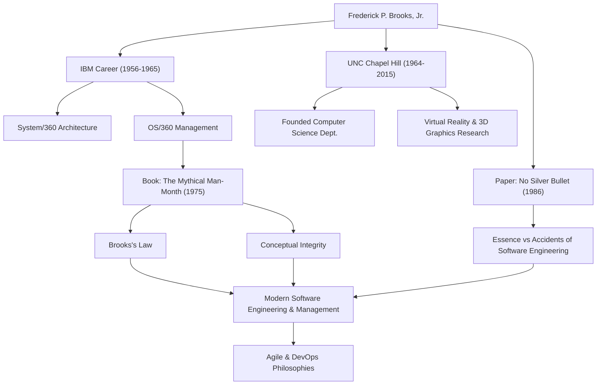

Qualquer pessoa envolvida no desenvolvimento de software provavelmente já ouviu a regra: "Adicionar mão de obra a um projeto de software atrasado o atrasa ainda mais". Isso é conhecido como a "Lei de Brooks" e é uma das máximas mais famosas na engenharia de software. O homem que propôs esta lei foi Frederick P. Brooks, Jr., um gigante da ciência da computação e um gerente de projetos lendário.

Este artigo mergulha fundo na vida de Brooks, sua profunda filosofia e o impacto duradouro que ele continua a ter no desenvolvimento de software moderno.

## Talento Excepcional e o Desafio na IBM

Frederick Brooks nasceu em 1931 na Carolina do Norte, EUA. Mostrando um forte interesse por matemática e ciências desde jovem, ele estudou física na Duke University e mais tarde obteve um doutorado em matemática aplicada na Universidade de Harvard sob a orientação de Howard Aiken.

Ao ingressar na IBM em 1956, Brooks rapidamente demonstrou seus talentos. O maior ponto de virada em sua carreira foi o desenvolvimento da família "System/360", um projeto massivo no qual a IBM apostou seu futuro. Depois de atuar como gerente de arquitetura de hardware, Brooks foi nomeado gerente de projeto para o desenvolvimento do "OS/360", o sistema operacional de software.

O OS/360 era um projeto de escala e complexidade sem precedentes no desenvolvimento de software da época. Apesar de milhares de meses-homem de esforço e um orçamento massivo, o cronograma atrasou e a equipe foi atormentada por inúmeros bugs. Brooks liderou este projeto difícil até seu lançamento após muitas dificuldades, mas as amargas experiências e profundas reflexões dessa época levariam às suas maiores contribuições para a engenharia de software.

## "O Mítico Homem-Mês" e a Lei de Brooks

Baseado em suas experiências na IBM, sua obra-prima "O Mítico Homem-Mês" (The Mythical Man-Month) foi publicada em 1975. Este livro é uma coleção de ensaios perspicazes sobre o gerenciamento de projetos de software e continua sendo uma bíblia lida por engenheiros e gerentes em todo o mundo hoje.

Foi neste livro que a referida "Lei de Brooks" foi proposta. Ele apontou que o desenvolvimento de software, ao contrário de cavar um buraco ou pintar, não pode simplesmente ser concluído mais rápido adicionando mais pessoas. Adicionar desenvolvedores incorre no custo de treinar novos membros e faz com que os caminhos de comunicação explodam, o que acaba atrasando todo o projeto — uma verdade contraintuitiva no gerenciamento capturada de forma brilhante por esta lei.

Ele também explicou a dificuldade inerente ao desenvolvimento de software da perspectiva da "Integridade Conceitual" (Conceptual Integrity). Ele argumentou que um sistema deve ser construído sobre uma única e consistente filosofia de design e, para conseguir isso, o design deve ser confiado a um pequeno número de excelentes "arquitetos". Este é um conceito pioneiro que prega a importância da arquitetura de software de hoje.

## Não Há Bala de Prata (No Silver Bullet)

Em 1986, Brooks publicou outro artigo monumental, "No Silver Bullet - Essence and Accidents of Software Engineering" (Não Há Bala de Prata - Essência e Acidentes da Engenharia de Software).

Neste artigo, ele categorizou as dificuldades do desenvolvimento de software em "Essência" e "Acidentes". Ele afirmou que a evolução das linguagens de programação e a melhoria das ferramentas só podem resolver as dificuldades acidentais, e não há uma "bala de prata" mágica que possa resolver instantaneamente as dificuldades essenciais, como complexidade, conformidade, mutabilidade e invisibilidade dos problemas que o software deve resolver.

Esse argumento forneceu uma perspectiva altamente realista e sóbria para uma indústria de TI propensa a colocar expectativas excessivas em novas tecnologias e ferramentas. Sua visão de que o desenvolvimento de software sempre permanecerá um esforço humano intelectual e árduo não desapareceu de forma alguma, mesmo na era atual de adoção generalizada do desenvolvimento Ágil e DevOps.

## Contribuições para a Academia e Legado

Depois de deixar a IBM em 1964, Brooks fundou o Departamento de Ciência da Computação em sua alma mater, a Universidade da Carolina do Norte em Chapel Hill (UNC), onde ensinou como professor por muitos anos. Lá, ele liderou pesquisas pioneiras não apenas em engenharia de software, mas também em computação gráfica e realidade virtual (VR), cultivando muitos talentos. Em particular, sua pesquisa em sistemas para visualizar e manipular estruturas moleculares em 3D para visualização científica teve um impacto massivo em campos como a bioquímica.

Em 1999, ele foi premiado com o "Prêmio Turing", muitas vezes considerado o Prêmio Nobel da ciência da computação, em reconhecimento às suas contribuições inovadoras para arquitetura de computadores, sistemas operacionais e engenharia de software.

## Correlação de Conquistas e Impactos

O diagrama a seguir ilustra a conexão entre a carreira de Brooks e o impacto que ele deixou nas gerações futuras.

## Conclusão

Frederick Brooks faleceu em 2022 aos 91 anos. No entanto, as palavras e ideias que ele deixou continuam a servir como uma bússola para os engenheiros de software de hoje.

O que ele pregava não era mera teoria tecnológica. Era uma visão universal dos "limites humanos" enfrentados ao construir sistemas complexos e da "natureza da organização e do design" necessários para superá-los. Suas palavras "Não há Bala de Prata" nos ensinam a importância do esforço constante e da reflexão profunda. Para todos os envolvidos com software, as lições a serem aprendidas com a trajetória de Brooks nunca se esgotarão.
