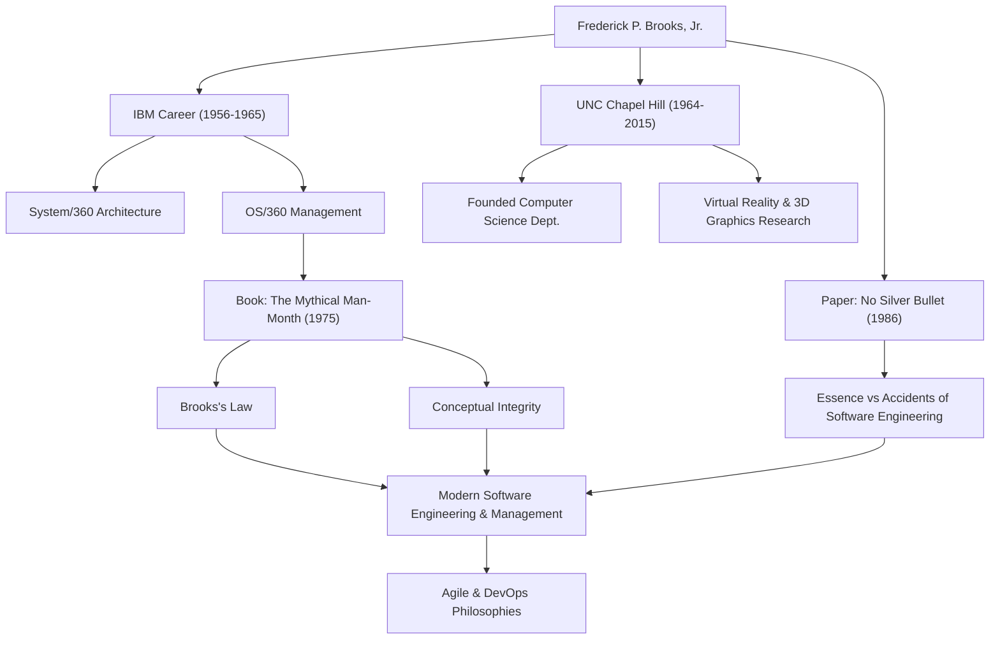

Любой, кто занимается разработкой программного обеспечения, вероятно, слышал правило: «Добавление рабочей силы в отстающий программный проект только задерживает его еще больше». Это известно как «Закон Брукса» и является одной из самых известных максим в программной инженерии. Человеком, предложившим этот закон, был Фредерик П. Брукс-младший, гигант компьютерных наук и легендарный руководитель проектов.

В этой статье глубоко исследуется жизнь Брукса, его глубокая философия и то длительное влияние, которое он продолжает оказывать на современную разработку программного обеспечения.

## Исключительный талант и вызов в IBM

Фредерик Брукс родился в 1931 году в Северной Каролине, США. С юных лет проявляя сильный интерес к математике и науке, он изучал физику в Университете Дьюка, а затем получил степень доктора прикладной математики в Гарвардском университете под руководством Говарда Эйкена.

Присоединившись к IBM в 1956 году, Брукс быстро продемонстрировал свои таланты. Самым большим поворотным моментом в его карьере стала разработка семейства «System/360» — масштабного проекта, на который IBM поставила свое будущее. Проработав менеджером по аппаратной архитектуре, Брукс был назначен руководителем проекта по разработке «OS/360», программной операционной системы.

OS/360 был проектом беспрецедентного масштаба и сложности в разработке программного обеспечения того времени. Несмотря на тысячи человеко-месяцев усилий и огромный бюджет, график задерживался, а команду преследовали многочисленные ошибки. Брукс довел этот сложный проект до выпуска после многих трудностей, но горький опыт и глубокие размышления того времени привели к его величайшему вкладу в программную инженерию.

## «Мифический человеко-месяц» и Закон Брукса

Основываясь на его опыте работы в IBM, в 1975 году был опубликован его шедевр «Мифический человеко-месяц» (The Mythical Man-Month). Эта книга представляет собой сборник глубоких эссе об управлении программными проектами и по сей день остается библией, которую читают инженеры и менеджеры во всем мире.

Именно в этой книге был предложен вышеупомянутый «Закон Брукса». Он указал, что разработку программного обеспечения, в отличие от рытья ямы или покраски, нельзя просто закончить быстрее, добавив больше людей. Добавление разработчиков влечет за собой затраты на обучение новых членов и вызывает взрывной рост путей коммуникации, что в конечном итоге задерживает весь проект — контринтуитивная истина в управлении, блестяще схваченная этим законом.

Он также объяснил присущую разработке программного обеспечения сложность с точки зрения «Концептуальной целостности» (Conceptual Integrity). Он утверждал, что система должна строиться на единой, последовательной философии проектирования, и для достижения этого проектирование следует поручить небольшому числу выдающихся «архитекторов». Это новаторская концепция, которая проповедует важность сегодняшней архитектуры программного обеспечения.

## Серебряной пули нет (No Silver Bullet)

В 1986 году Брукс опубликовал еще одну монументальную статью: «Серебряной пули нет — сущность и случайности программной инженерии» (No Silver Bullet - Essence and Accidents of Software Engineering).

В этой статье он разделил трудности разработки программного обеспечения на «Сущность» (Essence) и «Случайности» (Accidents). Он утверждал, что эволюция языков программирования и улучшение инструментов могут решить только случайные трудности, и не существует волшебной «серебряной пули», которая могла бы мгновенно решить основные трудности, такие как сложность, соответствие, изменчивость и невидимость проблем, которые должно решать программное обеспечение.

Этот аргумент предоставил весьма реалистичную и отрезвляющую перспективу ИТ-индустрии, склонной возлагать чрезмерные ожидания на новые технологии и инструменты. Его понимание того, что разработка программного обеспечения всегда будет оставаться интеллектуальным и кропотливым человеческим трудом, нисколько не померкло даже в сегодняшнюю эпоху широкого распространения Agile-разработки и DevOps.

## Вклад в академическую науку и наследие

После ухода из IBM в 1964 году Брукс основал кафедру компьютерных наук в своей альма-матер, Университете Северной Каролины в Чапел-Хилл (UNC), где он преподавал в качестве профессора на протяжении многих лет. Там он руководил новаторскими исследованиями не только в области программной инженерии, но и в области компьютерной графики и виртуальной реальности (VR), воспитав множество талантов. В частности, его исследования систем визуализации и манипулирования молекулярными структурами в 3D для научной визуализации оказали огромное влияние на такие области, как биохимия.

В 1999 году он был удостоен «Премии Тьюринга», которую часто считают Нобелевской премией в области компьютерных наук, в знак признания его новаторского вклада в компьютерную архитектуру, операционные системы и программную инженерию.

## Взаимосвязь достижений и влияния

На следующей диаграмме показана связь между карьерой Брукса и тем влиянием, которое он оставил будущим поколениям.

## Заключение

Фредерик Брукс скончался в 2022 году в возрасте 91 года. Однако слова и идеи, которые он оставил после себя, продолжают служить компасом для сегодняшних инженеров-программистов.

То, что он проповедовал, не было простой технологической теорией. Это было универсальное понимание «человеческих пределов», с которыми сталкиваются при создании сложных систем, и «природы организации и проектирования», необходимых для их преодоления. Его слова «Серебряной пули нет» учат нас важности постоянных усилий и глубоких размышлений. Для всех, кто связан с программным обеспечением, уроки, которые можно извлечь из пути Брукса, никогда не будут исчерпаны.
