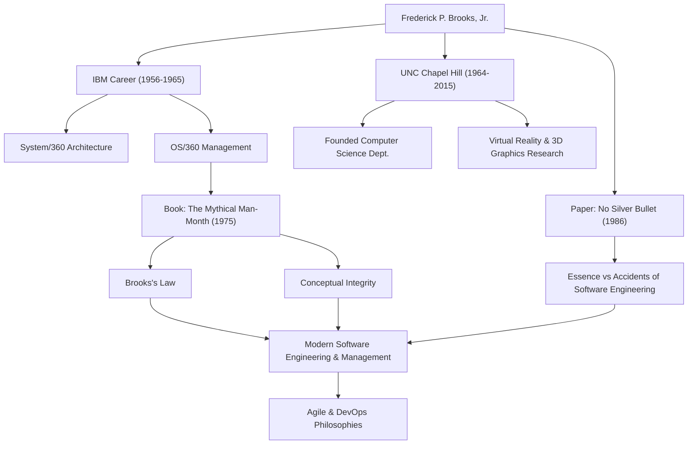

只要是从事软件开发的人，想必都曾听过这样一条定律：“向进度落后的软件项目增加人手，只会让项目更加落后。”这被称为“布鲁克斯定律”，是软件工程中最著名的格言之一。提出这一定律的人，正是计算机科学巨星、传奇的项目经理——弗雷德里克·P·布鲁克斯（Frederick P. Brooks, Jr.）。

本文将深入探讨对现代软件开发至今仍有着深远影响的布鲁克斯的一生，他留下的深邃哲学，以及对后世的影响。

## 卓越的才华与在IBM的挑战

弗雷德里克·布鲁克斯于1931年出生于美国北卡罗来纳州。他从小就对数学和科学表现出浓厚的兴趣，在杜克大学学习物理学之后，又在哈佛大学霍华德·艾肯的指导下获得了应用数学博士学位。

1956年加入IBM后，布鲁克斯很快就展现出了他的才华。他职业生涯中最大的转折点，是负责IBM赌上公司命运的庞大项目“System/360”系列的开发。布鲁克斯在担任硬件架构经理之后，被任命为软件操作系统“OS/360”的开发负责人（项目经理）。

OS/360是当时软件开发中规模和复杂程度史无前例的项目。尽管投入了数千人月的劳动力和巨额预算，但进度依然延误，并且被无数的漏洞所困扰。布鲁克斯指挥着这个艰难的项目，历经千辛万苦终于迎来了发布，但这段痛苦的经历和深刻的反思，造就了他日后对软件工程最大的贡献。

## 《人月神话》与布鲁克斯定律

基于在IBM的经验，他在1975年出版了名著《人月神话》（The Mythical Man-Month）。这本书是一本充满软件项目管理洞察力的散文集，至今仍是全世界工程师和管理者的必读圣经。

正是在这本书中，他提出了前文所述的“布鲁克斯定律”。他指出，软件开发并不像挖坑或刷漆那样，单纯增加人数就能更快完成。增加开发人员会带来培训新成员的成本，并且会导致沟通路径爆炸式增长，结果反而会使整个项目进度延误。这一定律精辟地指出了管理中违反直觉的真相。

他还从“概念完整性”（Conceptual Integrity）的角度解释了软件开发本质上的困难。系统必须基于一个连贯的单一设计理念来构建，为此，应该将设计交给少数优秀的“架构师”。这是论述当今软件架构重要性的先驱性思想。

## 没有银弹（No Silver Bullet）

1986年，布鲁克斯发表了另一篇具有里程碑意义的论文《没有银弹——软件工程的本质性与附属性工作》（No Silver Bullet - Essence and Accidents of Software Engineering）。

在这篇论文中，他将软件开发的困难分为“本质性困难”（Essence）和“附属性困难”（Accidents）。他断言，编程语言的进化和工具的改进只能解决附属性困难，而对于软件所要解决的问题本身的复杂性、一致性、可变性和不可见性等本质性困难，不存在能够像魔法一样瞬间解决的“银弹”。

这一主张为当时容易对新技术和工具抱有过度期待的IT行业，提供了一个极其现实和冷静的视角。软件开发将永远是一项需要人类智慧和艰苦努力的工作，他的这一洞察力，即使在敏捷开发和DevOps普及的今天，也丝毫没有褪色。

## 对学术界的贡献与后世的影响

离开IBM后，布鲁克斯于1964年在他的故乡北卡罗来纳大学教堂山分校（UNC）创立了计算机科学系，并在此担任教授多年。在这里，他不仅引领了软件工程领域的研究，还推动了计算机图形学和虚拟现实（VR）领域的先驱性研究，培养了大量优秀人才。特别是在科学可视化中，将分子结构进行3D可视化和操作的系统研究，对生物化学等领域产生了重大影响。

1999年，为表彰他在计算机体系结构、操作系统和软件工程方面做出的划时代贡献，他荣获了被誉为计算机科学界诺贝尔奖的“图灵奖”。

## 功绩与影响的关系图

下图展示了布鲁克斯的职业生涯及其对后世影响的联系。

## 结语

弗雷德里克·布鲁克斯于2022年与世长辞，享年91岁。然而，他留下的名言和思想，至今依然是软件工程师们的指南针。

他所阐述的不仅仅是技术理论。那是对人类在构建复杂系统时面临的“人类局限”，以及为克服这些局限所需的“组织与设计方式”的普遍洞察。他那句“没有银弹”，教会了我们脚踏实地的努力和深刻思考的重要性。对于所有从事软件行业的人来说，从布鲁克斯的足迹中可以学到的东西，将永远不会枯竭。
