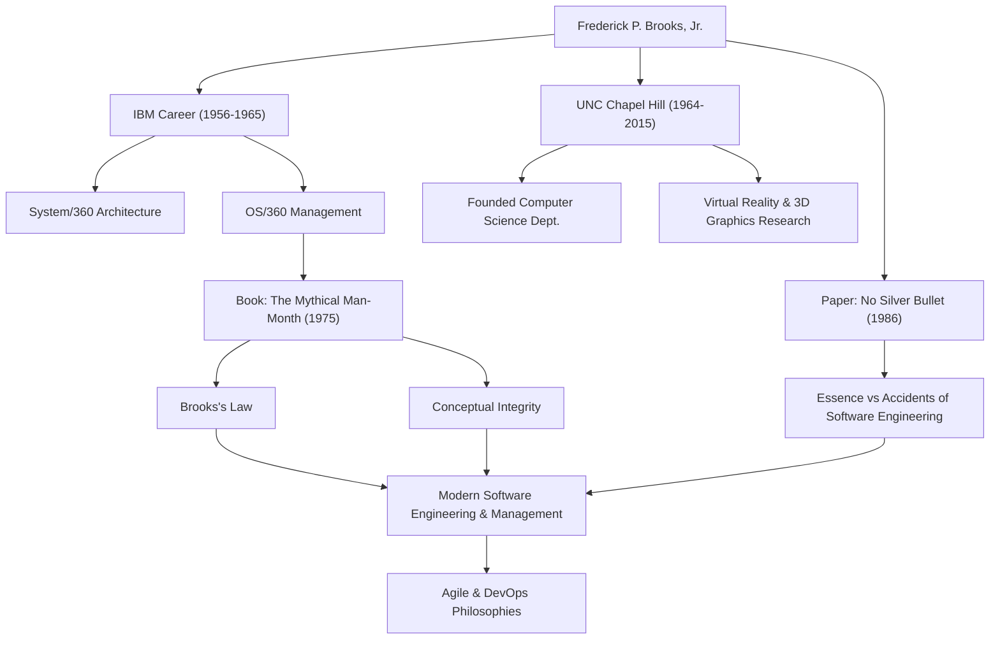

只要是從事軟體開發的人，想必都曾聽過這樣一條定律：「向進度落後的軟體專案增加人手，只會讓專案更加落後。」這被稱為「布魯克斯定律」，是軟體工程中最著名的格言之一。提出這一定律的人，正是計算機科學巨星、傳奇的專案經理——弗雷德里克·P·布魯克斯（Frederick P. Brooks, Jr.）。

本文將深入探討對現代軟體開發至今仍有著深遠影響的布魯克斯的一生，他留下的深邃哲學，以及對後世的影響。

## 卓越的才華與在IBM的挑戰

弗雷德里克·布魯克斯於1931年出生於美國北卡羅來納州。他從小就對數學和科學表現出濃厚的興趣，在杜克大學學習物理學之後，又在哈佛大學霍華德·艾肯的指導下獲得了應用數學博士學位。

1956年加入IBM後，布魯克斯很快就展現出了他的才華。他職業生涯中最大的轉折點，是負責IBM賭上公司命運的龐大專案「System/360」系列的開發。布魯克斯在擔任硬體架構經理之後，被任命為軟體作業系統「OS/360」的開發負責人（專案經理）。

OS/360是當時軟體開發中規模和複雜程度史無前例的專案。儘管投入了數千人月的勞動力和巨額預算，但進度依然延誤，並且被無數的漏洞所困擾。布魯克斯指揮著這個艱難的專案，歷經千辛萬苦終於迎來了發布，但這段痛苦的經歷和深刻的反思，造就了他日後對軟體工程最大的貢獻。

## 《人月神話》與布魯克斯定律

基於在IBM的經驗，他在1975年出版了名著《人月神話》（The Mythical Man-Month）。這本書是一本充滿軟體專案管理洞察力的散文集，至今仍是全世界工程師和管理者的必讀聖經。

正是在這本書中，他提出了前文所述的「布魯克斯定律」。他指出，軟體開發並不像挖坑或刷漆那樣，單純增加人數就能更快完成。增加開發人員會帶來培訓新成員的成本，並且會導致溝通路徑爆炸式增長，結果反而會使整個專案進度延誤。這一定律精闢地指出了管理中違反直覺的真相。

他還從「概念完整性」（Conceptual Integrity）的角度解釋了軟體開發本質上的困難。系統必須基於一個連貫的單一設計理念來構建，為此，應該將設計交給少數優秀的「架構師」。這是論述當今軟體架構重要性的先驅性思想。

## 沒有銀彈（No Silver Bullet）

1986年，布魯克斯發表了另一篇具有里程碑意義的論文《沒有銀彈——軟體工程的本質性與附屬性工作》（No Silver Bullet - Essence and Accidents of Software Engineering）。

在這篇論文中，他將軟體開發的困難分為「本質性困難」（Essence）和「附屬性困難」（Accidents）。他斷言，程式語言的進化和工具的改進只能解決附屬性困難，而對於軟體所要解決的問題本身的複雜性、一致性、可變性和不可見性等本質性困難，不存在能夠像魔法一樣瞬間解決的「銀彈」。

這一主張為當時容易對新技術和工具抱有過度期待的IT行業，提供了一個極其現實和冷靜的視角。軟體開發將永遠是一項需要人類智慧和艱苦努力的工作，他的這一洞察力，即使在敏捷開發和DevOps普及的今天，也絲毫沒有褪色。

## 對學術界的貢獻與後世的影響

離開IBM後，布魯克斯於1964年在他的故鄉北卡羅來納大學教堂山分校（UNC）創立了計算機科學系，並在此擔任教授多年。在這裡，他不僅引領了軟體工程領域的研究，還推動了計算機圖學和虛擬實境（VR）領域的先驅性研究，培養了大量優秀人才。特別是在科學視覺化中，將分子結構進行3D視覺化和操作的系統研究，對生物化學等領域產生了重大影響。

1999年，為表彰他在計算機體系結構、作業系統和軟體工程方面做出的劃時代貢獻，他榮獲了被譽為計算機科學界諾貝爾獎的「圖靈獎」。

## 功績與影響的關係圖

下圖展示了布魯克斯的職業生涯及其對後世影響的聯繫。

## 結語

弗雷德里克·布魯克斯於2022年與世長辭，享年91歲。然而，他留下的名言和思想，至今依然是軟體工程師們的指南針。

他所闡述的不僅僅是技術理論。那是對人類在構建複雜系統時面臨的「人類局限」，以及為克服這些局限所需的「組織與設計方式」的普遍洞察。他那句「沒有銀彈」，教會了我們腳踏實地的努力和深刻思考的重要性。對於所有從事軟體行業的人來說，從布魯克斯的足跡中可以學到的東西，將永遠不會枯竭。
