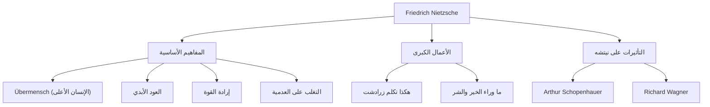

مرحبًا. اليوم، سوف نتعمق في حياة وفكر الفيلسوف فريدريك نيتشه، الذي اصطدم كنيزك ضخم بعالم الفلسفة في القرن التاسع عشر وكان له تأثير لا يقاس على الفكر الحديث.

"مات الإله" —— هذه العبارة الشهيرة لم تكن مجرد استفزاز، بل كانت إعلانًا عن تحول نموذجي هائل هز أسس الحضارة الغربية. لا تزال فلسفته تخضع لإعادة التقييم في سياق المجتمع التكنولوجي الحديث وتحقيق الذات الفردية.

## من سنواته الأولى إلى عبقري مبكر النضج

وُلد فريدريك فيلهلم نيتشه في 15 أكتوبر 1844 في قرية روكن الصغيرة في مملكة بروسيا (ألمانيا الحالية). نشأ في عائلة متدينة حيث خدمت أجيال كقساوسة لوثريين، لكنه فقد والده عندما كان في الخامسة من عمره. ستلقي هذه الخسارة بظلالها على تكوين فكره لاحقًا.

أظهر نيتشه ذكاءً استثنائيًا منذ طفولته وانغمس في اللغات الكلاسيكية والأدب في مدرسة بفورتا الداخلية المرموقة. درس فقه اللغة في جامعتي بون ولايبزيغ، وفي سن مبكرة جدًا (24 عامًا)، تم تعيينه أستاذًا استثنائيًا لفقه اللغة الكلاسيكية في جامعة بازل في سويسرا. إن تحول طالب لا يحمل حتى درجة الدكتوراه فجأة إلى أستاذ كان استثناءً غير عادي حتى في ذلك الوقت.

ومع ذلك، توسعت اهتماماته الأكاديمية تدريجيًا إلى ما وراء فقه اللغة نحو الفلسفة. في أول عمل تمثيلي له، "مولد التراجيديا"، صور الثقافة اليونانية القديمة على أنها صراع وتكامل بين "الأبولوني" (العقل/النظام) و"الديونيسي" (العاطفة/النشوة)، مما جعله عرضة لانتقادات شرسة من الأوساط الأكاديمية.

## الترحال المنعزل والصحوة نحو "الإنسان الأعلى"

بعد تعيينه كأستاذ، بدأ نيتشه يعاني من مشاكل صحية خطيرة (صداع شديد، فقدان البصر، واضطرابات الجهاز الهضمي). في عام 1879، عن عمر يناهز 34 عامًا، استقال أخيرًا من الجامعة وبدأ حياة بدوية منعزلة، متنقلاً من مكان إلى آخر في أوروبا (مثل سيلس ماريا في سويسرا وإيطاليا) بينما كان يتلقى معاشًا تقاعديًا.

ومن المفارقات أن هذا المرض والعزلة أصبحا الحافز الذي فجر إبداعه. رفض "الضغينة" (استياء الضعفاء من الأقوياء) وانتقد الأخلاق المسيحية بشدة واعتبرها "أخلاق العبيد".

تتويجًا لذلك كان كتاب "هكذا تكلم زرادشت". وفيه، قدم نيتشه المفاهيم الهامة التالية:

1. **موت الإله**: وصول عصر العدمية حيث انهارت القيم المطلقة والحقائق (الأخلاق المسيحية).
2. **الإنسان الأعلى (Übermensch)**: الشخصية الإنسانية المثالية التي تخلق، في عالم انهارت فيه القيم الحالية، قيمًا جديدة بإرادتها الخاصة وتعيش بقوة.
3. **العود الأبدي (Ewige Wiederkunft)**: النظرة الكونية القائلة بأن الكون يكرر نفس التاريخ تمامًا إلى ما لا نهاية دون أي غرض. كان يُعتبر التأكيد الكامل ومحبة هذا المصير القاسي الذي لا معنى له (حب القدر - Amor fati) شرطًا للإنسان الأعلى.
4. **إرادة القوة (Wille zur Macht)**: الدافع الأساسي الذي تمتلكه كل حياة للتغلب على نفسها وتصبح أقوى.

## مخطط ارتباط الأفكار وتدفق الإنجازات

تم تلخيص نظام تفكير نيتشه المعقد وعلاقات التأثير في المخطط التالي:

## الجنون والتأثير الهائل على الأجيال القادمة

في يناير 1889، في تورينو بإيطاليا، انهار نيتشه باكيًا عند رؤية حصان يُجلد في الشارع وأصيب بانهيار عقلي. ومنذ ذلك الحين وحتى وفاته عن عمر يناهز 55 عامًا في عام 1900، لم يستعد قواه العقلية أبدًا.

بعد وفاته، تم تحرير ملاحظاته الهائلة (المخطوطات بعد وفاته) بشكل تعسفي من قبل أخته إليزابيث، مما أدى إلى مأساة استخدامها من قبل معاداة السامية والتحسين الوراثي النازي. كان نيتشه نفسه يكره القومية ومعاداة السامية بشدة، ولكن بسبب هذا التشويه تراجعت سمعته مؤقتًا.

ومع ذلك، بعد الحرب، تقدمت دراسة النصوص الصارمة من قبل والتر كوفمان وغيره، وتمت استعادة أفكار نيتشه الأصلية. كان لأفكاره تأثير حاسم على الحركات الفكرية الكبرى في القرن العشرين، مثل الوجودية (سارتر، كامو)، التحليل النفسي (فرويد، يونغ)، وما بعد البنيوية (فوكو، دريدا، دولوز).

## أهمية نيتشه في العصر الحديث

في صناعة التكنولوجيا الحديثة، حيث يتم التأكيد على "الابتكار المزعزع" و"التحول الذاتي السريع"، يستمر موقف نيتشه المتمثل في "تدمير القيم الحالية وخلق قيم جديدة" في إلهام العديد من رواد الأعمال والمبدعين.

يسألنا نيتشه: "هل يمكنك تأكيد هذه الحياة حتى لو تكررت بنفس الطريقة تمامًا إلى ما لا نهاية، قائلاً: 'هل هذا هو ما تدور حوله الحياة؟ إذن مرة أخرى!'؟"

فريدريك نيتشه، الذي استمر في محاربة حدوده في العزلة وحاول رفع الروح البشرية إلى مستوى أعلى. يمكن القول إن الكلمات التي تركها تشرق أكثر في العصر الحديث، حيث أدى صعود الذكاء الاصطناعي إلى التساؤل عن معنى الوجود البشري مرة أخرى.
