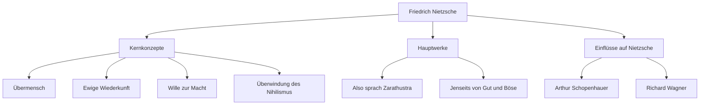

Hallo. Dieses Mal werden wir tief in das Leben und Denken von Friedrich Nietzsche eintauchen, einem Philosophen, der wie ein riesiger Meteorit in die philosophische Welt des 19. Jahrhunderts einschlug und einen unermesslichen Einfluss auf das moderne Denken ausübte.

„Gott ist tot“ – dieser allzu berühmte Satz war nicht nur eine Provokation, sondern die Erklärung eines epischen Paradigmenwechsels, der die Grundlagen der westlichen Zivilisation erschütterte. Seine Philosophie wird auch im Kontext der modernen Technologiegesellschaft und der individuellen Selbstverwirklichung immer wieder neu bewertet.

## Von den frühen Jahren zum frühreifen Genie

Friedrich Wilhelm Nietzsche wurde am 15. Oktober 1844 in dem kleinen Dorf Röcken im Königreich Preußen (im heutigen Deutschland) geboren. Er wuchs in einer frommen Familie auf, in der sein Vater und sein Großvater lutherische Pastoren waren, verlor jedoch seinen Vater im Alter von 5 Jahren. Dieser Verlust warf einen Schatten auf seine spätere ideologische Entwicklung.

Nietzsche zeigte schon früh außergewöhnliche Intelligenz und vertiefte sich im renommierten Internat Pforta in klassische Sprachen und Literatur. Er studierte Philologie an der Universität Bonn und der Universität Leipzig und wurde im Alter von nur 24 Jahren zum außerordentlichen Professor für klassische Philologie an der Universität Basel in der Schweiz ernannt. Dass ein Student ohne Doktortitel plötzlich Professor wurde, war selbst für die damalige Zeit höchst ungewöhnlich.

Sein akademisches Interesse ging jedoch allmählich über die Grenzen der Philologie hinaus und wandte sich der Philosophie zu. In seinem frühen Meisterwerk „Die Geburt der Tragödie“ beschrieb er die antike griechische Kultur als Konflikt und Integration zwischen dem „Apollinischen“ (Vernunft/Ordnung) und dem „Dionysischen“ (Emotion/Rausch), was aus der akademischen Welt auf heftige Kritik stieß.

## Einsame Wanderschaft und das Erwachen zum „Übermenschen“

Nach seiner Ernennung zum Professor begann Nietzsche unter schweren gesundheitlichen Problemen (heftige Kopfschmerzen, Sehverlust, Magen-Darm-Störungen) zu leiden. Im Jahr 1879, im Alter von 34 Jahren, trat er schließlich von der Universität zurück und begann ein einsames Wanderleben, wobei er durch Europa (darunter Sils Maria in der Schweiz und Italien) zog und eine Rente bezog.

Ironischerweise waren es gerade diese Krankheit und Einsamkeit, die als Katalysator für seine kreative Explosion wirkten. Er lehnte das „Ressentiment“ (den Groll der Schwachen gegenüber den Starken) ab und kritisierte die christliche Moral radikal als „Sklavenmoral“.

Der Höhepunkt all dessen war „Also sprach Zarathustra“. Darin präsentierte Nietzsche die folgenden wichtigen Konzepte:

1. **Der Tod Gottes**: Die Ankunft einer Ära des Nihilismus, in der absolute Werte und Wahrheiten (christliche Moral) zusammengebrochen sind.
2. **Übermensch**: Ein ideales Menschenbild, das in einer Welt, in der bestehende Werte zusammengebrochen sind, aus eigenem Willen neue Werte schafft und kraftvoll überlebt.
3. **Ewige Wiederkunft**: Die kosmologische Ansicht, dass das Universum die exakt gleiche Geschichte auf unbestimmte Zeit ohne Zweck wiederholt. Die Bejahung und Liebe zu diesem bedeutungslosen und grausamen Schicksal in seiner Gesamtheit (Amor fati) wurde als Bedingung für den Übermenschen angesehen.
4. **Wille zur Macht**: Der grundlegende Drang, den alles Leben hat, sich selbst zu überwinden und stärker zu werden.

## Korrelationsdiagramm des Denkens und Einflussfluss

Nietzsches komplexes Denksystem und seine Einflüsse sind im folgenden Diagramm zusammengefasst.

## Wahnsinn und der enorme Einfluss auf zukünftige Generationen

Im Januar 1889 weinte Nietzsche in Turin, Italien, und brach zusammen, als er sah, wie ein Pferd auf der Straße ausgepeitscht wurde, was zu einem geistigen Zusammenbruch führte. Danach, bis zu seinem Tod im Jahr 1900 im Alter von 55 Jahren, erlangte er nie wieder seinen Verstand zurück.

Nach seinem Tod wurden seine hinterlassenen umfangreichen Notizen (Nachlass) von seiner Schwester Elisabeth willkürlich bearbeitet, was zu der Tragödie führte, dass sie für den Antisemitismus und die Eugenik der Nazis verwendet wurden. Nietzsche selbst verabscheute Nationalismus und Antisemitismus zutiefst, aber aufgrund dieser Verzerrung fiel sein Ruf zeitweise auf einen Tiefpunkt.

Nach dem Krieg schritt jedoch die strenge Textforschung durch Gelehrte wie Walter Kaufmann voran und Nietzsches ursprüngliches Denken wurde wiederhergestellt. Sein Denken hatte einen entscheidenden Einfluss auf die wichtigsten intellektuellen Bewegungen des 20. Jahrhunderts, wie den Existenzialismus (Sartre, Camus), die Psychoanalyse (Freud, Jung) und den Poststrukturalismus (Foucault, Derrida, Deleuze).

## Nietzsches Bedeutung in der modernen Zeit

In der modernen Technologiebranche, in der „disruptive Innovation“ und „agile Selbsttransformation“ im Vordergrund stehen, inspiriert Nietzsches Haltung, „bestehende Werte zu zerstören und neue Werte zu schaffen“, weiterhin viele Unternehmer und Schöpfer.

Nietzsche fragt uns: „Könntest du, selbst wenn dieses Leben sich auf unbestimmte Zeit auf genau dieselbe Weise wiederholen würde, es bejahen, indem du sagst: ‚War das das Leben? Wohlan! Noch einmal!‘?“

Friedrich Nietzsche, der in seiner Einsamkeit weiterhin gegen seine eigenen Grenzen ankämpfte und versuchte, den menschlichen Geist auf eine höhere Ebene zu heben. Seine Worte leuchten noch heller in dieser modernen Zeit, in der KI aufsteigt und der Sinn der menschlichen Existenz neu hinterfragt wird.
