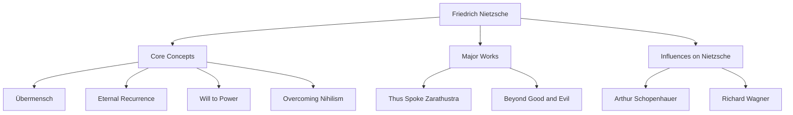

Hello. Today, we will delve deeply into the life and thoughts of Friedrich Nietzsche, a philosopher who struck the 19th-century philosophical world like a massive meteorite and has had an immeasurable impact on modern thought.

"God is dead"—this extremely famous phrase was not merely a provocation, but a declaration of a grand paradigm shift that shook the very foundations of Western civilization. His philosophy continues to be reevaluated in the context of modern technological society and individual self-realization.

## From Early Childhood to Precocious Genius

Friedrich Wilhelm Nietzsche was born on October 15, 1844, in Röcken, a small village in the Kingdom of Prussia (modern-day Germany). He grew up in a devout family with a long line of Lutheran pastors, but lost his father at the age of five. This loss would cast a shadow over the later formation of his thought.

Nietzsche demonstrated exceptional intelligence from a young age and immersed himself in classical languages and literature at the prestigious Schulpforta boarding school. He studied philology at the University of Bonn and the University of Leipzig, and at the tender age of 24, he was appointed as a special professor of classical philology at the University of Basel in Switzerland. For a student without even a doctorate to suddenly become a professor was extremely unprecedented, even at the time.

However, his academic interests gradually moved beyond the framework of philology towards philosophy. In his early masterpiece, *The Birth of Tragedy*, he depicted ancient Greek culture as a conflict and integration of the "Apollonian" (reason and order) and the "Dionysian" (emotion and intoxication), which drew fierce criticism from the academic community.

## Lonely Wandering and Awakening to the "Übermensch"

After taking up his professorship, Nietzsche began to suffer from severe health problems (intense headaches, failing eyesight, and gastrointestinal disorders). In 1879, at the age of 34, he finally resigned from the university and began a lonely wandering life, moving across Europe (such as Sils Maria in Switzerland and Italy) while receiving a pension.

Ironically, this illness and loneliness became the catalyst that exploded his creativity. He rejected "ressentiment" (the resentment of the weak towards the strong) and thoroughly criticized Christian morality as "slave morality."

The culmination of this is *Thus Spoke Zarathustra*. In this work, Nietzsche presented the following important concepts:

1. **The Death of God**: The arrival of an era of nihilism where absolute values and truths (Christian morality) have collapsed.
2. **Übermensch (Superman)**: An ideal human figure who, in a world where existing values have collapsed, creates new values through their own will and lives vigorously.
3. **Eternal Recurrence**: A cosmological view that the universe infinitely repeats the exact same history without purpose. Completely affirming and loving this meaningless and harsh fate (Amor fati) was considered the condition of the Übermensch.
4. **Will to Power**: The fundamental impulse in all life to overcome itself and become stronger.

## Concept Correlation Chart and Achievement Flow

Nietzsche's complex philosophical system and its influences are summarized in the diagram below.

## Madness and Massive Influence on Posterity

In January 1889, in Turin, Italy, Nietzsche broke down in tears seeing a horse being whipped in the street, leading to a mental collapse. From then until his death in 1900 at the age of 55, he never regained his sanity.

After his death, the massive amount of notes (posthumous manuscripts) he left behind were arbitrarily edited by his sister Elisabeth and tragically used for Nazi antisemitism and eugenics. Nietzsche himself fiercely loathed nationalism and antisemitism, but due to this distortion, his reputation temporarily plummeted.

However, after the war, rigorous textual research by Walter Kaufmann and others advanced, restoring Nietzsche's original philosophy. His thoughts had a decisive influence on major 20th-century philosophical movements such as existentialism (Sartre, Camus), psychoanalysis (Freud, Jung), and post-structuralism (Foucault, Derrida, Deleuze).

## The Significance of Nietzsche in the Modern Era

In the modern technology industry, where "disruptive innovation" and "agile self-transformation" are emphasized, Nietzsche's stance of "destroying existing values and creating new ones" continues to inspire many entrepreneurs and creators.

Nietzsche asks us: "If this life were to be repeated infinitely in exactly the same way, could you affirm it by saying, 'Is this what it means to live? Then once more!'?"

Friedrich Nietzsche continued to fight his own limits in solitude, attempting to push the human spirit to a higher level. It can be said that his remaining words shine even more brightly today, an era where AI is rising and the significance of human existence is being questioned anew.
