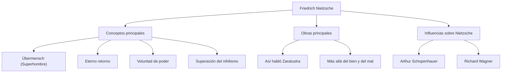

Hola. Hoy profundizaremos en la vida y el pensamiento del filósofo Friedrich Nietzsche, quien chocó como un enorme meteorito contra el mundo filosófico del siglo XIX y tuvo un impacto inmensurable en el pensamiento moderno.

"Dios ha muerto": esta frase tan famosa no fue una simple provocación, sino una declaración de un cambio de paradigma monumental que sacudió los cimientos de la civilización occidental. Su filosofía continúa siendo reevaluada en el contexto de la sociedad tecnológica moderna y la autorrealización individual.

## De sus primeros años a un genio precoz

Friedrich Wilhelm Nietzsche nació el 15 de octubre de 1844 en Röcken, un pequeño pueblo del Reino de Prusia (actual Alemania). Creció en una familia devota donde generaciones habían servido como pastores luteranos, pero perdió a su padre a la edad de 5 años. Esta pérdida arrojaría una sombra sobre la formación posterior de su pensamiento.

Nietzsche demostró un intelecto excepcional desde su infancia y se sumergió en las lenguas y la literatura clásicas en el prestigioso internado de Pforta. Estudió filología en las universidades de Bonn y Leipzig y, a la temprana edad de 24 años, fue nombrado profesor extraordinario de filología clásica en la Universidad de Basilea en Suiza. Que un estudiante sin siquiera un doctorado se convirtiera en profesor de repente era una excepción inusual incluso para la época.

Sin embargo, sus intereses académicos se expandieron gradualmente más allá de la filología hacia la filosofía. En su primera obra representativa, "El nacimiento de la tragedia", describió la cultura griega antigua como un conflicto e integración entre lo "apolíneo" (razón/orden) y lo "dionisíaco" (emoción/embriaguez), lo que le valió feroces críticas de la comunidad académica.

## Un deambular solitario y el despertar al "Superhombre"

Tras su nombramiento como profesor, Nietzsche comenzó a sufrir graves problemas de salud (fuertes dolores de cabeza, pérdida de visión y trastornos gastrointestinales). En 1879, a la edad de 34 años, finalmente renunció a la universidad y comenzó una vida solitaria de vagabundo, trasladándose de un lugar a otro por Europa (como Sils Maria en Suiza e Italia) mientras recibía una pensión.

Irónicamente, esta enfermedad y soledad se convirtieron en el catalizador que hizo explotar su creatividad. Rechazó el "ressentiment" (el resentimiento de los débiles hacia los fuertes) y criticó duramente la moral cristiana como una "moral de esclavos".

La culminación de esto es "Así habló Zaratustra". En ella, Nietzsche presentó los siguientes conceptos importantes:

1. **La muerte de Dios**: La llegada de una era de nihilismo en la que los valores absolutos y las verdades (la moral cristiana) se han derrumbado.
2. **El Superhombre (Übermensch)**: La figura humana ideal que, en un mundo donde los valores existentes han colapsado, crea nuevos valores a través de su propia voluntad y sobrevive con fuerza.
3. **El eterno retorno (Ewige Wiederkunft)**: La visión cosmológica de que el universo repite exactamente la misma historia infinitamente sin ningún propósito. Afirmar por completo y amar este destino sin sentido y cruel (Amor fati: amor al destino) se consideraba la condición del Superhombre.
4. **La voluntad de poder (Wille zur Macht)**: El impulso fundamental que tiene toda vida de superarse a sí misma y ser más fuerte.

## Diagrama de correlación de pensamientos y flujo de logros

El complejo sistema de pensamiento y las relaciones de influencia de Nietzsche se resumen en el siguiente diagrama:

## Locura y el enorme impacto en las generaciones posteriores

En enero de 1889, en Turín, Italia, Nietzsche se echó a llorar al ver a un caballo siendo azotado en la calle y sufrió un colapso mental. A partir de entonces, hasta su muerte a la edad de 55 años en 1900, nunca recuperó la cordura.

Tras su muerte, sus vastas notas (manuscritos póstumos) fueron editadas arbitrariamente por su hermana Elisabeth, lo que resultó en la tragedia de ser utilizadas por el antisemitismo y la eugenesia nazi. El propio Nietzsche detestaba ferozmente el nacionalismo y el antisemitismo, pero esta distorsión hizo que su reputación cayera en picado temporalmente.

Sin embargo, después de la guerra, el riguroso estudio de textos de Walter Kaufmann y otros progresó, y el pensamiento original de Nietzsche fue restaurado. Sus ideas tuvieron un impacto decisivo en los principales movimientos intelectuales del siglo XX, como el existencialismo (Sartre, Camus), el psicoanálisis (Freud, Jung) y el postestructuralismo (Foucault, Derrida, Deleuze).

## La importancia de Nietzsche en la actualidad

En la industria tecnológica moderna, donde se enfatizan la "innovación disruptiva" y la "autotransformación ágil", la actitud de Nietzsche de "destruir los valores existentes y crear nuevos valores" continúa inspirando a muchos emprendedores y creadores.

Nietzsche nos pregunta: "¿Puedes afirmar esta vida incluso si se repite exactamente de la misma manera infinitamente, diciendo: '¿Es esto de lo que se trata la vida? ¡Entonces una vez más!'?"

Friedrich Nietzsche, quien continuó luchando contra sus propias limitaciones en la soledad e intentó elevar el espíritu humano a un plano superior. Se puede decir que sus palabras brillan aún más en la era moderna, donde el auge de la IA está haciendo que se cuestione una vez más el significado de la existencia humana.
