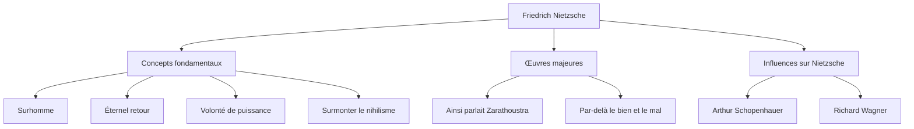

Bonjour. Aujourd'hui, nous allons plonger profondément dans la vie et la pensée de Friedrich Nietzsche, un philosophe qui a frappé le monde philosophique du 19ème siècle comme une météorite géante et a eu un impact incommensurable sur la pensée moderne.

« Dieu est mort » —— cette phrase trop célèbre n'était pas une simple provocation, mais la déclaration d'un changement de paradigme épique qui a ébranlé les fondations de la civilisation occidentale. Sa philosophie continue d'être réévaluée dans le contexte de la société technologique moderne et de la réalisation de soi de l'individu.

## Des débuts à un génie précoce

Friedrich Wilhelm Nietzsche est né le 15 octobre 1844 à Röcken, un petit village du Royaume de Prusse (aujourd'hui en Allemagne). Élevé dans une famille pieuse où l'on était pasteurs luthériens de génération en génération, il perd son père à l'âge de 5 ans. Cette perte jettera une ombre sur la formation de sa pensée ultérieure.

Dès son enfance, Nietzsche fait preuve d'une intelligence exceptionnelle et se plonge dans les langues classiques et la littérature au prestigieux pensionnat de Pforta. Il étudie la philologie aux universités de Bonn et de Leipzig, et, à peine âgé de 24 ans, il est nommé professeur extraordinaire de philologie classique à l'université de Bâle, en Suisse. Le fait qu'un étudiant sans doctorat devienne soudainement professeur était une exception absolue, même à cette époque.

Cependant, ses intérêts académiques dépassent progressivement le cadre de la philologie pour se tourner vers la philosophie. Dans sa première œuvre majeure, *La Naissance de la tragédie*, il décrit la culture de la Grèce antique comme un conflit et une intégration de l'« apollinien » (raison/ordre) et du « dionysiaque » (émotion/ivresse), et subit de féroces critiques de la part du monde académique.

## Errance solitaire et éveil au « Surhomme »

Après sa nomination comme professeur, Nietzsche commence à souffrir de graves problèmes de santé (maux de tête violents, perte de la vue, troubles gastro-intestinaux). En 1879, à l'âge de 34 ans, il démissionne finalement de l'université et entame une vie d'errance solitaire, voyageant à travers l'Europe (comme à Sils-Maria en Suisse ou en Italie) tout en percevant une pension.

Ironiquement, c'est cette maladie et cette solitude qui ont été les catalyseurs faisant exploser sa créativité. Il rejette le « ressentiment » (la rancune des faibles envers les forts) et critique radicalement la morale chrétienne en tant que « morale d'esclave ».

L'apogée de sa réflexion est *Ainsi parlait Zarathoustra*. Dans cet ouvrage, Nietzsche présente les concepts clés suivants :

1. **La mort de Dieu** : L'avènement d'une ère de nihilisme où les valeurs et vérités absolues (la morale chrétienne) se sont effondrées.
2. **Le Surhomme (Übermensch)** : L'idéal humain qui, dans un monde où les valeurs existantes se sont effondrées, crée de nouvelles valeurs par sa propre volonté et vit avec force.
3. **L'Éternel retour (Ewige Wiederkunft)** : La vision cosmique selon laquelle l'univers répète sans fin exactement la même histoire, sans aucun but. Affirmer et aimer entièrement ce destin impitoyable et dénué de sens (Amor fati : l'amour du destin) était considéré comme la condition du Surhomme.
4. **La volonté de puissance (Wille zur Macht)** : L'impulsion fondamentale qu'a toute vie à se surmonter et à devenir plus forte.

## Diagramme de corrélation des idées et flux des accomplissements

Le système de pensée complexe de Nietzsche et ses influences sont résumés dans le diagramme suivant.

## Folie et impact colossal sur la postérité

En janvier 1889, à Turin en Italie, Nietzsche s'effondre en larmes en voyant un cheval se faire fouetter dans la rue, ce qui provoque son effondrement mental. Par la suite, jusqu'à sa mort en 1900 à l'âge de 55 ans, il ne recouvra jamais la raison.

Après sa mort, ses volumineuses notes laissées (écrits posthumes) ont été arbitrairement éditées par sa sœur Elisabeth et ont été tragiquement utilisées pour l'antisémitisme et l'eugénisme nazi. Nietzsche lui-même détestait violemment le nationalisme et l'antisémitisme, mais cette distorsion a temporairement fait chuter sa réputation.

Cependant, après la guerre, des recherches textuelles rigoureuses menées par Walter Kaufmann et d'autres ont progressé, et la pensée originelle de Nietzsche a été réhabilitée. Sa philosophie a eu une influence décisive sur les principaux mouvements intellectuels du 20ème siècle tels que l'existentialisme (Sartre, Camus), la psychanalyse (Freud, Jung) et le post-structuralisme (Foucault, Derrida, Deleuze).

## La signification de Nietzsche à l'époque moderne

Dans l'industrie technologique moderne, où « l'innovation de rupture » et la « transformation personnelle agile » sont valorisées, l'attitude de Nietzsche consistant à « détruire les valeurs existantes et créer de nouvelles valeurs » continue d'inspirer de nombreux entrepreneurs et créateurs.

Nietzsche nous interroge : « Peux-tu affirmer cette vie, même si elle devait se répéter à l'infini exactement de la même manière, en disant : 'C'est donc ça la vie ? Eh bien, encore une fois !' ? »

Friedrich Nietzsche, qui a continué à lutter contre ses propres limites dans la solitude et a tenté d'élever l'esprit humain vers de nouveaux sommets. On peut dire que les mots qu'il a laissés brillent d'un éclat encore plus vif dans le monde d'aujourd'hui, où l'IA émerge et où le sens de l'existence humaine est à nouveau remis en question.
