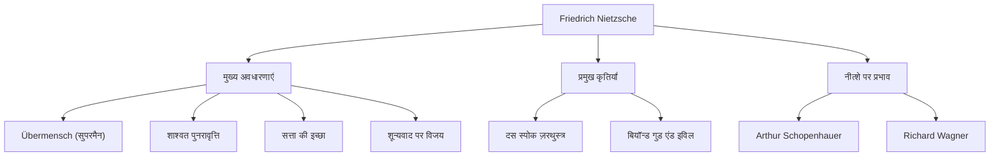

नमस्ते। आज हम फ्रेडरिक नीत्शे (Friedrich Nietzsche) के जीवन और विचारों पर गहराई से विचार करेंगे, एक दार्शनिक जो 19वीं सदी के दर्शनशास्त्र की दुनिया में एक विशाल उल्कापिंड की तरह टकराए और जिनका आधुनिक विचारों पर अकल्पनीय प्रभाव पड़ा।

"ईश्वर मर चुका है" —— यह अत्यंत प्रसिद्ध वाक्य मात्र कोई उकसावा नहीं था, बल्कि एक विशाल प्रतिमान बदलाव (paradigm shift) की घोषणा थी जिसने पश्चिमी सभ्यता की नींव को हिलाकर रख दिया। उनके दर्शन का आधुनिक तकनीकी समाज और व्यक्तिगत आत्म-साक्षात्कार के संदर्भ में आज भी पुनर्मूल्यांकन किया जा रहा है।

## प्रारंभिक जीवन से लेकर एक अकाल-प्रौढ़ प्रतिभा तक

फ्रेडरिक विल्हेम नीत्शे का जन्म 15 अक्टूबर 1844 को प्रशिया साम्राज्य (वर्तमान जर्मनी) के एक छोटे से गाँव रॉकेन में हुआ था। वह एक ऐसे धार्मिक परिवार में पले-बढ़े जहाँ पीढ़ियों ने लूथरन पादरी के रूप में काम किया था, लेकिन जब वह 5 वर्ष के थे तब उन्होंने अपने पिता को खो दिया। इस नुकसान ने बाद में उनके विचारों के गठन पर एक गहरी छाप छोड़ी।

नीत्शे ने बचपन से ही असाधारण बुद्धि का प्रदर्शन किया और प्रतिष्ठित फोर्टा (Pforta) बोर्डिंग स्कूल में शास्त्रीय भाषाओं और साहित्य में खुद को डुबो दिया। उन्होंने बॉन और लीपज़िग विश्वविद्यालयों में भाषाशास्त्र (philology) का अध्ययन किया, और केवल 24 वर्ष की कम उम्र में, स्विट्जरलैंड के बासेल विश्वविद्यालय में शास्त्रीय भाषाशास्त्र के असाधारण प्रोफेसर के रूप में नियुक्त किए गए। एक छात्र का, जिसके पास डॉक्टरेट की उपाधि भी नहीं थी, अचानक प्रोफेसर बन जाना उस समय भी एक बहुत ही असामान्य बात थी।

हालाँकि, उनकी शैक्षणिक रुचियाँ धीरे-धीरे भाषाशास्त्र की सीमाओं से परे दर्शन की ओर बढ़ने लगीं। अपनी पहली प्रमुख कृति, "द बर्थ ऑफ ट्रेजेडी" (The Birth of Tragedy) में, उन्होंने प्राचीन ग्रीक संस्कृति को "अपोलोनियन" (तर्क और व्यवस्था) और "डायोनिसियन" (भावना और मादकता) के बीच संघर्ष और एकीकरण के रूप में चित्रित किया, जिसके लिए उन्हें अकादमिक दुनिया से भयंकर आलोचना का सामना करना पड़ा।

## एकान्त भटकन और "सुपरमैन" (Übermensch) की ओर जागरण

प्रोफेसर बनने के बाद, नीत्शे को गंभीर स्वास्थ्य समस्याओं (गंभीर सिरदर्द, कम होती दृष्टि, और गैस्ट्रोइंटेस्टाइनल विकार) का सामना करना पड़ा। 1879 में, 34 वर्ष की आयु में, उन्होंने अंततः विश्वविद्यालय से इस्तीफा दे दिया और पेंशन प्राप्त करते हुए यूरोप के विभिन्न स्थानों (जैसे स्विट्जरलैंड में सिल्स मारिया और इटली) में एकान्त खानाबदोश जीवन बिताना शुरू किया।

विडंबना यह है कि यह बीमारी और एकान्त ही वह उत्प्रेरक बन गया जिसने उनकी रचनात्मकता को प्रज्वलित कर दिया। उन्होंने "रेसेंटिमेंट" (ressentiment - बलवानों के प्रति दुर्बलों की नाराजगी) को खारिज कर दिया और ईसाई नैतिकता की "गुलाम नैतिकता" के रूप में कड़ी आलोचना की।

इसकी परिणति "दस स्पोक ज़रथुस्त्र" (Thus Spoke Zarathustra) में हुई। इसमें, नीत्शे ने निम्नलिखित महत्वपूर्ण अवधारणाएँ प्रस्तुत कीं:

1. **ईश्वर की मृत्यु**: शून्यवाद (nihilism) के युग का आगमन जहां पूर्ण मूल्य और सत्य (ईसाई नैतिकता) ढह गए हैं।
2. **सुपरमैन (Übermensch)**: वह आदर्श मानव जो, एक ऐसी दुनिया में जहां मौजूदा मूल्य ढह गए हैं, अपनी इच्छा से नए मूल्य बनाता है और मजबूती से जीवित रहता है।
3. **शाश्वत पुनरावृत्ति (Ewige Wiederkunft)**: यह ब्रह्माण्ड संबंधी दृष्टिकोण कि ब्रह्मांड बिना किसी उद्देश्य के असीम रूप से बिल्कुल उसी इतिहास को दोहराता है। इस अर्थहीन और क्रूर भाग्य को पूरी तरह से स्वीकार करना और उससे प्रेम करना (अमोर फाती - Amor fati: भाग्य से प्रेम) सुपरमैन की शर्त मानी जाती थी।
4. **सत्ता की इच्छा (Wille zur Macht)**: वह मूलभूत आवेग जो हर जीवन में स्वयं को दूर करने और अधिक मजबूत होने के लिए होता है।

## विचारों का सहसंबंध आरेख और उपलब्धियों का प्रवाह

नीत्शे की जटिल विचार प्रणाली और प्रभाव संबंधों को निम्नलिखित आरेख में संक्षेपित किया गया极:

## पागलपन, और आने वाली पीढ़ियों पर विशाल प्रभाव

जनवरी 1889 में, ट्यूरिन, इटली में, नीत्शे सड़क पर कोड़े मारे जा रहे एक घोड़े को देखकर रो पड़े और उनका मानसिक संतुलन बिगड़ गया। इसके बाद, 1900 में 55 वर्ष की आयु में अपनी मृत्यु तक, उन्होंने कभी अपना मानसिक संतुलन वापस नहीं पाया।

उनकी मृत्यु के बाद, उनके छोड़े गए विशाल नोट्स (मरणोपरांत पांडुलिपियां) उनकी बहन एलिज़ाबेथ द्वारा मनमाने ढंग से संपादित किए गए थे, जिसके परिणामस्वरूप नाजी यहूदी-विरोधी और सुजनन (eugenics) द्वारा उनका उपयोग किए जाने की त्रासदी हुई। नीत्शे स्वयं राष्ट्रवाद और यहूदी-विरोधी का घोर विरोध करते थे, लेकिन इस विकृति के कारण उनकी प्रतिष्ठा अस्थायी रूप से गिर गई।

हालाँकि, युद्ध के बाद, वाल्टर कॉफ़मैन और अन्य लोगों द्वारा कठोर पाठ्य शोध आगे बढ़ा, और नीत्शे के मूल विचारों को बहाल किया गया। उनके विचारों का 20वीं सदी के प्रमुख बौद्धिक आंदोलनों, जैसे अस्तित्ववाद (सार्त्र, कामू), मनोविश्लेषण (फ्रायड, जुंग), और उत्तर-संरचनावाद (फौकॉल्ट, डेरिडा, डेल्यूज़) पर निर्णायक प्रभाव पड़ा।

## आधुनिक युग में नीत्शे का महत्व

आधुनिक तकनीकी उद्योग में, जहाँ "विघटनकारी नवाचार" (disruptive innovation) और "तीव्र आत्म-परिवर्तन" (agile self-transformation) पर जोर दिया जाता है, नीत्शे का "मौजूदा मूल्यों को नष्ट करने और नए मूल्य बनाने" का दृष्टिकोण कई उद्यमियों और रचनाकारों को प्रेरित करता रहता है।

नीत्शे हमसे पूछते हैं: "क्या तुम इस जीवन को स्वीकार कर सकते हो, भले ही यह असीम रूप से बिल्कुल उसी तरह दोहराया जाए, यह कहते हुए: 'क्या यही जीवन है? तो एक बार और!'?"

फ्रेडरिक नीत्शे, जो अकेलेपन में अपनी सीमाओं से लड़ते रहे और मानव भावना को एक उच्च स्तर पर ले जाने का प्रयास किया। यह कहा जा सकता है कि उनके छोड़े गए शब्द आधुनिक युग में और भी अधिक चमक रहे हैं, जहाँ AI के उदय से मानव अस्तित्व के अर्थ पर फिर से सवाल उठाया जा रहा है।
