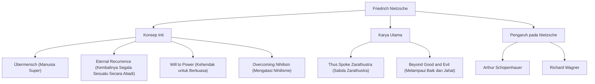

Halo. Kali ini, kita akan menggali lebih dalam tentang kehidupan dan pemikiran Friedrich Nietzsche, seorang filsuf yang menabrak dunia filsafat abad ke-19 seperti meteor raksasa dan memberikan pengaruh yang tak terukur pada pemikiran modern.

"Tuhan telah mati" - ungkapan yang sangat terkenal ini bukan sekadar provokasi, melainkan sebuah deklarasi tentang pergeseran paradigma epik yang mengguncang fondasi peradaban Barat. Filsafatnya terus dievaluasi ulang bahkan dalam konteks masyarakat teknologi modern dan realisasi diri individu.

## Dari Masa Kecil Hingga Menjadi Jenius yang Cepat Matang

Friedrich Wilhelm Nietzsche lahir pada tanggal 15 Oktober 1844, di desa kecil Röcken di Kerajaan Prusia (sekarang Jerman). Ia dibesarkan dalam keluarga religius yang taat di mana ayah dan kakeknya menjabat sebagai pendeta Lutheran, tetapi kehilangan ayahnya pada usia 5 tahun. Kehilangan ini memberikan bayangan pada pembentukan pemikirannya di kemudian hari.

Nietzsche menunjukkan kecerdasan yang luar biasa sejak usia dini, dan membenamkan dirinya dalam bahasa dan sastra klasik di sekolah asrama Pforta yang bergengsi. Ia belajar filologi di Universitas Bonn dan Universitas Leipzig, dan pada usia yang sangat muda, 24 tahun, ia diangkat sebagai profesor luar biasa untuk filologi klasik di Universitas Basel di Swiss. Fakta bahwa seorang mahasiswa tanpa gelar doktor tiba-tiba menjadi profesor merupakan hal yang sangat tidak biasa, bahkan pada masa itu.

Namun, minat akademisnya perlahan-lahan melampaui batas-batas filologi dan beralih ke filsafat. Dalam mahakarya awalnya "Lahirnya Tragedi", ia menggambarkan budaya Yunani kuno sebagai konflik dan integrasi antara "Apollonian" (rasio/keteraturan) dan "Dionysian" (emosi/kemabukan), yang menuai kritik keras dari dunia akademis.

## Pengembaraan yang Sepi dan Kebangkitan Menuju "Manusia Super"

Setelah diangkat menjadi profesor, Nietzsche mulai menderita masalah kesehatan yang parah (sakit kepala hebat, kehilangan penglihatan, gangguan pencernaan). Pada tahun 1879, pada usia 34 tahun, ia akhirnya mengundurkan diri dari universitas dan memulai kehidupan pengembaraan yang sepi, berpindah dari satu tempat ke tempat lain di Eropa (termasuk Sils Maria di Swiss dan Italia) sambil menerima uang pensiun.

Ironisnya, penyakit dan kesepian inilah yang menjadi katalisator bagi ledakan kreativitasnya. Ia menolak "ressentiment" (kebencian yang lemah terhadap yang kuat) dan secara radikal mengkritik moralitas Kristen sebagai "moralitas budak".

Puncak dari semua ini adalah "Sabda Zarathustra". Di dalamnya, Nietzsche menyajikan konsep-konsep penting berikut:

1. **Kematian Tuhan**: Kedatangan era nihilisme di mana nilai-nilai dan kebenaran mutlak (moralitas Kristen) telah runtuh.
2. **Manusia Super (Übermensch)**: Sosok manusia ideal yang, di dunia di mana nilai-nilai yang ada telah runtuh, menciptakan nilai-nilai baru atas kemauannya sendiri dan bertahan hidup dengan kuat.
3. **Kembalinya Segala Sesuatu Secara Abadi (Ewige Wiederkunft)**: Pandangan kosmologis bahwa alam semesta mengulang sejarah yang sama persis tanpa batas waktu tanpa tujuan. Mengafirmasi dan mencintai takdir yang tak bermakna dan kejam ini secara keseluruhan (Amor fati) dianggap sebagai kondisi bagi Übermensch.
4. **Kehendak untuk Berkuasa (Wille zur Macht)**: Dorongan mendasar yang dimiliki semua kehidupan untuk mengatasi diri sendiri dan menjadi lebih kuat.

## Diagram Korelasi Pemikiran dan Alur Pengaruh

Pemikiran sistematis Nietzsche yang kompleks dan hubungan pengaruhnya dirangkum dalam diagram berikut.

## Kegilaan dan Pengaruh Besar pada Generasi Mendatang

Pada bulan Januari 1889, di Turin, Italia, Nietzsche menangis dan pingsan melihat seekor kuda dicambuk di jalan, yang menyebabkan gangguan mental. Setelah itu, sampai kematiannya pada tahun 1900 di usia 55 tahun, ia tidak pernah mendapatkan kembali kewarasannya.

Setelah kematiannya, banyak catatan (manuskrip) yang ditinggalkannya diedit secara sewenang-wenang oleh saudara perempuannya Elisabeth, yang mengakibatkan tragedi karena catatan tersebut digunakan untuk anti-Semitisme dan eugenika Nazi. Nietzsche sendiri sangat membenci nasionalisme dan anti-Semitisme, tetapi karena distorsi ini, reputasinya sempat jatuh ke titik terendah.

Namun, setelah perang, penelitian teks yang ketat oleh cendekiawan seperti Walter Kaufmann berkembang, dan pemikiran asli Nietzsche dipulihkan. Pemikirannya memberikan pengaruh yang menentukan pada gerakan intelektual utama abad ke-20, seperti eksistensialisme (Sartre, Camus), psikoanalisis (Freud, Jung), dan pascastrukturalisme (Foucault, Derrida, Deleuze).

## Relevansi Nietzsche di Era Modern

Di industri teknologi modern, di mana "inovasi disruptif" dan "transformasi diri yang tangkas" ditekankan, sikap Nietzsche tentang "menghancurkan nilai-nilai yang ada dan menciptakan nilai-nilai baru" terus menginspirasi banyak pengusaha dan kreator.

Nietzsche bertanya kepada kita: "Apakah Anda, bahkan jika hidup ini diulang tanpa batas waktu dengan cara yang sama persis, dapat mengafirmasinya dengan mengatakan, 'Apakah ini yang namanya hidup? Kalau begitu, sekali lagi!'?"

Friedrich Nietzsche, yang terus berjuang melawan keterbatasannya sendiri dalam kesepian dan mencoba mendorong semangat manusia ke tingkat yang lebih tinggi. Kata-katanya bersinar lebih terang di era modern ini, di mana AI bangkit dan makna keberadaan manusia dipertanyakan kembali.
