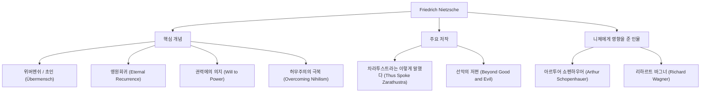

안녕하세요. 이번에는 19세기 철학계에 거대한 운석처럼 충돌하여 현대 사상에 헤아릴 수 없는 영향을 미친 철학자 프리드리히 니체(Friedrich Nietzsche)의 생애와 그 사상에 대해 깊이 파헤쳐 보겠습니다.

"신은 죽었다"——이 너무나도 유명한 문구는 단순한 도발이 아니라 서구 문명의 근간을 뒤흔든 장대한 패러다임 전환의 선언이었습니다. 그의 철학은 현대의 기술 사회나 개인의 자아실현이라는 맥락에서도 계속해서 재평가받고 있습니다.

## 성장 과정에서 조숙한 천재로

프리드리히 빌헬름 니체는 1844년 10월 15일, 프로이센 왕국(현재의 독일)의 작은 마을 뢰켄에서 태어났습니다. 대대로 루터교 목사를 지낸 독실한 가정에서 자랐으나 5세 때 아버지를 여의었습니다. 이 상실은 훗날 그의 사상 형성에 그림자를 드리우게 됩니다.

니체는 어린 시절부터 남다른 지성을 발휘하여 명문 프포르타 기숙학교에서 고전문어와 문학에 몰두했습니다. 본 대학과 라이프치히 대학에서 문헌학을 공부하고, 불과 24세의 나이로 스위스 바젤 대학의 고전문헌학 특임 교수로 발탁됩니다. 박사 학위조차 없는 학생이 갑자기 교수가 된다는 것은 당시로서도 이례적인 일이었습니다.

그러나 그의 학문적 관심은 점차 문헌학의 틀을 넘어 철학으로 향합니다. 초기 대표작 『비극의 탄생』에서는 고대 그리스 문화를 '아폴론적(이성·질서)'과 '디오니소스적(정동·도취)'의 대립과 통합으로 그려내어 학계로부터 맹렬한 비판을 받았습니다.

## 고독한 방랑과 '초인'으로의 각성

교수 취임 후 니체는 심각한 건강 문제(극심한 두통, 시력 저하, 위장 장애)에 시달리게 됩니다. 1879년, 34세의 나이로 마침내 대학을 사임하고 연금을 받으며 유럽 각지(스위스의 실스마리아, 이탈리아 등)를 전전하는 고독한 방랑 생활에 들어갔습니다.

아이러니하게도 이 병고와 고독이야말로 그의 창조력을 폭발시키는 기폭제가 되었습니다. 그는 '르상티망(강자에 대한 약자의 원한)'을 물리치고 기독교적 도덕을 '노예 도덕'으로 철저히 비판합니다.

그 집대성이라고 할 수 있는 것이 『차라투스트라는 이렇게 말했다』입니다. 이 책에서 니체는 다음과 같은 중요한 개념을 제시했습니다.

1. **신의 죽음**: 절대적인 가치관이나 진리(기독교적 도덕)가 붕괴한 허무주의(니힐리즘) 시대의 도래.
2. **초인(Übermensch)**: 기존의 가치관이 붕괴한 세계에서 자신의 의지로 새로운 가치를 창조하고 굳세게 살아가는 이상적인 인간상.
3. **영원회귀(Ewige Wiederkunft)**: 우주는 목적도 없이 완전히 똑같은 역사를 무한히 반복한다는 우주관. 이 무의미하고 가혹한 운명을 통째로 긍정하고 사랑하는 것(운명애: Amor fati)이야말로 초인의 조건으로 여겨졌습니다.
4. **권력에의 의지(힘에의 의지, Wille zur Macht)**: 모든 생명이 근원적으로 지니는, 자기 자신을 극복하고 더 강해지려는 충동.

## 사상의 상관도와 공적 흐름

니체의 복잡한 사상 체계와 영향 관계를 다음 표로 정리했습니다.

## 발광, 그리고 후세에 미친 거대한 영향

1889년 1월, 이탈리아 토리노에서 니체는 길거리에서 채찍질을 당하는 말을 보고 오열하며 쓰러졌고, 그대로 정신 붕괴를 일으킵니다. 이후 1900년 55세의 나이로 세상을 떠날 때까지 그는 제정신을 되찾지 못했습니다.

그가 죽은 후 남겨진 방대한 메모(유고)는 여동생 엘리자베트에 의해 자의적으로 편집되어 나치의 반유대주의와 우생학에 이용되는 비극을 낳았습니다. 니체 자신은 국가주의나 반유대주의를 몹시 혐오했지만, 이 왜곡으로 인해 한때 그의 평가는 바닥으로 떨어집니다.

그러나 전후 발터 카우프만 등에 의한 엄밀한 텍스트 연구가 진행되면서 니체의 본래 사상이 복권됩니다. 그의 사상은 실존주의(사르트르, 카뮈), 정신분석학(프로이트, 융), 포스트구조주의(푸코, 데리다, 들뢰즈) 등 20세기의 주요 사상 운동에 결정적인 영향을 미쳤습니다.

## 현대에 있어서 니체의 의의

현대의 기술 업계에서 '파괴적 혁신'이나 '애자일한 자기 변혁'이 중시되는 가운데, 니체의 '기존의 가치를 파괴하고 새로운 가치를 창조한다'는 자세는 많은 창업가와 크리에이터에게 끊임없이 영감을 주고 있습니다.

니체는 우리에게 묻습니다. "너는 이 삶이 완전히 똑같이 무한히 반복된다고 해도, 그것을 '이것이 삶이라는 것인가, 그렇다면 한 번 더!'라고 긍정할 수 있는가?"라고요.

고독 속에서 자신의 한계와 계속 싸우며 인류의 정신을 한 단계 높은 곳으로 끌어올리려 했던 프리드리히 니체. 그가 남긴 말은 AI가 대두하고 인간 존재의 의의가 다시금 묻혀지는 현대에 이르러서야말로 더욱 빛을 발하고 있다고 할 수 있을 것입니다.
