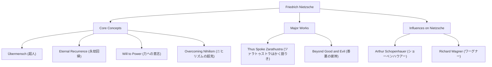

こんにちは。今回は、19世紀の哲学界に巨大な隕石のように衝突し、現代思想に計り知れない影響を与えた哲学者、フリードリヒ・ニーチェ（Friedrich Nietzsche）の生涯とその思想について深く掘り下げていきます。

「神は死んだ」——このあまりにも有名なフレーズは、単なる挑発ではなく、西洋文明の根幹を揺るがす壮大なパラダイムシフトの宣言でした。彼の哲学は、現代のテクノロジー社会や個人の自己実現の文脈でも再評価され続けています。

## 生い立ちから早熟の天才へ

フリードリヒ・ヴィルヘルム・ニーチェは、1844年10月15日、プロイセン王国（現在のドイツ）の小村レッケンで生まれました。代々ルター派の牧師を務める敬虔な家庭に育ちましたが、5歳の時に父を亡くします。この喪失は、後の彼の思想形成に影を落とすことになります。

ニーチェは幼少期から類まれな知性を発揮し、名門プフォルタ寄宿学校で古典語や文学に没頭しました。ボン大学、ライプツィヒ大学で文献学を学び、弱冠24歳にしてスイスのバーゼル大学で古典文献学の特任教授に抜擢されます。博士号すら持たない学生がいきなり教授になるというのは、当時としても異例中の異例でした。

しかし、彼の学問的関心は次第に文献学の枠を超え、哲学へと向かいます。初期の代表作『悲劇の誕生』では、古代ギリシア文化を「アポロン的（理性・秩序）」と「ディオニュソス的（情動・陶酔）」の対立と統合として描き、学界から猛烈な批判を浴びました。

## 孤独なる放浪と「超人」への覚醒

教授就任後、ニーチェは深刻な健康問題（激しい頭痛、視力低下、胃腸障害）に悩まされるようになります。1879年、34歳でついに大学を辞職し、年金を受け取りながらヨーロッパ各地（スイスのシルス・マリアやイタリアなど）を転々とする孤独な放浪生活に入りました。

皮肉なことに、この病苦と孤独こそが彼の創造力を爆発させる起爆剤となりました。彼は「ルサンチマン（弱者の強者に対する怨恨）」を退け、キリスト教的道徳を「奴隷道徳」として徹底的に批判します。

その集大成とも言えるのが『ツァラトゥストラはかく語りき』です。この中でニーチェは以下の重要な概念を提示しました。

1. **神の死**：絶対的な価値観や真理（キリスト教的道徳）が崩壊したニヒリズムの時代の到来。
2. **超人（Übermensch）**：既存の価値観が崩壊した世界において、自らの意志で新しい価値を創造し、力強く生き抜く理想の人間像。
3. **永劫回帰（Ewige Wiederkunft）**：宇宙は目的もなく全く同じ歴史を無限に繰り返すという宇宙観。この無意味で過酷な運命を丸ごと肯定し、愛する（運命愛：Amor fati）ことこそが超人の条件とされました。
4. **力への意志（Wille zur Macht）**：すべての生命が根源的に持つ、自己を克服し、より強くあろうとする衝動。

## 思想の相関図と功績フロー

ニーチェの複雑な思想体系と影響関係を以下の図にまとめました。

## 発狂、そして後世への巨大な影響

1889年1月、イタリアのトリノでニーチェは路上で鞭打たれる馬を見て泣き崩れ、そのまま精神崩壊を起こします。以後、1900年に55歳で世を去るまで、彼は正気を取り戻すことはありませんでした。

彼の死後、その残された膨大なメモ（遺稿）は、妹のエリーザベトによって恣意的に編集され、ナチスの反ユダヤ主義や優生思想に利用されるという悲劇を生みました。ニーチェ自身は国家主義や反ユダヤ主義を激しく嫌悪していましたが、この歪曲により一時彼の評価は地に落ちます。

しかし、戦後になってヴァルター・カウフマンらによる厳密なテクスト研究が進み、ニーチェの本来の思想が復権を果たします。彼の思想は、実存主義（サルトル、カミュ）、精神分析（フロイト、ユング）、ポスト構造主義（フーコー、デリダ、ドゥルーズ）といった20世紀の主要な思想運動に決定的な影響を与えました。

## 現代におけるニーチェの意義

現代のテクノロジー業界において、「破壊的イノベーション」や「アジャイルな自己変革」が重視される中、ニーチェの「既存の価値を破壊し、新たな価値を創造する」という姿勢は、多くの起業家やクリエイターにインスピレーションを与え続けています。

ニーチェは私たちに問いかけます。「お前は、この人生が全く同じように無限に繰り返されても、それを『これが生きるということか、ならばもう一度！』と肯定できるか？」と。

孤独の中で自身の限界と闘い続け、人類の精神を一段高みへと押し上げようとしたフリードリヒ・ニーチェ。彼の残した言葉は、AIが台頭し、人間存在の意義が改めて問われる現代においてこそ、より一層の輝きを放っていると言えるでしょう。
