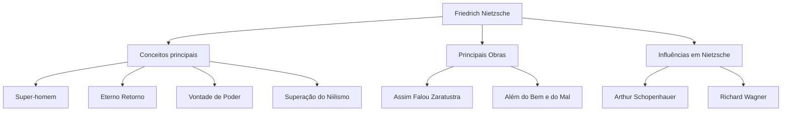

Olá. Hoje, vamos mergulhar profundamente na vida e no pensamento de Friedrich Nietzsche, um filósofo que atingiu o mundo filosófico do século XIX como um meteorito gigante e teve um impacto incomensurável no pensamento moderno.

"Deus está morto" —— esta frase excessivamente famosa não foi uma mera provocação, mas a declaração de uma mudança de paradigma épica que abalou os fundamentos da civilização ocidental. A sua filosofia continua a ser reavaliada no contexto da sociedade tecnológica moderna e da autorrealização do indivíduo.

## Dos primórdios a um gênio precoce

Friedrich Wilhelm Nietzsche nasceu em 15 de outubro de 1844 em Röcken, uma pequena vila no Reino da Prússia (agora Alemanha). Criado em uma família piedosa que serviu como pastores luteranos de geração em geração, ele perdeu seu pai aos 5 anos. Essa perda lançaria uma sombra sobre a formação de seu pensamento posterior.

Desde a infância, Nietzsche exibiu uma inteligência excepcional e mergulhou nas línguas clássicas e literatura no prestigioso internato Pforta. Ele estudou filologia nas universidades de Bonn e Leipzig e, com apenas 24 anos, foi nomeado professor extraordinário de filologia clássica na Universidade de Basileia, na Suíça. Um estudante sem doutorado se tornar repentinamente professor era uma exceção absoluta, mesmo naquela época.

No entanto, seus interesses acadêmicos gradualmente transcenderam os limites da filologia para a filosofia. Em sua primeira grande obra, "O Nascimento da Tragédia", ele descreveu a cultura grega antiga como o conflito e integração do "apolíneo" (razão/ordem) e o "dionisíaco" (emoção/embriaguez), e sofreu críticas ferozes do mundo acadêmico.

## Errância solitária e despertar para o "Super-homem"

Após sua nomeação como professor, Nietzsche começou a sofrer de graves problemas de saúde (fortes dores de cabeça, perda de visão, distúrbios gastrointestinais). Em 1879, aos 34 anos, ele finalmente renunciou à universidade e iniciou uma vida de errância solitária, viajando pela Europa (como Sils-Maria na Suíça e Itália) enquanto recebia uma pensão.

Ironicamente, foram essa doença e solidão que atuaram como catalisadores para explodir sua criatividade. Ele rejeitou o "ressentimento" (o rancor dos fracos contra os fortes) e criticou radicalmente a moralidade cristã como "moralidade de escravos".

O culminar de seu pensamento é "Assim Falou Zaratustra". Nesta obra, Nietzsche apresentou os seguintes conceitos-chave:

1. **A morte de Deus**: O advento de uma era de niilismo onde os valores absolutos e verdades (a moralidade cristã) colapsaram.
2. **O Super-homem (Übermensch)**: O ideal humano que, em um mundo onde os valores existentes colapsaram, cria novos valores por sua própria vontade e vive com força.
3. **O Eterno Retorno (Ewige Wiederkunft)**: A visão cósmica de que o universo repete infinitamente exatamente a mesma história, sem nenhum propósito. Afirmar e amar totalmente este destino implacável e sem sentido (Amor fati: o amor ao destino) era considerado a condição do Super-homem.
4. **A Vontade de Poder (Wille zur Macht)**: O impulso fundamental que toda vida tem para superar a si mesma e tentar ser mais forte.

## Diagrama de correlação de ideias e fluxo de realizações

O complexo sistema de pensamento de Nietzsche e as suas influências estão resumidos no seguinte diagrama.

## Loucura e impacto colossal na posteridade

Em janeiro de 1889, em Turim, Itália, Nietzsche caiu em prantos ao ver um cavalo sendo chicoteado na rua, o que causou seu colapso mental. Posteriormente, até sua morte em 1900, aos 55 anos, ele nunca recuperou a sanidade.

Após sua morte, suas volumosas anotações (escritos póstumos) foram editadas arbitrariamente por sua irmã Elisabeth e usadas tragicamente para o antissemitismo e a eugenia nazista. O próprio Nietzsche odiava ferozmente o nacionalismo e o antissemitismo, mas essa distorção fez com que sua reputação caísse temporariamente.

No entanto, após a guerra, a rigorosa pesquisa textual de Walter Kaufmann e outros avançou, e o pensamento original de Nietzsche foi reabilitado. Sua filosofia teve uma influência decisiva nos principais movimentos intelectuais do século 20, como o existencialismo (Sartre, Camus), a psicanálise (Freud, Jung) e o pós-estruturalismo (Foucault, Derrida, Deleuze).

## O significado de Nietzsche na era moderna

Na indústria tecnológica moderna, onde "inovação disruptiva" e "transformação ágil de si mesmo" são valorizadas, a atitude de Nietzsche de "destruir os valores existentes e criar novos valores" continua a inspirar muitos empreendedores e criadores.

Nietzsche nos questiona: "Você pode afirmar esta vida, mesmo que ela se repita infinitamente da mesma forma exata, dizendo: 'Então, isso é a vida? Pois bem, mais uma vez!'?"

Friedrich Nietzsche, que continuou a lutar contra suas próprias limitações na solidão e tentou elevar o espírito humano a novas alturas. Pode-se dizer que as palavras que ele deixou brilham ainda mais no mundo de hoje, onde a IA emerge e o significado da existência humana é mais uma vez questionado.
