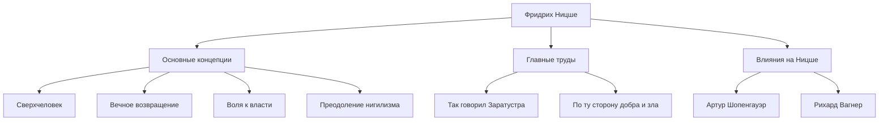

Здравствуйте. Сегодня мы глубоко погрузимся в жизнь и мысли Фридриха Ницше, философа, который подобно гигантскому метеориту врезался в философский мир 19 века и оказал неизмеримое влияние на современную мысль.

«Бог мертв» —— эта слишком известная фраза была не просто провокацией, а провозглашением эпического сдвига парадигмы, потрясшего основы западной цивилизации. Его философия продолжает переоцениваться в контексте современного технологического общества и самореализации личности.

## От ранних лет к скороспелому гению

Фридрих Вильгельм Ницше родился 15 октября 1844 года в Рёккене, небольшой деревне в Королевстве Пруссия (ныне Германия). Выросший в благочестивой семье, где из поколения в поколение были лютеранскими пасторами, он потерял отца в возрасте 5 лет. Эта потеря бросила тень на формирование его более поздних идей.

С детства Ницше проявлял исключительный интеллект и погружался в классические языки и литературу в престижной школе-интернате Пфорта. Он изучал филологию в Боннском и Лейпцигском университетах, а в возрасте всего 24 лет был назначен экстраординарным профессором классической филологии в Базельском университете в Швейцарии. То, что студент без докторской степени внезапно стал профессором, было абсолютным исключением даже в то время.

Однако его академические интересы постепенно вышли за рамки филологии и обратились к философии. В своем первом крупном произведении «Рождение трагедии» он описал древнегреческую культуру как конфликт и интеграцию «аполлонического» (разум/порядок) и «дионисийского» (эмоция/опьянение), и подвергся яростной критике со стороны академического мира.

## Одинокие странствия и пробуждение к «Сверхчеловеку»

После назначения профессором Ницше начал страдать от серьезных проблем со здоровьем (сильные головные боли, потеря зрения, желудочно-кишечные расстройства). В 1879 году, в возрасте 34 лет, он наконец ушел из университета и начал одинокую жизнь странника, путешествуя по Европе (например, в Зильс-Мария в Швейцарии или в Италии), получая пенсию.

По иронии судьбы, именно эта болезнь и одиночество стали катализаторами, которые взорвали его творческий потенциал. Он отверг «ресентимент» (обиду слабых на сильных) и радикально критиковал христианскую мораль как «мораль рабов».

Кульминацией его размышлений является «Так говорил Заратустра». В этой работе Ницше представил следующие ключевые концепции:

1. **Смерть Бога**: Наступление эпохи нигилизма, когда рухнули абсолютные ценности и истины (христианская мораль).
2. **Сверхчеловек (Übermensch)**: Человеческий идеал, который в мире рухнувших существующих ценностей создает новые ценности по собственной воле и живет с силой.
3. **Вечное возвращение (Ewige Wiederkunft)**: Космическое видение того, что Вселенная бесконечно повторяет одну и ту же историю, без какой-либо цели. Полностью принять и полюбить эту безжалостную и бессмысленную судьбу (Amor fati: любовь к судьбе) считалось условием Сверхчеловека.
4. **Воля к власти (Wille zur Macht)**: Фундаментальный импульс всей жизни к преодолению себя и стремлению стать сильнее.

## Диаграмма корреляции идей и поток достижений

Сложная система мыслей Ницше и его влияния обобщены на следующей диаграмме.

## Безумие и колоссальное влияние на потомков

В январе 1889 года в Турине, Италия, Ницше разрыдался, увидев на улице избиваемую лошадь, что привело к его нервному срыву. Впоследствии, до своей смерти в 1900 году в возрасте 55 лет, он так и не пришел в себя.

После его смерти его объемные оставленные записи (посмертные труды) были произвольно отредактированы его сестрой Элизабет и трагически использованы для нацистского антисемитизма и евгеники. Сам Ницше яростно ненавидел национализм и антисемитизм, но это искажение временно уронило его репутацию.

Однако после войны строгие текстовые исследования, проведенные Вальтером Кауфманом и другими, продвинулись, и первоначальная мысль Ницше была реабилитирована. Его философия оказала решающее влияние на основные интеллектуальные движения 20-го века, такие как экзистенциализм (Сартр, Камю), психоанализ (Фрейд, Юнг) и постструктурализм (Фуко, Деррида, Делёз).

## Значение Ницше в современную эпоху

В современной технологической индустрии, где ценятся «подрывные инновации» и «гибкая трансформация себя», позиция Ницше по «разрушению существующих ценностей и созданию новых ценностей» продолжает вдохновлять многих предпринимателей и создателей.

Ницше спрашивает нас: «Можешь ли ты утверждать эту жизнь, даже если бы она повторялась бесконечно и в точности так же, говоря: 'Так это и есть жизнь? Что ж, еще раз!'?»

Фридрих Ницше, который продолжал бороться со своими собственными ограничениями в одиночестве и пытался поднять человеческий дух на новые высоты. Можно сказать, что оставленные им слова сияют еще ярче в современном мире, где возникает ИИ и снова ставится под вопрос смысл человеческого существования.
