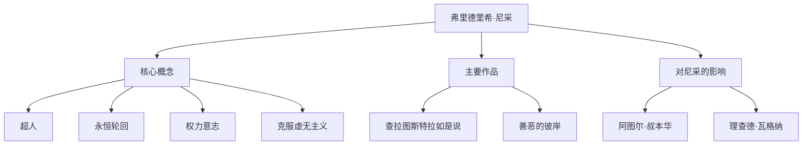

大家好。今天，我们将深入探讨弗里德里希·尼采（Friedrich Nietzsche）的一生及其思想，这位哲学家如同巨大的陨石般撞击了19世纪的哲学界，对现代思想产生了不可估量的影响。

“上帝死了”——这句极其著名的话不仅仅是挑衅，更是动摇西方文明根基的宏大范式转移的宣言。在现代科技社会和个人自我实现的语境下，他的哲学不断被重新评价。

## 从早年生活到早熟的天才

弗里德里希·威廉·尼采于1844年10月15日出生于普鲁士王国（现德国）的小村庄洛肯。他在一个世代担任路德宗牧师的虔诚家庭中长大，但在5岁时失去了父亲。这一丧失为他日后思想的形成投下了阴影。

尼采从小就展现出非凡的才智，在著名的普福尔塔寄宿学校沉浸于古典语言和文学。他在波恩大学和莱比锡大学学习文献学，年仅24岁就被破格任命为瑞士巴塞尔大学的古典文献学特聘教授。一个连博士学位都没有的学生直接成为教授，在当时也是极为罕见的特例。

然而，他的学术兴趣逐渐超越了文献学的框架，转向了哲学。在他的早期代表作《悲剧的诞生》中，他将古希腊文化描绘为“阿波罗式（理性与秩序）”和“狄俄尼索斯式（情感与沉醉）”的冲突与融合，这遭到了学术界的猛烈批评。

## 孤独的流浪与对“超人”的觉醒

就任教授后，尼采开始受到严重健康问题（剧烈头痛、视力下降和肠胃疾病）的困扰。1879年，34岁的他终于辞去了大学职务，开始在欧洲各地（如瑞士的锡尔斯玛利亚和意大利）过着孤独的流浪生活，靠领取养老金度日。

讽刺的是，这种病痛和孤独恰恰成为了引爆他创造力的导火索。他拒绝了“怨恨（弱者对强者的愤恨）”，并彻底批判基督教道德为“奴隶道德”。

其集大成之作便是《查拉图斯特拉如是说》。在这部著作中，尼采提出了以下重要概念：

1. **上帝之死**：绝对价值观和真理（基督教道德）崩溃的虚无主义时代的到来。
2. **超人（Übermensch）**：在现有价值观崩溃的世界中，凭借自身意志创造新价值并顽强生存的理想人类形象。
3. **永恒轮回（Ewige Wiederkunft）**：一种宇宙观，认为宇宙没有目的地无限重复完全相同的历史。完全肯定并热爱这种毫无意义和残酷的命运（命运之爱：Amor fati）被认为是超人的条件。
4. **权力意志（Wille zur Macht）**：所有生命根本上具有的、克服自我并渴望变得更强的冲动。

## 思想相关图与成就流程

尼采复杂的思想体系及其影响关系总结在下图中。

## 精神崩溃及对后世的巨大影响

1889年1月，在意大利都灵，尼采在街上看到一匹正在挨鞭打的马，当场痛哭流涕，随后精神崩溃。此后，直到1900年他55岁去世，他再也没有恢复理智。

他死后，留下的庞大笔记（遗稿）被其妹妹伊丽莎白随意编辑，悲剧性地被纳粹的反犹太主义和优生学思想所利用。尼采本人极其厌恶国家主义和反犹太主义，但由于这种歪曲，他的声誉曾一度跌入谷底。

然而，战后瓦尔特·考夫曼等人进行了严格的文本研究，使尼采的本来思想得以复兴。他的思想对20世纪的主要思想运动产生了决定性影响，如存在主义（萨特、加缪）、精神分析（弗洛伊德、荣格）和后结构主义（福柯、德里达、德勒兹）。

## 尼采在现代的意义

在强调“颠覆性创新”和“敏捷自我变革”的现代科技行业中，尼采“破坏现有价值，创造新价值”的姿态继续为许多企业家和创作者提供灵感。

尼采向我们发问：“如果这种生活完全一样地无限重复，你能否肯定它，说出‘这就是生活吗？那么再来一次！’？”

弗里德里希·尼采在孤独中不断与自身的极限抗争，试图将人类的精神推向更高的高度。可以说，在AI崛起、人类存在意义被重新拷问的现代，他留下的话语正散发出更加耀眼的光芒。
