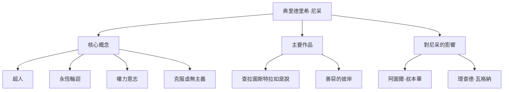

大家好。今天，我們將深入探討弗里德里希·尼采（Friedrich Nietzsche）的一生及其思想，這位哲學家如同巨大的隕石般撞擊了19世紀的哲學界，對現代思想產生了不可估量的影響。

「上帝死了」——這句極其著名的話不僅僅是挑釁，更是動搖西方文明根基的宏大典範轉移的宣言。在現代科技社會和個人自我實現的語境下，他的哲學不斷被重新評價。

## 從早年生活到早熟的天才

弗里德里希·威廉·尼采於1844年10月15日出生於普魯士王國（現德國）的小村莊洛肯。他在一個世代擔任路德宗牧師的虔誠家庭中長大，但在5歲時失去了父親。這一喪失為他日後思想的形成投下了陰影。

尼采從小就展現出非凡的才智，在著名的普福爾塔寄宿學校沉浸於古典語言和文學。他在波昂大學和萊比錫大學學習文獻學，年僅24歲就被破格任命為瑞士巴塞爾大學的古典文獻學特聘教授。一個連博士學位都沒有的學生直接成為教授，在當時也是極為罕見的特例。

然而，他的學術興趣逐漸超越了文獻學的框架，轉向了哲學。在他的早期代表作《悲劇的誕生》中，他將古希臘文化描繪為「阿波羅式（理性與秩序）」和「戴歐尼修斯式（情感與沉醉）」的衝突與融合，這遭到了學術界的猛烈批評。

## 孤獨的流浪與對「超人」的覺醒

就任教授後，尼采開始受到嚴重健康問題（劇烈頭痛、視力下降和腸胃疾病）的困擾。1879年，34歲的他終於辭去了大學職務，開始在歐洲各地（如瑞士的西爾斯瑪利亞和義大利）過著孤獨的流浪生活，靠領取養老金度日。

諷刺的是，這種病痛和孤獨恰恰成為了引爆他創造力的導火索。他拒絕了「怨恨（弱者對強者的憤恨）」，並徹底批判基督教道德為「奴隸道德」。

其集大成之作便是《查拉圖斯特拉如是說》。在這部著作中，尼采提出了以下重要概念：

1. **上帝之死**：絕對價值觀和真理（基督教道德）崩潰的虛無主義時代的到來。
2. **超人（Übermensch）**：在現有價值觀崩潰的世界中，憑藉自身意志創造新價值並頑強生存的理想人類形象。
3. **永恆輪迴（Ewige Wiederkunft）**：一種宇宙觀，認為宇宙沒有目的地無限重複完全相同的歷史。完全肯定並熱愛這種毫無意義和殘酷的命運（命運之愛：Amor fati）被認為是超人的條件。
4. **權力意志（Wille zur Macht）**：所有生命根本上具有的、克服自我並渴望變得更強的衝動。

## 思想相關圖與成就流程

尼采複雜的思想體系及其影響關係總結在下圖中。

## 精神崩潰及對後世的巨大影響

1889年1月，在義大利杜林，尼采在街上看到一匹正在挨鞭打的馬，當場痛哭流涕，隨後精神崩潰。此後，直到1900年他55歲去世，他再也沒有恢復理智。

他死後，留下的龐大筆記（遺稿）被其妹妹伊莉莎白隨意編輯，悲劇性地被納粹的反猶太主義和優生學思想所利用。尼采本人極其厭惡國家主義和反猶太主義，但由於這種歪曲，他的聲譽曾一度跌入谷底。

然而，戰後瓦爾特·考夫曼等人進行了嚴格的文本研究，使尼采的本來思想得以復興。他的思想對20世紀的主要思想運動產生了決定性影響，如存在主義（沙特、卡繆）、精神分析（佛洛伊德、榮格）和後結構主義（傅柯、德希達、德勒茲）。

## 尼采在現代的意義

在強調「顛覆性創新」和「敏捷自我變革」的現代科技行業中，尼采「破壞現有價值，創造新價值」的姿態繼續為許多企業家和創作者提供靈感。

尼采向我們發問：「如果這種生活完全一樣地無限重複，你能否肯定它，說出『這就是生活嗎？那麼再來一次！』？」

弗里德里希·尼采在孤獨中不斷與自身的極限抗爭，試圖將人類的精神推向更高的高度。可以說，在AI崛起、人類存在意義被重新拷問的現代，他留下的話語正散發出更加耀眼的光芒。
