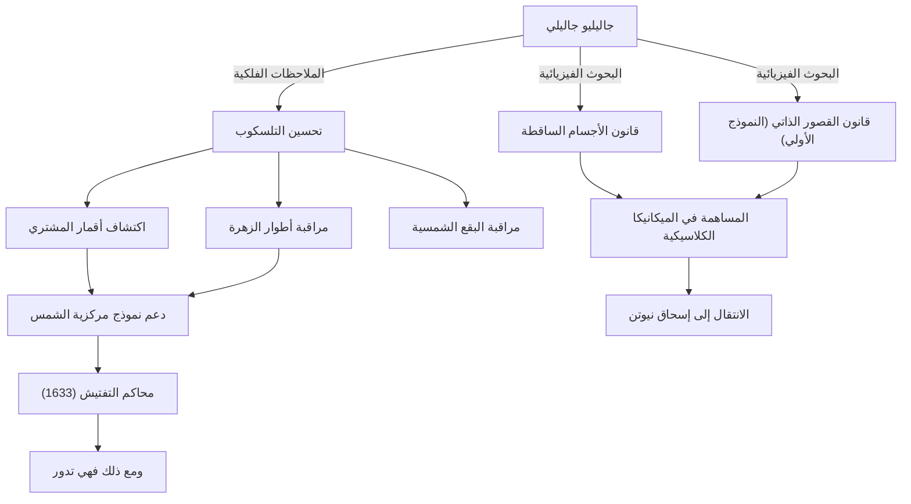

جاليليو جاليلي (1564 - 1642) هو فيزيائي وعالم فلك وفيلسوف إيطالي يُعرف باسم "أبو العلم الحديث". لا يقتصر أعظم إنجازاته على مجرد الاكتشافات الجديدة، بل يتمثل في قلبه الجذري لـ "الطريقة" التي تفهم بها البشرية العالم الطبيعي. أصبحت الوضعية القائمة على بيانات المراقبة والوصف الطبيعي باستخدام الرياضيات حجر الزاوية الراسخ للثورة العلمية التي تلت ذلك.

## حياة من الاستكشاف: من بيزا إلى فلورنسا، ثم محاكم التفتيش

ولد جاليليو في بيزا بإيطاليا عام 1564، وتأثر بوالده الموسيقي فينتشنزو، مما نمى لديه روحاً حرة وتفكيراً نقدياً. كان من المقرر أن يدرس الطب في جامعة بيزا، لكنه سُحر بجاذبية الرياضيات والفيزياء، ومضى في طريق كشف قوانين العالم الطبيعي.

ما رفع اسمه عالياً فجأة هو قيامه بنفسه بتحسين التلسكوب الذي كان قد اختُرع حديثاً في هولندا عام 1609، وتوجيهه نحو سماء الليل. اكتشف جاليليو تباعاً أن سطح القمر مليء بالتضاريس مثل الأرض، والأقمار الأربعة التي تدور حول المشتري (أقمار جاليليو)، وأطوار كوكب الزهرة، والبقع الشمسية. شكلت حقائق الرصد هذه تحدياً خطيراً لـ "نموذج مركزية الأرض" الأرسطي والبطلمي، والذي كان النظرة الكونية المطلقة في ذلك الوقت.

كان جاليليو مقتنعاً بأن "نموذج مركزية الشمس" الذي اقترحه كوبرنيكوس هو الشكل الحقيقي للكون، وجادل بذلك بناءً على بيانات الرصد الخاصة به. ومع ذلك، كان هذا الادعاء يتعارض بشكل مباشر مع عقيدة الكنيسة الكاثوليكية. في عام 1633، خضع جاليليو لمحاكمة التفتيش سيئة السمعة من قبل محاكم التفتيش الرومانية، وأُجبر على التراجع عن نظريته، وحُكم عليه بالإقامة الجبرية مدى الحياة. الكلمات التي يُقال إنه تمتم بها أثناء مغادرته قاعة المحكمة، "ومع ذلك فهي تدور (E pur si muove)"، لا تزال تُروى كأسطورة ترمز إلى السعي وراء الحقيقة الذي لا يخضع للسلطة.

## مخطط يوضح الإنجازات والتأثيرات

يوضح الرسم البياني أدناه الإنجازات الرئيسية لجاليليو وتدفق التأثيرات التي أحدثتها.

## فلسفة جاليليو: كتاب الطبيعة مكتوب بلغة الرياضيات

أعمق إرث فلسفي لجاليليو يكمن في "منهجيته". في كتابه "المُجرِّب" (Il Saggiatore)، صرح قائلاً: "كتاب الكون مكتوب بلغة الرياضيات. وحروفه هي المثلثات والدوائر والأشكال الهندسية الأخرى".

اعتمدت الفلسفة الطبيعية حتى العصور الوسطى بشكل كبير على سلطة أرسطو والتفسيرات اللاهوتية، وكانت الاستنتاجات النوعية هي السائدة. ومع ذلك، أنشأ جاليليو نهجاً لاستخراج العناصر القابلة للقياس (الوقت، والمسافة، والسرعة، وما إلى ذلك) من الظواهر الطبيعية والتعبير عن علاقاتها بصيغ رياضية. وهذا ما يُعرف أيضاً بـ "الرياضيات في العالم الطبيعي"، وأصبح النموذج الأساسي للعلم حتى الفيزياء النظرية الحديثة.

علاوة على ذلك، من المهم أيضاً أنه مارس "المنهج العلمي" للتحقق من الفرضيات من خلال التجربة والملاحظة، كما يتضح من تجربة الإسقاط من برج بيزا المائل (رغم أنه يقال إنها أسطورة) والتجارب الدقيقة باستخدام الأسطح المائلة. موقفه الذي يقدر الملاحظة بعينيه والمنطق العقلاني أكثر من كلام السلطة، أصبح رائداً لـ "الوضعية" الحديثة.

## التأثير الهائل على الأجيال القادمة والأهمية في العصر الحديث

أعطت الآفاق التي فتحها جاليليو تأثيراً حاسماً على الأجيال القادمة. القوانين المتعلقة بالحركة التي قدمها (وخاصة قانون الأجسام الساقطة ومفهوم القصور الذاتي) تم دمجها بواسطة إسحاق نيوتن، وتُوجت بالنظام الرائع للميكانيكا الكلاسيكية. عندما قال نيوتن "إذا كنت قد رأيت أبعد من غيري، فذلك لأنني وقفت على أكتاف العمالقة"، فلا شك أن جاليليو كان أحد أولئك العمالقة.

كما تقدم مأساة القمع من قبل محاكم التفتيش درساً تاريخياً مهماً لا يزال قائماً عند التفكير في العلاقة بين العلم والدين، أو بين الحقيقة والسلطة. في عام 1992، اعترف البابا يوحنا بولس الثاني رسمياً بخطأ الكنيسة في محاكمة جاليليو وأعاد الاعتبار إليه. بعد أكثر من 350 عاماً، كانت تلك هي اللحظة التي هزمت فيها الحقيقة السلطة.

اليوم، ننظر بشكل أبعد وأعمق إلى الكون الذي وجه إليه جاليليو تلسكوبه لأول مرة. ومع ذلك، فإن الفضول تجاه المجهول، والموقف النقدي المتمثل في التأكد بأعيننا، والإيمان بالانسجام الرياضي الكامن وراء العالم الطبيعي - كل هذه تمثل الإرث العظيم الذي لا يتلاشى والذي تركه لنا باحث واحد يُدعى جاليليو جاليلي.
