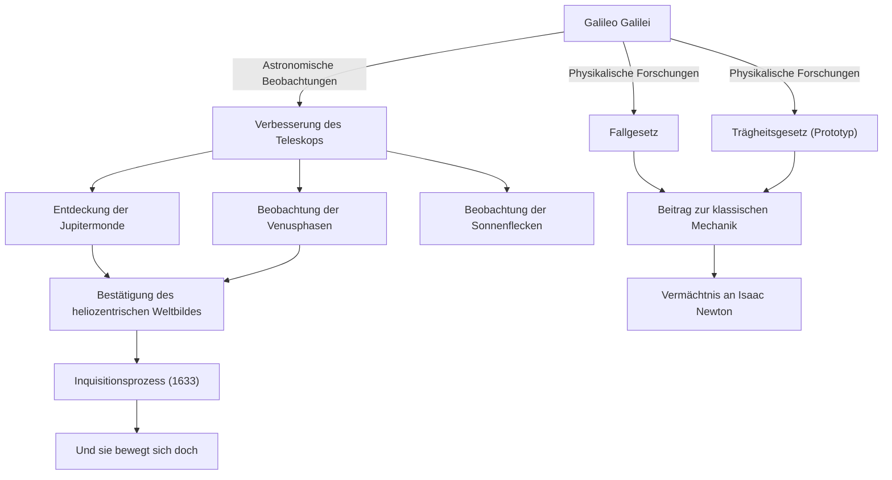

Galileo Galilei (1564 - 1642) war ein italienischer Physiker, Astronom und Philosoph, der als „Vater der modernen Wissenschaft“ bezeichnet wird. Sein größter Verdienst bestand nicht nur in neuen Entdeckungen, sondern darin, die "Methode", wie die Menschheit die Natur versteht, grundlegend zu revolutionieren. Der auf Beobachtungsdaten basierende Positivismus und die mathematische Naturbeschreibung bildeten ein festes Fundament für die darauffolgende wissenschaftliche Revolution.

## Ein Leben der Forschung: Von Pisa nach Florenz und zur Inquisition

Geboren 1564 im italienischen Pisa, entwickelte Galileo unter dem Einfluss seines Vaters Vincenzo, eines Musikers, einen freien Geist und kritisches Denken. Er sollte eigentlich an der Universität Pisa Medizin studieren, wurde jedoch von der Faszination für Mathematik und Physik ergriffen und schlug den Weg ein, die Gesetze der Natur zu entschlüsseln.

Was seinen Namen schlagartig berühmt machte, war die Tatsache, dass er das erst 1609 in den Niederlanden erfundene Teleskop selbst verbesserte und in den Nachthimmel richtete. Galileo entdeckte nacheinander, dass die Mondoberfläche wie die Erde reich an Unebenheiten ist, die vier Monde, die Jupiter umkreisen (Galileische Monde), die Phasen der Venus sowie die Sonnenflecken. Diese Beobachtungen warfen ernsthafte Zweifel am aristotelisch-ptolemäischen "geozentrischen Weltbild" auf, das das absolute kosmologische Paradigma der damaligen Zeit darstellte.

Galileo war überzeugt, dass das von Kopernikus vorgeschlagene „heliozentrische Weltbild“ die wahre Gestalt des Universums sei, und argumentierte dies basierend auf seinen eigenen Beobachtungsdaten. Diese Behauptung stand jedoch in direktem Widerspruch zur Doktrin der katholischen Kirche. 1633 wurde Galileo dem berüchtigten Inquisitionsprozess der Römischen Inquisition unterzogen; er wurde gezwungen, seine Lehren zu widerrufen, und zu lebenslangem Hausarrest verurteilt. Seine angebliche Äußerung beim Verlassen des Gerichts, „Und sie bewegt sich doch (E pur si muove)“, wird bis heute als Legende weitergegeben, die seinen Entdeckergeist für die Wahrheit symbolisiert, der sich keiner Macht beugt.

## Korrelationsdiagramm von Errungenschaften und Einflüssen

Das folgende Diagramm veranschaulicht die wichtigsten Errungenschaften von Galileo und die Kette von Einflüssen, die sie mit sich brachten.

## Galileos Philosophie: Das Buch der Natur ist in der Sprache der Mathematik geschrieben

Galileos tiefgründigstes philosophisches Erbe liegt in seiner „Methodik“. In seinem Buch *Der Prüfer mit der Goldwaage* (Il Saggiatore) schreibt er: „Das Buch des Universums ist in der Sprache der Mathematik geschrieben, und seine Buchstaben sind Dreiecke, Kreise und andere geometrische Figuren.“

Bis zum Mittelalter stützte sich die Naturphilosophie stark auf die Autorität von Aristoteles und theologische Interpretationen, wobei vor allem qualitatives Schließen vorherrschte. Galileo hingegen etablierte einen Ansatz, bei dem er messbare Elemente (wie Zeit, Entfernung und Geschwindigkeit) aus Naturphänomenen extrahierte und deren Beziehungen durch mathematische Formeln ausdrückte. Dies wird auch als „Mathematisierung der Natur“ bezeichnet und bildet bis hin zur modernen theoretischen Physik das grundlegendste Paradigma der Wissenschaft.

Es ist auch bedeutsam, dass er die „wissenschaftliche Methode“ praktizierte, nämlich Hypothesen durch Experimente und Beobachtungen zu verifizieren, wie die (oft als Legende bezeichneten) Fallexperimente vom Schiefen Turm von Pisa und präzise Experimente mit schiefen Ebenen zeigen. Seine Haltung, Beobachtungen mit eigenen Augen und rationale Logik höher zu bewerten als die Worte der Autoritäten, wurde zum Vorläufer des modernen „Positivismus“.

## Der immense Einfluss auf spätere Generationen und die moderne Bedeutung

Die von Galileo eröffneten Horizonte hatten einen entscheidenden Einfluss auf nachfolgende Generationen. Die von ihm vorgestellten Bewegungsgesetze (insbesondere das Fallgesetz und das Konzept der Trägheit) wurden von Isaac Newton integriert und mündeten in das großartige System der klassischen Mechanik. Als Newton sagte: „Wenn ich weiter sehen konnte, so deshalb, weil ich auf den Schultern von Riesen stand“, so war zweifellos Galileo einer dieser Riesen.

Darüber hinaus bietet die Tragödie seiner Unterdrückung durch den Inquisitionsprozess bis heute wichtige historische Lehren für das Nachdenken über die Beziehung zwischen Wissenschaft und Religion oder Wahrheit und Macht. Im Jahr 1992 erkannte Papst Johannes Paul II. offiziell den Irrtum der Kirche im Prozess gegen Galileo an und rehabilitierte ihn. Es war der Moment, in dem die Wahrheit nach über 350 Jahren die Macht besiegte.

Heute blicken wir noch weiter und tiefer in das Universum, auf das Galileo einst als Erster sein Teleskop richtete. Doch die Neugier auf das Unbekannte, die kritische Haltung, sich mit eigenen Augen vergewissern zu wollen, und der Glaube an die mathematische Harmonie hinter der Natur – all dies sind zeitlose, großartige Vermächtnisse, die uns ein einziger Forscher, Galileo Galilei, hinterlassen hat.
