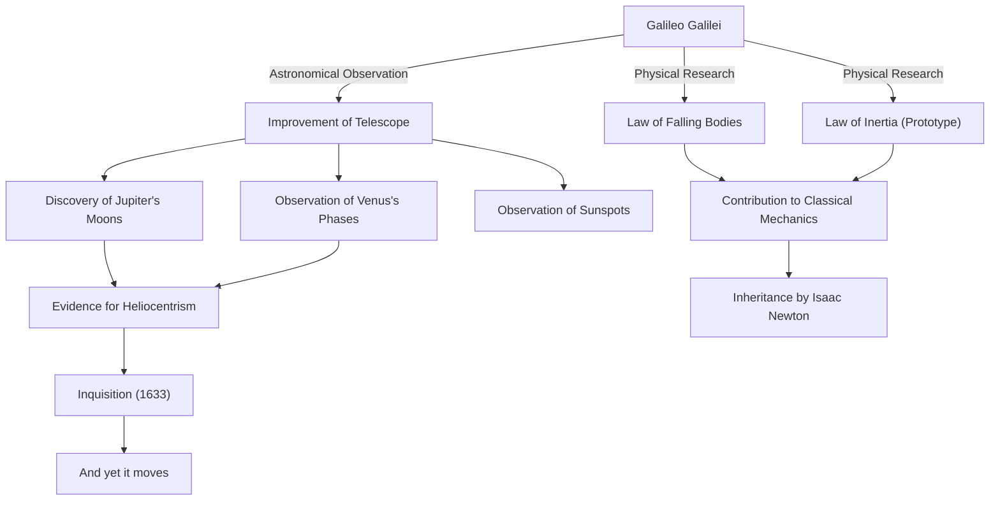

Galileo Galilei (1564 - 1642) is an Italian physicist, astronomer, and philosopher known as the "Father of Modern Science." His greatest achievement lies not merely in his new discoveries, but in fundamentally overturning the very "method" by which humanity understands the natural world. Positivism based on observational data and the description of nature using mathematics became the firm foundation of the scientific revolution that followed.

## A Life of Inquiry: From Pisa to Florence, and the Inquisition

Born in Pisa, Italy in 1564, Galileo was influenced by his father Vincenzo, a musician, and developed a free spirit and critical thinking. He originally planned to study medicine at the University of Pisa, but became captivated by the allure of mathematics and physics, proceeding on a path to unravel the laws of the natural world.

What made him famous overnight was his own improvement of the telescope, which had just been invented in the Netherlands in 1609, and turning it toward the night sky. Galileo discovered one after another that the surface of the Moon was rich in unevenness like the Earth, the four moons orbiting Jupiter (the Galilean moons), the phases of Venus, and sunspots. These observational facts cast serious doubt on the absolute cosmology of the time, the Aristotelian and Ptolemaic "geocentric theory."

Galileo became convinced that the "heliocentric theory" advocated by Copernicus was the true nature of the universe, and asserted it based on his own observational data. However, this assertion completely conflicted with the doctrines of the Catholic Church. In 1633, Galileo was subjected to a notorious trial by the Roman Inquisition, where he was forced to recant his theories and was sentenced to house arrest for life. The words he allegedly muttered as he left the courtroom, "And yet it moves (E pur si muove)," continue to be told as a legend symbolizing a quest for truth that does not yield to authority.

## Correlation Chart of Achievements and Influences

The following diagram shows the flow of Galileo's major achievements and the influence they brought about.

## Galileo's Philosophy: The Book of Nature is Written in the Language of Mathematics

Galileo's most profound philosophical legacy lies in his "methodology." In his book "The Assayer", he states, "The book of the universe is written in the language of mathematics, and its characters are triangles, circles, and other geometric figures."

Natural philosophy up to the Middle Ages relied heavily on the authority of Aristotle and theological interpretations, and consisted mainly of qualitative reasoning. However, Galileo established an approach of extracting measurable elements (time, distance, speed, etc.) from natural phenomena and expressing their relationships with mathematical formulas. This is also called the "mathematization of the natural world," and it has become the most fundamental paradigm of science up to modern theoretical physics.

It is also important that he practiced the "scientific method" of verifying hypotheses through experiment and observation, as typified by his falling experiments from the Leaning Tower of Pisa (though said to be a legend) and precise experiments using inclined planes. His attitude of valuing observation with his own eyes and rational logic over the words of authority became the forerunner of modern "positivism."

## Immense Influence on Later Generations and Significance Today

The horizons opened up by Galileo had a decisive influence on later generations. The laws regarding motion he presented (especially the law of falling bodies and the concept of inertia) were integrated by Isaac Newton, culminating in the grand system of classical mechanics. When Newton said, "If I have seen further it is by standing on the shoulders of Giants," there is no doubt that one of those giants was Galileo.

Furthermore, the tragedy of suppression by the Inquisition continues to provide an important historical lesson in considering the relationship between science and religion, or truth and authority. In 1992, Pope John Paul II officially acknowledged the Church's error in Galileo's trial and rehabilitated him. It was a moment when, after more than 350 years, truth defeated authority.

Today, we are looking even further and deeper into the universe where Galileo first turned his telescope. However, the curiosity heading toward the unknown, the critical attitude of confirming with our own eyes, and the heart that believes in the mathematical harmony behind the natural world - these are all the enduringly great legacy left to us by a single inquirer, Galileo Galilei.
