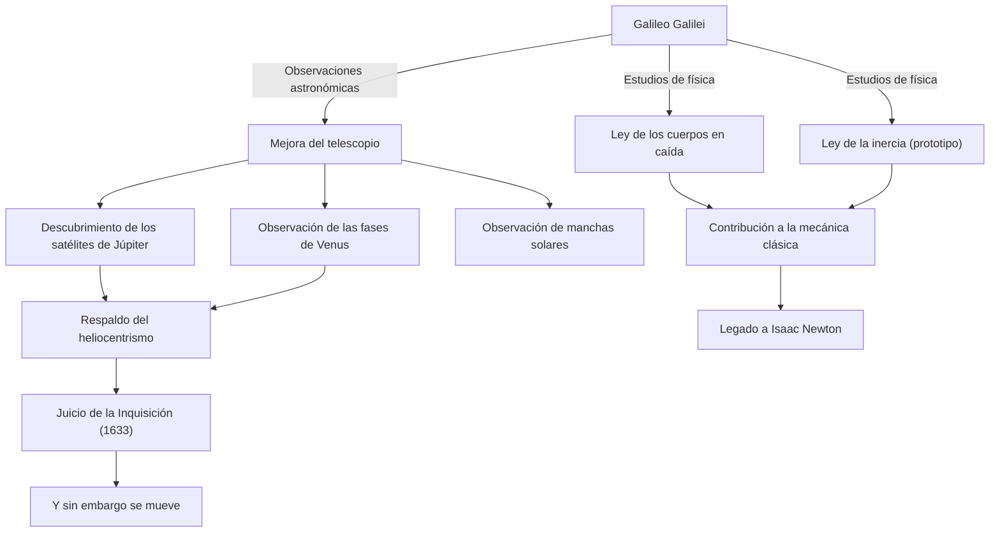

Galileo Galilei (1564 - 1642) es un físico, astrónomo y filósofo italiano conocido como el "padre de la ciencia moderna". Su mayor logro no se limita simplemente a nuevos descubrimientos, sino que transformó fundamentalmente el "método" mismo mediante el cual la humanidad comprende el mundo natural. El positivismo basado en datos de observación y la descripción de la naturaleza mediante las matemáticas se convirtieron en la base sólida de la revolución científica que siguió.

## Una vida de exploración: De Pisa a Florencia, y el juicio de la Inquisición

Nacido en Pisa, Italia, en 1564, Galileo fue influenciado por su padre músico, Vincenzo, y cultivó un espíritu libre y pensamiento crítico. Planeaba estudiar medicina en la Universidad de Pisa, pero quedó cautivado por el encanto de las matemáticas y la física, y se embarcó en el camino para desentrañar las leyes del mundo natural.

Lo que lo hizo repentinamente famoso fue que en 1609 mejoró el telescopio recién inventado en los Países Bajos y lo apuntó al cielo nocturno. Galileo descubrió uno tras otro que la superficie de la Luna era rugosa como la Tierra, los cuatro satélites que orbitaban Júpiter (lunas galileanas), las fases de Venus y las manchas solares. Estos hechos de observación plantearon serias dudas sobre el "geocentrismo" aristotélico y ptolemaico, que era la visión absoluta del universo en ese momento.

Galileo estaba convencido de que el "heliocentrismo" propuesto por Copérnico era la verdadera forma del universo y lo argumentó basándose en sus propios datos de observación. Sin embargo, esta afirmación estaba en conflicto directo con la doctrina de la Iglesia Católica. En 1633, Galileo, que fue sometido al infame juicio de la Inquisición romana, se vio obligado a retractarse de sus teorías y fue condenado a arresto domiciliario de por vida. Se dice que murmuró al salir del tribunal, "Y sin embargo se mueve" (E pur si muove), palabras que aún se transmiten como una leyenda que simboliza la búsqueda de la verdad que no se rinde ante el poder.

## Diagrama de correlación de logros e influencias

El siguiente diagrama muestra el flujo de los principales logros de Galileo y su influencia.

## La filosofía de Galileo: El libro de la naturaleza está escrito en lenguaje matemático

El legado filosófico más profundo de Galileo reside en su "metodología". En su libro "El ensayador" (Il Saggiatore), afirma: "El libro del universo está escrito en lenguaje matemático. Sus caracteres son triángulos, círculos y otras figuras geométricas".

Hasta la Edad Media, la filosofía natural dependía en gran medida de la autoridad de Aristóteles y de interpretaciones teológicas, y el razonamiento cualitativo era la norma. Sin embargo, Galileo estableció el enfoque de extraer elementos medibles (tiempo, distancia, velocidad, etc.) de los fenómenos naturales y expresar sus relaciones mediante fórmulas matemáticas. Esto también se llama la "matematización de la naturaleza" y sigue siendo el paradigma más fundamental de la ciencia hasta la física teórica moderna.

Además, es importante que puso en práctica el "método científico" de verificar hipótesis a través de experimentos y observaciones, como lo representan el experimento de caída desde la Torre Inclinada de Pisa (aunque se dice que es una leyenda) y los experimentos de precisión utilizando planos inclinados. Su postura de valorar las observaciones con sus propios ojos y la lógica racional por encima de las palabras de la autoridad fue un precursor del "positivismo" moderno.

## Gran influencia en la posteridad y significado en la era moderna

El horizonte que Galileo abrió tuvo un impacto decisivo en las generaciones posteriores. Las leyes sobre el movimiento que presentó (especialmente la ley de la caída de los cuerpos y el concepto de inercia) fueron integradas por Isaac Newton y fructificaron en el magnífico sistema de la mecánica clásica. Cuando Newton dijo: "Si he visto más lejos, es poniéndome sobre los hombros de gigantes", no hay duda de que uno de esos gigantes era Galileo.

Además, la tragedia de la represión mediante el juicio de la Inquisición todavía proporciona una lección histórica importante al considerar la relación entre la ciencia y la religión, o la verdad y el poder. En 1992, el Papa Juan Pablo II reconoció oficialmente los errores de la Iglesia en el juicio de Galileo y lo rehabilitó. Después de más de 350 años, fue el momento en que la verdad venció al poder.

Hoy en día, miramos aún más lejos y más profundo en el universo al que Galileo apuntó su telescopio por primera vez. Sin embargo, la curiosidad hacia lo desconocido, la actitud crítica de verificar con nuestros propios ojos y el corazón que cree en la armonía matemática detrás del mundo natural: todos esos son el gran legado perdurable dejado por un único explorador llamado Galileo Galilei.
