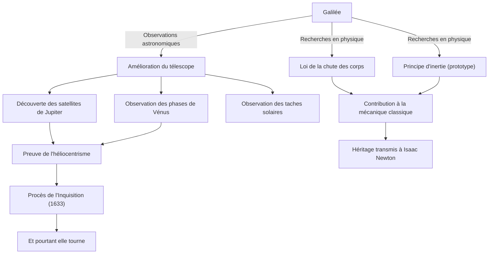

Galilée (1564 - 1642) est un physicien, astronome et philosophe italien, souvent qualifié de "père de la science moderne". Son plus grand accomplissement ne réside pas seulement dans ses nouvelles découvertes, mais dans le fait d'avoir fondamentalement bouleversé la "méthode" même par laquelle l'humanité comprend le monde naturel. Le positivisme basé sur des données d'observation et la description de la nature à l'aide des mathématiques ont jeté les bases solides de la révolution scientifique qui a suivi.

## Une vie d'exploration : De Pise à Florence, et au tribunal de l'Inquisition

Né à Pise, en Italie, en 1564, Galilée a cultivé un esprit libre et une pensée critique sous l'influence de son père, Vincenzo, qui était musicien. Il devait étudier la médecine à l'Université de Pise, mais, fasciné par les mathématiques et la physique, il s'engagea dans la voie de la découverte des lois du monde naturel.

Ce qui l'a rendu célèbre, c'est d'avoir lui-même amélioré le télescope, qui venait d'être inventé aux Pays-Bas en 1609, et de l'avoir pointé vers le ciel nocturne. Galilée a découvert tour à tour que la surface de la Lune était inégale comme celle de la Terre, les quatre satellites en orbite autour de Jupiter (satellites galiléens), les phases de Vénus, et les taches solaires. Ces observations remettaient sérieusement en question le "géocentrisme" d'Aristote et de Ptolémée, qui était la vision absolue de l'univers à l'époque.

Galilée était convaincu que l'"héliocentrisme" proposé par Copernic était la véritable forme de l'univers, et l'a soutenu sur la base de ses propres données d'observation. Cependant, cette affirmation était en opposition directe avec le dogme de l'Église catholique. En 1633, Galilée, soumis au tristement célèbre procès de l'Inquisition romaine, a été contraint de rétracter ses théories et condamné à l'assignation à résidence à vie. Les mots qu'il aurait murmurés en quittant le tribunal, "Et pourtant elle tourne" (E pur si muove), continuent d'être racontés comme une légende symbolisant la quête de la vérité qui ne cède pas au pouvoir.

## Diagramme des réalisations et de leur influence

La figure suivante illustre le flux des principales réalisations de Galilée et l'impact qu'elles ont eu.

## La philosophie de Galilée : Le livre de la nature est écrit en langage mathématique

L'héritage philosophique le plus profond de Galilée réside dans sa "méthodologie". Dans son livre "L'Essayeur", il déclare : "Le grand livre de l'Univers est écrit dans la langue mathématique. Ses caractères sont des triangles, des cercles, et d'autres figures géométriques".

Jusqu'au Moyen Âge, la philosophie naturelle dépendait fortement de l'autorité d'Aristote et des interprétations théologiques, et le raisonnement qualitatif prédominait. Cependant, Galilée a établi une approche consistant à extraire des éléments mesurables (temps, distance, vitesse, etc.) des phénomènes naturels et à exprimer leurs relations par des formules mathématiques. C'est ce qu'on appelle la "mathématisation de la nature", qui est devenue le paradigme le plus fondamental de la science jusqu'à la physique théorique moderne.

De plus, il est important de noter qu'il a mis en pratique la "méthode scientifique", qui consiste à vérifier des hypothèses par l'expérience et l'observation, comme le montrent ses expériences de chute depuis la tour de Pise (bien que parfois considérées comme une légende) et ses expériences précises utilisant des plans inclinés. Son attitude, qui privilégiait l'observation de ses propres yeux et la logique rationnelle aux paroles d'autorité, a été le précurseur du "positivisme" moderne.

## Son immense influence sur les générations futures et sa signification aujourd'hui

L'horizon ouvert par Galilée a eu un impact décisif sur les générations futures. Les lois du mouvement qu'il a présentées (notamment la loi de la chute des corps et le concept d'inertie) ont été intégrées par Isaac Newton et ont abouti au grand système de la mécanique classique. Lorsque Newton a dit : "Si j'ai vu plus loin, c'est en me tenant sur les épaules de géants", il ne fait aucun doute que l'un de ces géants était Galilée.

Par ailleurs, la tragédie de l'oppression par l'Inquisition continue de fournir d'importantes leçons historiques pour réfléchir aux relations entre science et religion, ou entre vérité et pouvoir. En 1992, le pape Jean-Paul II a officiellement reconnu les erreurs de l'Église dans le procès de Galilée et l'a réhabilité. Après plus de 350 ans, ce fut le moment où la vérité a triomphé du pouvoir.

Aujourd'hui, nous regardons encore plus loin et plus profondément dans l'univers vers lequel Galilée a pointé son télescope pour la première fois. Cependant, la curiosité envers l'inconnu, l'attitude critique consistant à vérifier par soi-même, et la croyance en une harmonie mathématique derrière le monde naturel — toutes ces choses sont le grand héritage intemporel qu'un seul chercheur, Galilée, nous a laissé.
