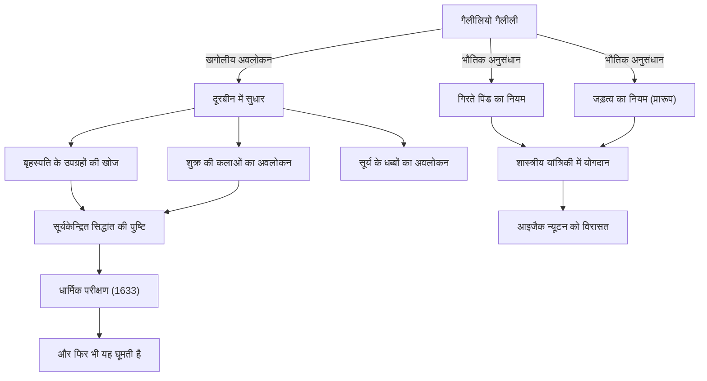

गैलीलियो गैलीली (1564 - 1642) एक इतालवी भौतिक विज्ञानी, खगोलशास्त्री और दार्शनिक हैं जिन्हें "आधुनिक विज्ञान के जनक" के रूप में जाना जाता है। उनकी सबसे बड़ी उपलब्धि केवल नई खोजों तक सीमित नहीं थी, बल्कि उन्होंने मानवता के प्राकृतिक दुनिया को समझने के "तरीके" को ही पूरी तरह से बदल दिया। अवलोकन डेटा पर आधारित प्रत्यक्षवाद और प्रकृति का वर्णन करने के लिए गणित के उपयोग ने बाद की वैज्ञानिक क्रांति के लिए एक ठोस आधार तैयार किया।

## खोज का जीवन: पीसा से फ्लोरेंस, और फिर धार्मिक परीक्षण तक

1564 में इटली के पीसा में जन्मे गैलीलियो अपने संगीतकार पिता विन्सेन्ज़ो से प्रभावित थे, जिन्होंने उनमें एक स्वतंत्र भावना और आलोचनात्मक सोच विकसित की। हालांकि वह पीसा विश्वविद्यालय में चिकित्सा का अध्ययन करने वाले थे, लेकिन वह गणित और भौतिकी के आकर्षण से मोहित हो गए और प्राकृतिक दुनिया के नियमों को उजागर करने के मार्ग पर चल पड़े।

उन्हें प्रसिद्धि तब मिली जब उन्होंने 1609 में नीदरलैंड में हाल ही में आविष्कार किए गए दूरबीन में सुधार किया और इसे रात के आकाश की ओर मोड़ दिया। गैलीलियो ने एक के बाद एक कई खोजें कीं, जिनमें यह कि चंद्रमा की सतह पृथ्वी की तरह ऊबड़-खाबड़ है, बृहस्पति की परिक्रमा करने वाले चार उपग्रह (गैलीलियन उपग्रह), शुक्र की कलाएं और सूर्य के धब्बे शामिल हैं। इन अवलोकनों ने उस समय के निरपेक्ष ब्रह्माण्ड विज्ञान, अरस्तूवादी और टॉलेमीक "भूकेन्द्रित सिद्धांत" पर गंभीर संदेह पैदा किया।

गैलीलियो को यकीन था कि कोपरनिकस द्वारा प्रस्तावित "सूर्यकेन्द्रित सिद्धांत" ही ब्रह्मांड का वास्तविक रूप है, और उन्होंने अपने स्वयं के अवलोकन डेटा के आधार पर इसका दावा किया। हालाँकि, यह दावा कैथोलिक चर्च के सिद्धांत के सीधे विरोध में था। 1633 में, रोमन इनक्विजिशन द्वारा एक कुख्यात धार्मिक परीक्षण के अधीन होने के बाद, गैलीलियो को अपने सिद्धांतों को वापस लेने के लिए मजबूर होना पड़ा और उन्हें आजीवन घर में नजरबंद रखने की सजा सुनाई गई। कहा जाता है कि अदालत से बाहर निकलते समय उन्होंने जो शब्द बुदबुदाए थे, "और फिर भी यह घूमती है (E pur si muove)", आज भी सत्ता के सामने न झुकने और सच्चाई की खोज के प्रतीक के रूप में किंवदंती के रूप में सुनाए जाते हैं।

## उपलब्धियों और प्रभावों का सहसंबंध आरेख

नीचे दिया गया चित्र गैलीलियो की प्रमुख उपलब्धियों और उनके द्वारा लाए गए प्रभावों के प्रवाह को दर्शाता है।

## गैलीलियो का दर्शन: प्रकृति की पुस्तक गणित की भाषा में लिखी गई है

गैलीलियो की सबसे गहरी दार्शनिक विरासत उनकी "पद्धति" में निहित है। अपनी पुस्तक 'द अस्सेयर' (Il Saggiatore) में वे कहते हैं, "ब्रह्मांड की यह पुस्तक गणित की भाषा में लिखी गई है, और इसके अक्षर त्रिभुज, वृत्त और अन्य ज्यामितीय आकृतियाँ हैं।"

मध्य युग तक प्राकृतिक दर्शन मुख्य रूप से अरस्तू के अधिकार और धार्मिक व्याख्याओं पर निर्भर था, और गुणात्मक तर्क इसका मुख्य आधार था। हालांकि, गैलीलियो ने प्राकृतिक घटनाओं से मापने योग्य तत्वों (जैसे समय, दूरी, गति, आदि) को निकालने और गणितीय सूत्रों का उपयोग करके उनके संबंधों को व्यक्त करने का एक दृष्टिकोण स्थापित किया। इसे "प्रकृति का गणितीकरण" भी कहा जाता है, और यह आधुनिक सैद्धांतिक भौतिकी तक विज्ञान का सबसे बुनियादी प्रतिमान बन गया है।

इसके अलावा, यह भी महत्वपूर्ण है कि उन्होंने "वैज्ञानिक पद्धति" का अभ्यास किया, जिसमें प्रयोगों और अवलोकनों के माध्यम से परिकल्पनाओं का परीक्षण किया जाता है, जैसा कि पीसा की झुकी हुई मीनार से गिरने के प्रयोग (हालांकि इसे एक किंवदंती भी कहा जाता है) और एक झुके हुए तल का उपयोग करके सटीक प्रयोगों द्वारा दर्शाया गया है। अधिकार के शब्दों के बजाय अपनी आँखों से अवलोकन और तर्कसंगत तर्क को महत्व देने का उनका रुख आधुनिक "प्रत्यक्षवाद" का अग्रदूत बन गया।

## भावी पीढ़ियों पर गहरा प्रभाव और आधुनिक समय में इसका महत्व

गैलीलियो द्वारा खोले गए क्षितिज ने बाद की पीढ़ियों पर निर्णायक प्रभाव डाला। गति के संबंध में उन्होंने जो नियम प्रस्तुत किए (विशेष रूप से गिरते पिंड का नियम और जड़त्व की अवधारणा) उन्हें आइजैक न्यूटन द्वारा एकीकृत किया गया और शास्त्रीय यांत्रिकी की एक भव्य प्रणाली में परिणत किया गया। जब न्यूटन ने कहा, "अगर मैंने आगे तक देखा है, तो यह दिग्गजों के कंधों पर खड़े होने के कारण है", तो इसमें कोई संदेह नहीं है कि गैलीलियो उन दिग्गजों में से एक थे।

साथ ही, धार्मिक परीक्षण द्वारा उत्पीड़न की त्रासदी आज भी विज्ञान और धर्म, या सत्य और सत्ता के बीच संबंध पर विचार करने में एक महत्वपूर्ण ऐतिहासिक सबक प्रदान करती है। 1992 में, पोप जॉन पॉल द्वितीय ने आधिकारिक तौर पर गैलीलियो के परीक्षण में चर्च की गलतियों को स्वीकार किया और उन्हें सम्मान वापस दिलाया। 350 से अधिक वर्षों के बाद, यह वह क्षण था जब सत्य ने सत्ता को हरा दिया।

आज, हम उस ब्रह्मांड में और भी आगे और गहराई से देख रहे हैं जहाँ गैलीलियो ने पहली बार अपनी दूरबीन को मोड़ा था। हालाँकि, अज्ञात की ओर जाने वाली जिज्ञासा, अपनी आँखों से जाँच करने का आलोचनात्मक रवैया, और प्राकृतिक दुनिया के पीछे गणितीय सामंजस्य में विश्वास—यह सब गैलीलियो गैलीली नामक एक एकल अन्वेषक द्वारा हमें छोड़ी गई एक महान, कभी न मिटने वाली विरासत है।
