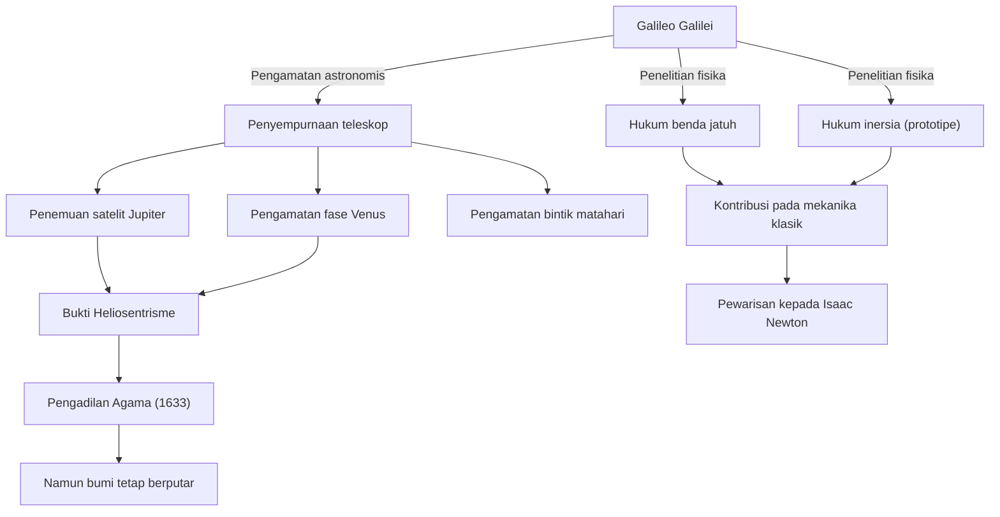

Galileo Galilei (1564 - 1642) adalah seorang fisikawan, astronom, dan filsuf Italia yang dijuluki sebagai "Bapak Ilmu Pengetahuan Modern". Pencapaian terbesarnya bukan sekadar penemuan-penemuan baru, melainkan telah merombak secara mendasar "metode" yang digunakan umat manusia untuk memahami alam semesta. Positivisme berdasarkan data pengamatan, dan deskripsi alam menggunakan matematika, menjadi landasan yang kokoh bagi revolusi ilmiah yang menyusul kemudian.

## Kehidupan Eksplorasi: Dari Pisa ke Florence, lalu ke Pengadilan Agama

Lahir di Pisa, Italia, pada tahun 1564, Galileo dipengaruhi oleh ayahnya, Vincenzo, yang merupakan seorang musisi, sehingga ia menumbuhkan jiwa yang bebas dan pemikiran yang kritis. Meskipun awalnya berencana untuk belajar kedokteran di Universitas Pisa, ia terpikat oleh pesona matematika dan fisika, dan melangkah ke jalan untuk mengungkap hukum-hukum alam semesta.

Namanya melesat ketika ia menyempurnakan teleskop, yang baru saja ditemukan di Belanda pada tahun 1609, dan mengarahkannya ke langit malam. Galileo berturut-turut menemukan bahwa permukaan bulan itu tidak rata dan bergelombang seperti Bumi, empat satelit yang mengorbit Jupiter (Satelit Galileo), fase-fase Venus, serta bintik matahari. Fakta-fakta pengamatan ini menimbulkan keraguan serius terhadap "Geosentrisme" Aristoteles dan Ptolemeus yang merupakan pandangan absolut tentang alam semesta pada masa itu.

Galileo yakin bahwa "Heliosentrisme" yang digagas oleh Copernicus adalah bentuk sebenarnya dari alam semesta, dan ia menyatakannya berdasarkan data pengamatannya sendiri. Namun, pernyataan ini sangat bertentangan dengan doktrin Gereja Katolik. Pada tahun 1633, Galileo diadili oleh Pengadilan Inkuisisi Romawi yang terkenal kejam, dan ia dipaksa untuk menarik kembali teorinya, serta dijatuhi hukuman tahanan rumah seumur hidup. Kalimat "Namun bumi tetap berputar (E pur si muove)" yang konon digumamkannya saat meninggalkan ruang sidang, terus diceritakan hingga kini sebagai legenda yang melambangkan semangat pencarian kebenaran yang tidak tunduk pada kekuasaan.

## Diagram Korelasi Prestasi dan Pengaruh

Diagram berikut menunjukkan aliran pencapaian utama Galileo dan pengaruh yang ditimbulkannya.

## Filosofi Galileo: Buku Alam Semesta Ditulis dalam Bahasa Matematika

Warisan filosofis Galileo yang paling mendalam terletak pada "metodologi" miliknya. Dalam bukunya _Il Saggiatore_, ia menyatakan bahwa "Buku alam semesta ditulis dalam bahasa matematika. Karakter-karakternya adalah segitiga, lingkaran, dan bentuk geometris lainnya."

Hingga Abad Pertengahan, filsafat alam sangat bergantung pada otoritas Aristoteles dan interpretasi teologis, yang sebagian besar berupa penalaran kualitatif. Namun, Galileo menetapkan pendekatan untuk mengekstraksi elemen-elemen yang dapat diukur (seperti waktu, jarak, dan kecepatan) dari fenomena alam, dan menyatakan hubungan-hubungan tersebut dalam rumus matematika. Ini juga disebut "matematisasi alam", dan telah menjadi paradigma paling mendasar dalam sains, hingga fisika teoretis modern.

Selain itu, penting juga bahwa ia mempraktikkan "metode ilmiah" untuk menguji hipotesis melalui eksperimen dan pengamatan, seperti yang ditunjukkan oleh eksperimen menjatuhkan benda dari Menara Miring Pisa (meskipun ada yang mengatakan itu legenda) dan eksperimen presisi menggunakan bidang miring. Sikapnya yang lebih menghargai observasi dengan matanya sendiri dan logika yang rasional dibandingkan kata-kata otoritas, telah menjadi pelopor bagi "positivisme" modern.

## Pengaruh Besar bagi Generasi Mendatang dan Maknanya di Era Modern

Cakrawala yang dibuka oleh Galileo telah memberikan pengaruh yang menentukan bagi generasi selanjutnya. Hukum-hukum gerak yang ia kemukakan (terutama hukum benda jatuh dan konsep inersia) disatukan oleh Isaac Newton dan membuahkan sistem mekanika klasik yang megah. Ketika Newton berkata, "Jika saya bisa melihat lebih jauh, itu karena saya berdiri di atas bahu raksasa", tidak diragukan lagi bahwa salah satu raksasa tersebut adalah Galileo.

Selain itu, tragedi penindasan melalui pengadilan agama masih memberikan pelajaran sejarah yang penting dalam mempertimbangkan hubungan antara sains dan agama, atau kebenaran dan kekuasaan. Pada tahun 1992, Paus Yohanes Paulus II secara resmi mengakui kesalahan gereja dalam persidangan Galileo dan memulihkan nama baiknya. Setelah lebih dari 350 tahun, itu adalah momen di mana kebenaran menghancurkan kekuasaan.

Saat ini, kita menatap alam semesta lebih jauh dan lebih dalam dibandingkan saat Galileo pertama kali mengarahkan teleskopnya. Namun, keingintahuan terhadap hal-hal yang tidak diketahui, sikap kritis untuk memastikan dengan mata sendiri, serta keyakinan akan harmoni matematika di balik alam semesta—semua itu adalah warisan abadi nan agung yang ditinggalkan kepada kita oleh seorang penjelajah bernama Galileo Galilei.
