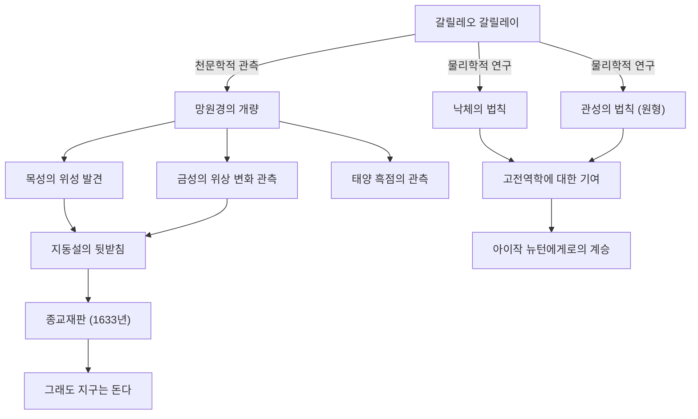

갈릴레오 갈릴레이(1564년 - 1642년)는 '근대 과학의 아버지'로 불리는 이탈리아의 물리학자, 천문학자, 그리고 철학자입니다. 그의 가장 큰 공적은 단순한 새로운 발견에 그치지 않고, 인류가 자연계를 이해하는 '방법' 자체를 근본부터 뒤바꿔 놓았다는 데 있습니다. 관측 데이터에 기반한 실증주의와 수학을 활용한 자연 기술은 뒤이은 과학 혁명의 확고한 초석이 되었습니다.

## 탐구의 생애: 피사에서 피렌체, 그리고 종교재판으로

1564년 이탈리아 피사에서 태어난 갈릴레오는 음악가였던 아버지 빈첸초의 영향을 받아 자유로운 정신과 비판적 사고를 길렀습니다. 피사 대학에서 의학을 공부할 예정이었으나, 수학과 물리학의 매력에 푹 빠져 자연계의 법칙을 해명하는 길로 나아갑니다.

그의 이름을 단숨에 높인 것은 1609년 네덜란드에서 갓 발명된 망원경을 직접 개량하여 밤하늘을 향하게 한 것이었습니다. 갈릴레오는 달의 표면이 지구처럼 굴곡이 심하다는 것, 목성 주위를 도는 4개의 위성(갈릴레오 위성), 금성의 위상 변화, 그리고 태양 흑점 등을 차례로 발견했습니다. 이러한 관측 사실들은 당시 절대적인 우주관이었던 아리스토텔레스적·프톨레마이오스적 '천동설'에 심각한 의문을 던지는 것이었습니다.

갈릴레오는 코페르니쿠스가 제창한 '지동설'이야말로 우주의 진정한 모습이라고 확신하고, 자신의 관측 데이터를 바탕으로 이를 주장했습니다. 하지만 이 주장은 가톨릭 교회의 교리와 정면으로 대립하는 것이었습니다. 1633년 로마 이단심문소에 의한 악명 높은 종교재판에 회부된 갈릴레오는 자신의 학설을 철회하도록 강요받고 종신 연금형에 처해집니다. 법정을 떠날 때 그가 중얼거렸다고 전해지는 "그래도 지구는 돈다(E pur si muove)"라는 말은 권력에 굴복하지 않는 진리를 향한 탐구심을 상징하는 전설로 지금도 전해 내려오고 있습니다.

## 업적과 영향의 상관도

다음 그림은 갈릴레오의 주요 공적과 그것이 가져온 영향의 흐름을 보여줍니다.

## 갈릴레오의 철학: 자연이라는 책은 수학의 언어로 쓰여 있다

갈릴레오의 가장 심오한 철학적 유산은 그 '방법론'에 있습니다. 그는 저서 『위조 화폐 감정관(Il Saggiatore)』에서 "우주라는 책은 수학의 언어로 쓰여 있다. 그 글자는 삼각형, 원, 그리고 기타 기하학적 도형이다"라고 말했습니다.

중세까지의 자연 철학은 아리스토텔레스의 권위나 신학적인 해석에 크게 의존했으며, 정성적인 추론이 주를 이루었습니다. 하지만 갈릴레오는 자연 현상에서 측정 가능한 요소(시간, 거리, 속도 등)를 추출하고, 그것들의 관계를 수학적인 수식으로 표현하는 접근법을 확립했습니다. 이는 '자연계의 수학화'라고도 불리며, 현대의 이론 물리학에 이르기까지 과학의 가장 기본적인 패러다임이 되었습니다.

또한, 피사의 사탑에서의 낙하 실험(전설이라고도 하지만)이나 빗면을 이용한 정밀한 실험으로 대표되듯, 가설을 실험과 관찰을 통해 검증한다는 '과학적 방법'을 실천한 것도 중요합니다. 권위자의 말보다 자신의 눈을 통한 관측과 합리적인 논리를 중시한 그의 태도는 근대적인 '실증주의'의 선구자가 되었습니다.

## 후세에 미친 지대한 영향과 현대적 의의

갈릴레오가 열어젖힌 지평은 다음 세대에 결정적인 영향을 미쳤습니다. 그가 제시한 운동에 관한 법칙(특히 낙체의 법칙과 관성의 개념)은 아이작 뉴턴에 의해 통합되어 고전역학이라는 장대한 체계로 결실을 맺었습니다. 뉴턴이 "내가 더 멀리 볼 수 있었다면, 그것은 거인들의 어깨 위에 올라서 있었기 때문입니다"라고 말했을 때, 그 거인 중 한 명이 갈릴레오였음은 의심할 여지가 없습니다.

또한 종교재판에 의한 탄압이라는 비극은 과학과 종교, 혹은 진리와 권력의 관계를 생각하는 데 있어 지금도 여전히 중요한 역사적 교훈을 제공하고 있습니다. 1992년, 로마 교황 요한 바오로 2세는 갈릴레오의 재판에 있어서 교회의 오류를 공식적으로 인정하고 그의 명예를 회복시켰습니다. 350년 이상의 시간이 흘러 진리가 권력을 타파한 순간이었습니다.

오늘날, 우리는 갈릴레오가 처음 망원경을 향했던 우주의 더 멀고 깊은 곳을 바라보고 있습니다. 하지만 미지의 것을 향한 호기심, 자신의 눈으로 확인하려는 비판적 태도, 그리고 자연계의 배후에 있는 수학적인 조화를 믿는 마음, 그 모든 것은 갈릴레오 갈릴레이라는 한 명의 탐구자가 우리에게 남긴, 결코 퇴색하지 않는 위대한 유산입니다.
