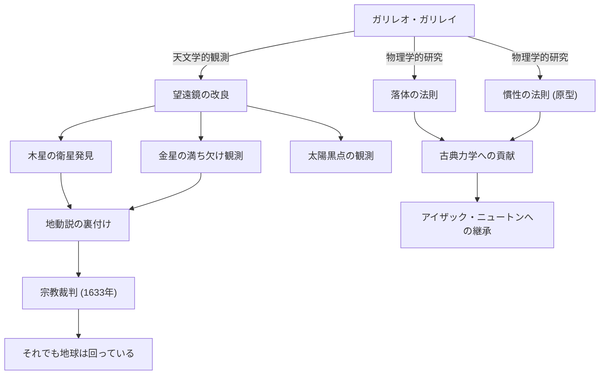

ガリレオ・ガリレイ（1564年 - 1642年）は、「近代科学の父」と称されるイタリアの物理学者、天文学者、そして哲学者です。彼の最大の功績は、単なる新しい発見にとどまらず、人類が自然界を理解するための「方法」そのものを根本から覆したことにあります。観測データに基づく実証主義と、数学を用いた自然記述は、後に続く科学革命の確固たる礎となりました。

## 探求の生涯：ピサからフィレンツェ、そして宗教裁判へ

1564年、イタリアのピサで生まれたガリレオは、音楽家であった父ヴィンチェンツォの影響を受け、自由な精神と批判的思考を育みました。ピサ大学で医学を学ぶ予定でしたが、数学と物理学の魅力に取り憑かれ、自然界の法則を解き明かす道へと進みます。

彼の名を一躍高めたのは、1609年にオランダで発明されたばかりの望遠鏡を自ら改良し、夜空へと向けたことでした。ガリレオは、月の表面が地球のように凹凸に富んでいること、木星の周囲を回る4つの衛星（ガリレオ衛星）、金星の満ち欠け、そして太陽黒点などを次々と発見しました。これらの観測事実は、当時の絶対的な宇宙観であったアリストテレス的・プトレマイオス的な「天動説」に深刻な疑問を投げかけるものでした。

ガリレオは、コペルニクスが提唱した「地動説」こそが宇宙の真の姿であると確信し、自らの観測データを基にそれを主張しました。しかし、この主張はカトリック教会の教義と真っ向から対立するものでした。1633年、ローマ異端審問所による悪名高い宗教裁判にかけられたガリレオは、自らの学説を撤回することを余儀なくされ、終身軟禁の刑に処されます。法廷を去る際に彼が呟いたとされる「それでも地球は回っている（E pur si muove）」という言葉は、権力に屈しない真理への探求心を象徴する伝説として今も語り継がれています。

## 業績と影響の相関図

以下の図は、ガリレオの主要な功績とそれがもたらした影響の流れを示しています。

## ガリレオの哲学：自然という書物は数学の言葉で書かれている

ガリレオの最も深遠な哲学的遺産は、その「方法論」にあります。彼は著書『偽金鑑識官』の中で、「宇宙という書物は、数学の言葉で書かれている。その文字は三角形、円、その他の幾何学図形である」と述べています。

中世までの自然哲学は、アリストテレスの権威や神学的な解釈に大きく依存し、定性的な推論が主でした。しかしガリレオは、自然現象から測定可能な要素（時間、距離、速度など）を抽出し、それらの関係を数学的な数式で表現するというアプローチを確立しました。これは「自然界の数学化」とも呼ばれ、現代の理論物理学に至るまで科学の最も基本的なパラダイムとなっています。

また、ピサの斜塔からの落下実験（伝説とも言われますが）や斜面を用いた精密な実験に代表されるように、仮説を実験と観察によって検証するという「科学的方法」を実践したことも重要です。権威の言葉よりも、自らの目による観測と合理的な論理を重んじた彼の姿勢は、近代的な「実証主義」の先駆けとなりました。

## 後世への絶大な影響と現代における意義

ガリレオが切り開いた地平は、後の世代に決定的な影響を与えました。彼が提示した運動に関する法則（特に落体の法則と慣性の概念）は、[アイザック・ニュートン](/p/newton/)によって統合され、古典力学という壮大な体系へと結実しました。ニュートンが「私がさらに遠くを見ることができたとしたら、それは巨人の肩の上に乗っていたからです」と語ったとき、その巨人の一人がガリレオであったことは疑いありません。

また、宗教裁判による弾圧という悲劇は、科学と宗教、あるいは真理と権力の関係を考える上で、今なお重要な歴史的教訓を提供しています。1992年、ローマ教皇ヨハネ・パウロ2世はガリレオの裁判における教会の誤りを公式に認め、彼を名誉回復しました。350年以上の時を経て、真理が権力を打ち破った瞬間でした。

今日、私たちはガリレオが初めて望遠鏡を向けた宇宙の、さらに遠く深くを見つめています。しかし、未知なるものへ向かう好奇心、自らの目で確かめるという批判的姿勢、そして自然界の背後にある数学的な調和を信じる心——それらはすべて、ガリレオ・ガリレイという一人の探求者が私たちに残した、色褪せることのない偉大な遺産なのです。
