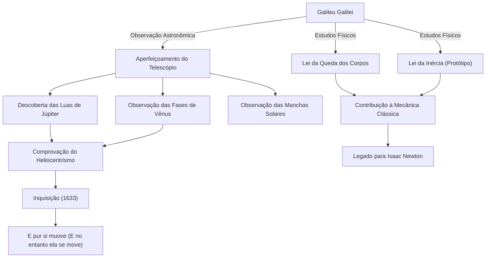

Galileu Galilei (1564 - 1642) foi um físico, astrônomo e filósofo italiano, aclamado como o "Pai da Ciência Moderna". Sua maior contribuição não se limitou a novas descobertas, mas esteve na transformação fundamental do próprio "método" pelo qual a humanidade entende o mundo natural. O positivismo baseado em dados observacionais e a descrição da natureza usando a matemática tornaram-se a base sólida da revolução científica subsequente.

## Uma Vida de Exploração: De Pisa a Florença, e o Julgamento da Inquisição

Nascido em Pisa, Itália, em 1564, Galileu foi influenciado por seu pai, Vincenzo, que era músico, cultivando um espírito livre e pensamento crítico. Embora ele devesse estudar medicina na Universidade de Pisa, foi cativado pelo fascínio da matemática e da física, seguindo o caminho para desvendar as leis do mundo natural.

O que o tornou famoso de imediato foi ter aperfeiçoado pessoalmente o telescópio, recém-inventado na Holanda em 1609, e tê-lo apontado para o céu noturno. Galileu fez uma série de descobertas: que a superfície da Lua era cheia de irregularidades, assim como a Terra; as quatro luas que orbitam Júpiter (as luas galileanas); as fases de Vênus; e as manchas solares. Esses fatos observacionais lançaram sérias dúvidas sobre a visão cosmológica "geocêntrica" de Aristóteles e Ptolomeu, que era absoluta na época.

Galileu estava convencido de que o "heliocentrismo" proposto por Copérnico era a verdadeira natureza do universo, e o defendeu com base em seus próprios dados observacionais. No entanto, essa afirmação estava em oposição direta à doutrina da Igreja Católica. Em 1633, Galileu foi levado ao infame julgamento da Inquisição Romana, forçado a retratar suas teorias e sentenciado à prisão domiciliar perpétua. As palavras que ele supostamente murmurou ao deixar o tribunal, "E pur si muove" (E no entanto, ela se move), continuam sendo contadas até hoje como uma lenda que simboliza a busca pela verdade que não se curva à autoridade.

## Diagrama de Conquistas e Influência

O diagrama a seguir mostra as principais conquistas de Galileu e o fluxo das influências que elas trouxeram.

## A Filosofia de Galileu: O Livro da Natureza é Escrito na Linguagem da Matemática

O legado filosófico mais profundo de Galileu está em sua "metodologia". Em seu livro "O Ensaiador", ele afirmou: "A filosofia encontra-se escrita neste grande livro que continuamente se abre perante nossos olhos, o universo, ... Ele está escrito na linguagem da matemática, e os caracteres são triângulos, círculos e outras figuras geométricas".

A filosofia natural até a Idade Média dependia fortemente da autoridade de Aristóteles e de interpretações teológicas, com raciocínios principalmente qualitativos. No entanto, Galileu estabeleceu uma abordagem que extraía elementos mensuráveis (como tempo, distância e velocidade) de fenômenos naturais e expressava suas relações por meio de fórmulas matemáticas. Isso é frequentemente chamado de "matematização da natureza" e tem sido o paradigma mais fundamental da ciência até a física teórica moderna.

Também é importante notar que ele praticou o "método científico" de verificar hipóteses através de experimentos e observações, como exemplificado pelo experimento de queda da Torre Inclinada de Pisa (embora muitas vezes considerado uma lenda) e por experimentos precisos usando planos inclinados. Sua postura de valorizar a observação com seus próprios olhos e a lógica racional acima da palavra da autoridade foi precursora do "positivismo" moderno.

## Imenso Impacto na Posteridade e Significado Moderno

Os horizontes que Galileu abriu tiveram uma influência decisiva nas gerações seguintes. As leis sobre o movimento que ele apresentou (especialmente a lei da queda dos corpos e o conceito de inércia) foram integradas por Isaac Newton, culminando no magnífico sistema da mecânica clássica. Quando Newton disse: "Se vi mais longe, foi por estar de pé sobre ombros de gigantes", não há dúvida de que um desses gigantes era Galileu.

Além disso, a tragédia de sua supressão pela Inquisição ainda oferece uma lição histórica importante sobre a relação entre ciência e religião, ou verdade e poder. Em 1992, o Papa João Paulo II admitiu formalmente os erros da Igreja no julgamento de Galileu e o reabilitou. Foi um momento em que a verdade triunfou sobre a autoridade após mais de 350 anos.

Hoje, olhamos ainda mais longe e mais fundo no universo para o qual Galileu apontou seu telescópio pela primeira vez. No entanto, a curiosidade em direção ao desconhecido, a atitude crítica de ver com os próprios olhos e a crença na harmonia matemática por trás do mundo natural - todos esses são os grandes e imperecíveis legados deixados a nós por um único explorador: Galileu Galilei.
