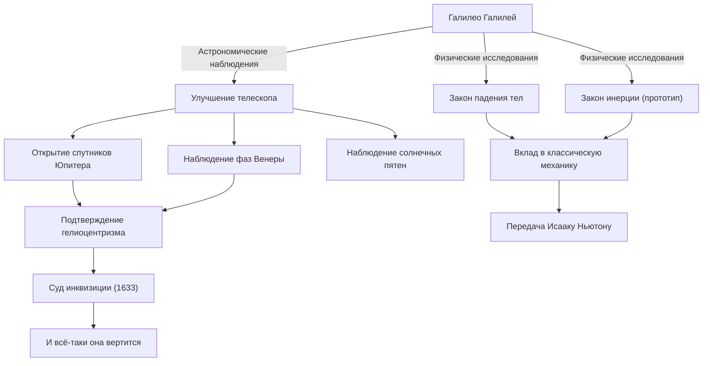

Галилео Галилей (1564 - 1642) — итальянский физик, астроном и философ, которого называют "отцом современной науки". Его величайшая заслуга заключается не просто в новых открытиях, а в фундаментальном перевороте самого "метода", с помощью которого человечество познает природу. Позитивизм, основанный на данных наблюдений, и математическое описание природы стали прочным фундаментом для последующей научной революции.

## Жизнь в поисках: от Пизы до Флоренции и суда инквизиции

Родившийся в 1564 году в итальянском городе Пиза, Галилей под влиянием своего отца Винченцо, который был музыкантом, развил свободный дух и критическое мышление. Он планировал изучать медицину в Пизанском университете, но увлекся математикой и физикой и пошел по пути разгадки законов природы.

То, что в одночасье прославило его имя, было то, что он усовершенствовал телескоп, только что изобретенный в Голландии в 1609 году, и направил его на ночное небо. Галилей один за другим открыл, что поверхность Луны, как и Земли, богата неровностями, обнаружил четыре спутника, вращающихся вокруг Юпитера (Галилеевы спутники), фазы Венеры и солнечные пятна. Эти факты наблюдений бросили серьезную тень сомнения на аристотелевскую и птолемеевскую "геоцентрическую систему", которая в то время была абсолютным представлением о строении космоса.

Галилей был убежден, что "гелиоцентрическая система", предложенная Коперником, является истинной картиной Вселенной, и отстаивал ее, основываясь на собственных данных наблюдений. Однако это утверждение прямо противоречило догматам католической церкви. В 1633 году Галилей предстал перед печально известным судом римской инквизиции, был вынужден отречься от своих теорий и приговорен к пожизненному домашнему аресту. Говорят, что слова "И всё-таки она вертится!" (E pur si muove), которые он пробормотал, покидая зал суда, до сих пор передаются как легенда, символизирующая его непреклонное стремление к истине перед лицом власти.

## Диаграмма достижений и их влияния

Следующая диаграмма показывает основные достижения Галилея и поток влияния, которое они оказали.

## Философия Галилея: книга природы написана на языке математики

Самое глубокое философское наследие Галилея заключается в его "методологии". В своей книге "Пробирных дел мастер" он утверждает: "Вселенная — это книга, написанная на языке математики, а ее символы — треугольники, круги и другие геометрические фигуры".

Натурфилософия вплоть до Средневековья сильно зависела от авторитета Аристотеля и теологических толкований, и в основном состояла из качественных рассуждений. Однако Галилей утвердил подход, заключающийся в выделении измеряемых элементов (время, расстояние, скорость и т.д.) из природных явлений и выражении их взаимосвязей с помощью математических формул. Это также называется "математизацией природы" и стало самой фундаментальной парадигмой науки вплоть до современной теоретической физики.

Кроме того, как показывают эксперимент с падением тел с Пизанской башни (хотя говорят, что это легенда) и точные эксперименты с использованием наклонных плоскостей, важно то, что он применял на практике "научный метод" проверки гипотез посредством экспериментов и наблюдений. Его позиция, заключающаяся в том, что собственные наблюдения и рациональная логика важнее слов авторитетов, стала предвестником современного "позитивизма".

## Огромное влияние на будущие поколения и значение в наши дни

Горизонты, открытые Галилеем, оказали решающее влияние на последующие поколения. Предложенные им законы движения (особенно закон падения тел и концепция инерции) были объединены Исааком Ньютоном и воплотились в грандиозную систему классической механики. Когда Ньютон сказал: "Если я видел дальше других, то потому, что стоял на плечах гигантов", нет сомнений в том, что одним из этих гигантов был Галилей.

Также трагедия подавления со стороны инквизиции по-прежнему служит важным историческим уроком при рассмотрении отношений между наукой и религией, или между истиной и властью. В 1992 году папа Иоанн Павел II официально признал ошибку церкви в суде над Галилеем и реабилитировал его честное имя. Это был момент, когда истина победила власть спустя более 350 лет.

Сегодня мы всматриваемся еще дальше и глубже во Вселенную, на которую Галилей впервые навел свой телескоп. Однако любопытство к неизвестному, критическое отношение к необходимости проверки собственными глазами и разум, верящий в математическую гармонию, скрывающуюся за миром природы, — все это великое, неувядающее наследие, оставленное нам одним искателем по имени Галилео Галилей.
