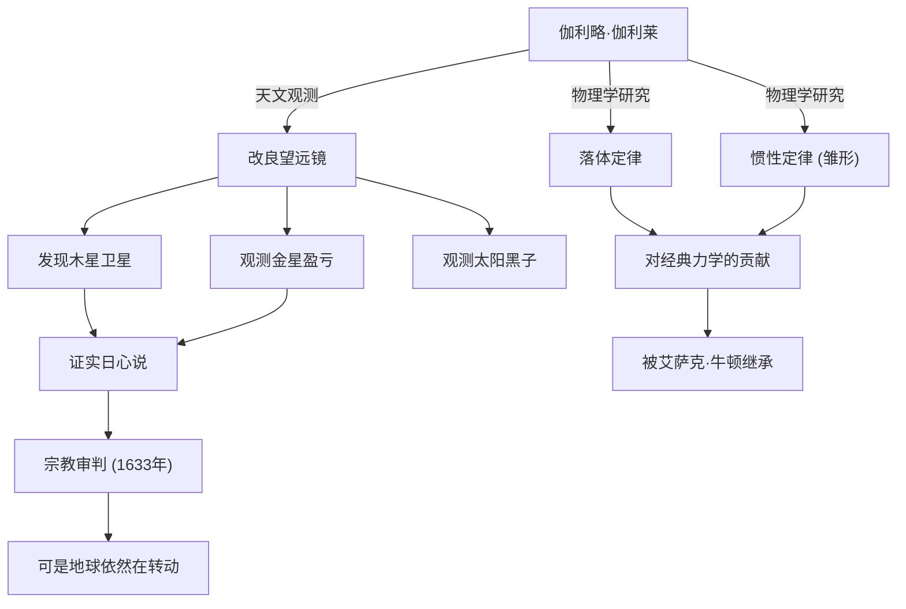

伽利略·伽利莱（1564年 - 1642年）是被称为“近代科学之父”的意大利物理学家、天文学家和哲学家。他最大的功绩不仅仅局限于新的发现，更在于从根本上颠覆了人类理解自然界的“方法”。基于观测数据的实证主义和运用数学描述自然，成为了后来科学革命的坚实基础。

## 探索的一生：从比萨到佛罗伦萨，再到宗教裁判所

1564年，伽利略出生于意大利比萨。受音乐家父亲文森佐的影响，他培养了自由的精神和批判性思维。他原本打算在比萨大学学习医学，但被数学和物理学的魅力所吸引，从而走上了揭示自然界法则的道路。

让他声名大噪的，是他在1609年亲自改良了刚刚在荷兰发明的望远镜，并将其指向夜空。伽利略接连发现了月球表面像地球一样崎岖不平、环绕木星运行的4颗卫星（伽利略卫星）、金星的盈亏以及太阳黑子等。这些观测事实，对当时占绝对统治地位的宇宙观——亚里士多德与托勒密的“地心说”提出了严重的质疑。

伽利略确信哥白尼提出的“日心说”才是宇宙的真实面貌，并基于自己的观测数据主张这一观点。然而，这一主张与天主教会的教义针锋相对。1633年，伽利略被罗马异端裁判所推上了臭名昭著的宗教法庭，被迫撤回自己的学说，并被判处终身软禁。据说他在离开法庭时喃喃自语道：“可是地球依然在转动（E pur si muove）”，这句话作为不屈服于权力、对真理孜孜以求的象征，至今仍被传为佳话。

## 成就与影响的关联图

下图展示了伽利略的主要成就及其产生影响的发展脉络。

## 伽利略的哲学：自然这部书是用数学的语言写成的

伽利略最深远的哲学遗产在于他的“方法论”。他在著作《试金者》（Il Saggiatore）中指出：“宇宙这部书是用数学语言写成的。它的字符是三角形、圆和其他几何图形。”

直至中世的自然哲学，极大程度上依赖于亚里士多德的权威和神学解释，主要以定性推理为主。但伽利略确立了这样一种方法：从自然现象中提取出可测量的要素（如时间、距离、速度等），并用数学公式来表达它们之间的关系。这也被称为“自然界的数学化”，直至现代的理论物理学，它依然是科学最基本的范式。

此外，以比萨斜塔的落体实验（尽管有人说是传说）和使用斜面进行的精密实验为代表，他践行了通过实验和观察来验证假说的“科学方法”，这也是至关重要的。相比于权威的言辞，他更看重亲眼的观测和合理的逻辑，这种态度成为了近代“实证主义”的先驱。

## 对后世的巨大影响与现代意义

伽利略开辟的新天地，对后代产生了决定性的影响。他提出的关于运动的定律（特别是落体定律和惯性概念），被艾萨克·牛顿整合，并最终结晶为经典力学这一宏大的体系。当牛顿说出“如果说我看得比别人更远些，那是因为我站在巨人们的肩上”时，毫无疑问，其中一位巨人就是伽利略。

另外，遭受宗教裁判所镇压的悲剧，在探讨科学与宗教、或者真理与权力的关系时，至今仍提供着重要的历史教训。1992年，罗马教皇若望保禄二世正式承认了教会在伽利略审判中的错误，并为他恢复了名誉。历经350多年，这是真理战胜权力的瞬间。

今天，我们正注视着伽利略第一次用望远镜观测的那个宇宙的更深更远处。然而，对于未知事物的好奇心、亲眼证实的批判性态度、以及坚信自然界背后存在数学和谐的心——这些全都是伽利略·伽利莱这位探索者留给我们的永不褪色的伟大遗产。
