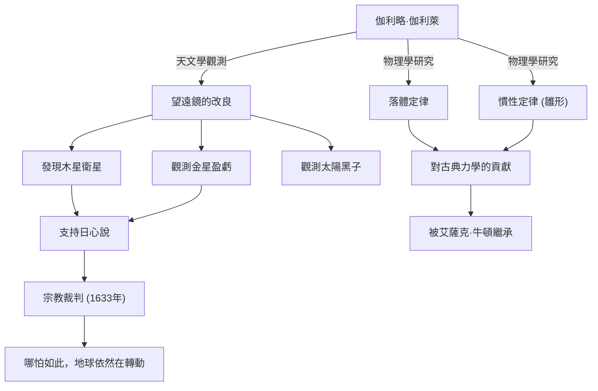

伽利略·伽利萊（1564年 - 1642年）是義大利的物理學家、天文學家和哲學家，被譽為「近代科學之父」。他最大的貢獻不僅僅是帶來了新發現，而是從根本上顛覆了人類理解自然界的「方法」。基於觀測數據的實證主義，以及使用數學來描述自然，成為了後來科學革命的堅實基礎。

## 探索的一生：從比薩到佛羅倫斯，再到宗教裁判所

1564年，伽利略出生於義大利比薩，受到音樂家父親溫琴佐的影響，培養了自由的精神與批判性思考。他原本預定在比薩大學學習醫學，卻被數學和物理學的魅力所吸引，進而走上了解開自然界法則的道路。

讓他一舉成名的，是他親自改良了1609年剛在荷蘭發明的望遠鏡，並將其指向了夜空。伽利略接連發現了月球表面如同地球般崎嶇不平、環繞木星運行的四顆衛星（伽利略衛星）、金星的盈虧，以及太陽黑子等。這些觀測事實，對當時作為絕對宇宙觀的亞里斯多德與托勒密的「地心說」提出了嚴峻的質疑。

伽利略深信哥白尼提出的「日心說」才是宇宙的真實樣貌，並根據自己的觀測數據來主張這一點。然而，這個主張與天主教教會的教義發生了正面衝突。1633年，伽利略被羅馬異端裁判所那場聲名狼藉的宗教審判起訴，被迫撤回自己的學說，並被處以終身軟禁。相傳他在離開法庭時喃喃自語的一句「哪怕如此，地球依然在轉動（E pur si muove）」，至今仍作為不屈服於權威、追求真理的傳奇而被傳頌。

## 業績與影響的相關圖

下圖展示了伽利略的主要貢獻及其帶來的影響流程。

## 伽利略的哲學：大自然這本書是用數學語言寫成的

伽利略最深遠的哲學遺產，在於他的「方法論」。他在著作《試金者》中提到：「宇宙這本書，是用數學語言寫成的。它的文字是三角形、圓形及其他幾何圖形。」

直到中世為止的自然哲學，很大程度上依賴於亞里斯多德的權威與神學解釋，並以定性推論為主。但伽利略確立了一種方法，即從自然現象中提取可測量的要素（如時間、距離、速度等），並用數學公式來表達它們之間的關係。這也被稱為「自然界的數學化」，成為了直到現代理論物理學為止，科學最基本的典範。

此外，以比薩斜塔的落體實驗（雖然被認為是傳說）及使用斜面進行的精密實驗為代表，他實踐了透過實驗與觀察來驗證假說的「科學方法」，這點也極為重要。比起權威的言論，他更重視親眼觀測與合理邏輯的態度，成為了近代「實證主義」的先驅。

## 對後世的巨大影響與現代意義

伽利略所開拓的視野，對後代產生了決定性的影響。他所提出的關於運動的定律（特別是落體定律與慣性概念），被艾薩克·牛頓整合，最終結成了古典力學這個宏大的體系。當牛頓說出「如果我能看得更遠，那是因為我站在巨人的肩膀上」時，毫無疑問，伽利略就是其中一位巨人。

此外，因宗教審判而遭受打壓的悲劇，在思考科學與宗教、或是真理與權力的關係時，至今依然提供著重要的歷史教訓。1992年，教宗若望保祿二世正式承認了教會在伽利略審判中的錯誤，並為他平反。經過了350多年，這是真理戰勝權力的瞬間。

今日，我們凝視著伽利略第一次將望遠鏡指向的宇宙，看向更深更遠的地方。然而，對於未知事物的好奇心、用自己雙眼確認的批判性態度，以及相信自然界背後存在數學和諧的心——這些全都是伽利略·伽利萊這位探索者留給我們的，永不褪色的偉大遺產。
