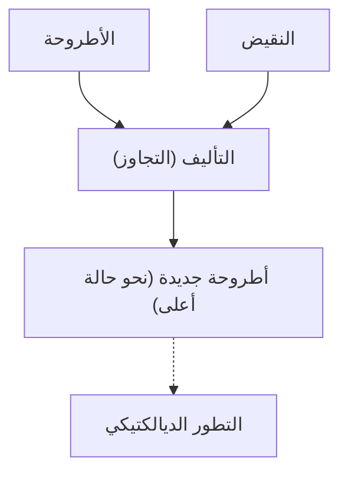
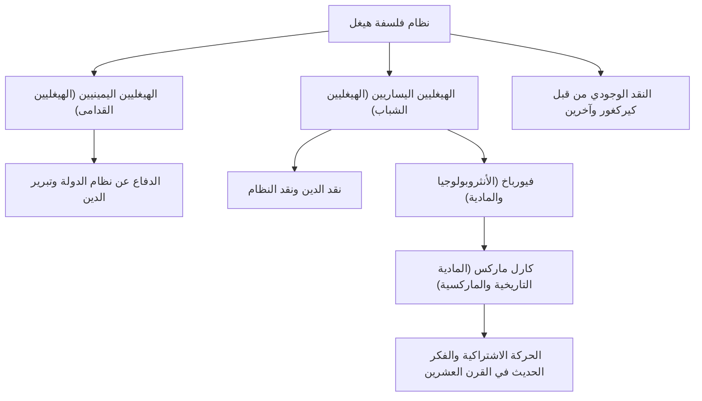

في تاريخ الفلسفة الغربية، المفكر الذي بلغ ذروة المثالية الألمانية في القرن التاسع عشر، والتي بدأت مع إيمانويل كانط، هو غيورغ فيلهلم فريدريش هيغل (1770–1831). نظامه الفلسفي العميق والضخم، مع مفاهيم مثل "الديالكتيك" و"الروح المطلق"، لم يكن له تأثير واسع النطاق على عصره فحسب، بل امتد تأثيره إلى كارل ماركس والوجودية، وصولاً إلى العلوم السياسية والتاريخية الحديثة. في هذا المقال، سنتتبع حياة هيغل ونتعمق في جوهر فلسفته وتأثيره على الأجيال اللاحقة.

## من طالب متفوق في مدرسة اللاهوت إلى فيلسوف عظيم

ولد هيغل في 27 أغسطس 1770، في شتوتغارت، عاصمة دوقية فورتمبيرغ، لعائلة من موظفي الخدمة المدنية. كان متفوقاً في دراسته منذ طفولته، والتحق بمدرسة اللاهوت (شتيفت) في جامعة توبنغن. هناك، كان له لقاء مصيري مع المواهب التي مثلت الرومانسية الألمانية، مثل الشاعر العظيم المستقبلي فريدريش هولدرلين والفيلسوف العبقري فريدريش فيلهلم يوزف شيلنغ، وقضى شبابه معهم في نفس الغرفة. وبينما كان حماس الثورة الفرنسية يجتاح أوروبا، تعاطفوا هم أيضاً بعمق مع فكرة "الحرية"، وتأثروا بالأفكار الراديكالية مثل زراعة شجرة الحرية.

بعد التخرج، عمل هيغل كمدرس خاص في برن وفرانكفورت، بينما كان يطور أفكاره الخاصة سراً. في مراحله الأولى، تأمل في دور الدين والتاريخ، واتخذ من الحياة المتناغمة في بوليس اليونان القديمة نموذجاً مثالياً، بينما كان يبحث عن كيفية التغلب على الحالة الممزقة (الاغتراب) في المجتمع الحديث. بعد ذلك، في عام 1801، بدعوة من شيلنغ، أصبح محاضراً خاصاً في جامعة جينا، وبدأ تدريجياً في السير نحو بناء نظامه الفريد.

في عام 1806، في خضم فوضى غزو جيش نابليون لجينا، أكمل رائعته الأولى، "ظاهريات الروح". في ذلك الوقت، قصته في وصف نابليون بأنه "روح العالم على ظهر حصان" مشهورة جداً. بعد ذلك، عمل كمدير لمدرسة ثانوية (جيمنازيوم) في نورمبرغ وأستاذ في جامعة هايدلبرغ، وفي عام 1818، تم تعيينه أستاذاً في جامعة برلين، عاصمة مملكة بروسيا. هنا سيطر على العالم الأكاديمي وأسس سلطة يمكن أن يطلق عليها الفيلسوف الرسمي للدولة البروسية.

## جوهر فلسفة هيغل: الديالكتيك ومسار الروح

الكلمة الأساسية الأكثر أهمية لفهم فلسفة هيغل هي "الديالكتيك" (Dialektik). يشير الديالكتيك إلى منطق حركة تطور الأشياء إلى حالة أعلى من خلال الصراع والتناقض.

تولد حالة معينة (الأطروحة) حالة معاكسة (النقيض) من خلال التناقضات داخلها، وبعد أن يمر الاثنان بالصراع والنزاع، يتم دمجهما في مستوى أعلى مع الحفاظ على كل من العناصر (التأليف). اعتقد هيغل أن عملية "التجاوز" (Aufheben) هذه هي الآلية التي يتطور من خلالها التاريخ والعالم والإدراك البشري.

الركيزة الأخرى لنظامه هي مفهوم "الروح المطلق". وفقاً لهيغل، العالم ليس مجرد مجموعة من المواد، بل هو العملية التي يحقق فيها "الروح" العقلاني نفسه. مقولته الشهيرة، "ما هو عقلاني هو واقعي، وما هو واقعي هو عقلاني"، تظهر اقتناعه بأن تطور التاريخ هو عملية حتمية يكتسب فيها العقل حريته.

يصور كتاب "ظاهريات الروح" الرحلة العظيمة للروح، بدءاً من الحواس الساذجة للوعي البشري، مروراً بتجربة مختلف التناقضات، ووصولاً في النهاية إلى "المعرفة المطلقة". في أعماله اللاحقة مثل "علم المنطق"، "الموسوعة"، و"فلسفة الحق"، وضع الطبيعة، التاريخ، الدولة، الفن، والدين ضمن نظام منطقي واحد.

## إرث الفكر: انقسام المدرسة الهيغلية والتأثير على الماركسية

في عام 1831، أصيب هيغل بالكوليرا التي كانت مستعرة في برلين (أو قيل إنه مرض معدي معوي)، وتوفي فجأة عن عمر يناهز 61 عاماً. ومع ذلك، بعد وفاته، أصبح إرثه الفكري الضخم موضوعاً لنقاشات حادة.

انقسمت المدرسة الهيغلية إلى "الهيغليين اليمينيين" (الهيغليين القدامى)، الذين فسروا نظامه بشكل محافظ ودعموا الدولة البروسية، و"الهيغليين اليساريين" (الهيغليين الشباب)، الذين فسروا منطق التطور الديالكتيكي بشكل راديكالي وانتقدوا الدولة والدين الحاليين.

التأثير الأخير، على وجه الخصوص، حرك التاريخ بشكل كبير. بعد نقد الدين للودفيغ فيورباخ، ظهر كارل ماركس وفريدريش إنجلز. انتقد ماركس الديالكتيك المثالي لهيغل باعتباره "يقف على رأسه"، لكنه ورث منطق التطور نفسه، وعكسه وطوره إلى "المادية التاريخية" (الفهم المادي للتاريخ). وبعبارة أخرى، اعتقد أن ما يحرك التاريخ ليس "الروح"، بل تناقضات "البنية التحتية الاقتصادية" المادية.

## خاتمة: فلسفة هيغل الحية في العصر الحديث

أحياناً يتم انتقاد فكر هيغل لكونه مرتعاً للشمولية، وأحياناً يعاد تقييمه كنموذج رائد للدولة الليبرالية. كتاباته من بين الأكثر تعقيداً حتى بين الفلاسفة الناطقين بالألمانية، وليس من غير المألوف أن تمتد جملة واحدة لعدة صفحات، ولكن وراء ذلك كان هناك وعي عميق بالمشكلة: "كيف يمكننا إعادة التناغم إلى عالم ممزق ومنقسم؟"

في المجتمع الحديث، حيث تتصادم القيم المتنوعة وتتعمق الانقسامات، فإن الموقف الفكري الديالكتيكي لهيغل، الذي يحاول قيادة الصراعات إلى حل أعلى (التجاوز) بدلاً من إنهائها بمجرد الإقصاء، لا يزال يقدم حكمة مهمة يجب أن نواجهها حتى يومنا هذا.
