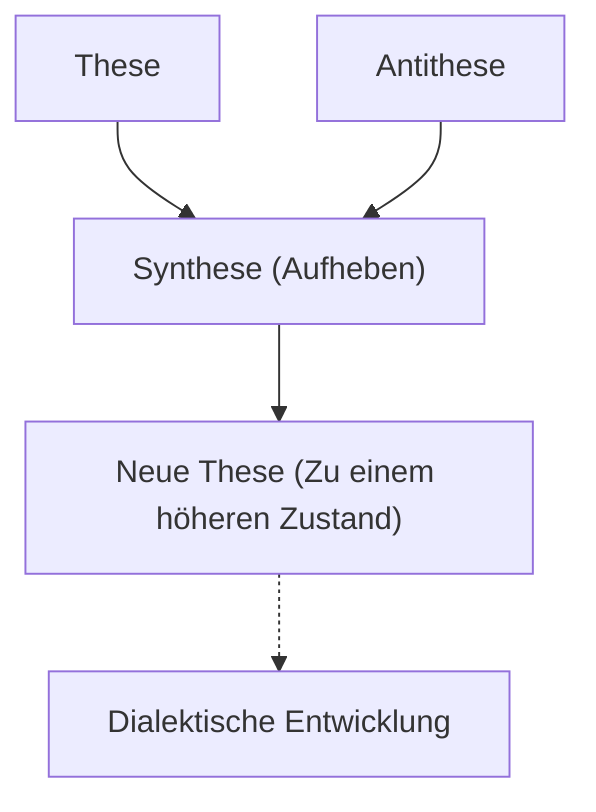
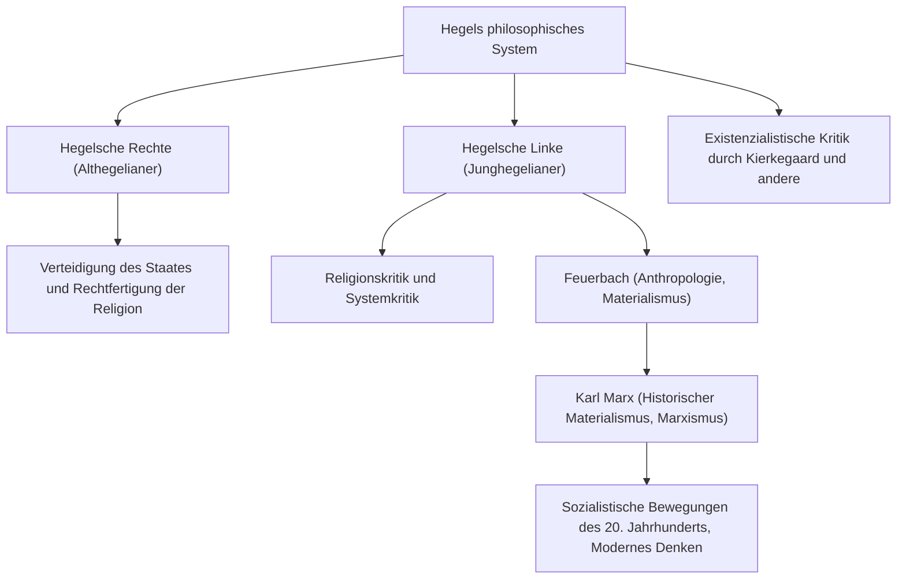

In der Geschichte der abendländischen Philosophie ist der Denker, der den Höhepunkt des deutschen Idealismus des 19. Jahrhunderts erreichte, beginnend mit Immanuel Kant, Georg Wilhelm Friedrich Hegel (1770–1831). Sein schwer verständliches und grandioses Gedankensystem, das sich auf die „Dialektik“ und den „absoluten Geist“ konzentriert, übte nicht nur zu seiner Zeit einen enormen Einfluss aus, sondern auch auf Karl Marx, den Existenzialismus und bis in die moderne Politik- und Geschichtswissenschaft hinein. In diesem Artikel werden wir Hegels Leben nachzeichnen und tief in die Essenz seiner Philosophie und deren Auswirkungen auf spätere Generationen eintauchen.

## Der Weg vom Musterschüler des Seminars zum großen Philosophen

Hegel wurde am 27. August 1770 in Stuttgart, der Hauptstadt des Herzogtums Württemberg, in eine Beamtenfamilie geboren. Er zeichnete sich schon in seiner Kindheit durch akademische Brillanz aus und trat in das theologische Seminar (Stift) der Universität Tübingen ein. Dort hatte er eine schicksalhafte Begegnung mit den repräsentativen Talenten der deutschen Romantik: dem zukünftigen großen Dichter Friedrich Hölderlin und dem genialen Philosophen Friedrich Wilhelm Joseph Schelling, mit denen er sich ein Zimmer teilte. Während die Begeisterung für die Französische Revolution Europa erfasste, fühlten auch sie sich stark von der Idee der „Freiheit“ angezogen und kamen mit radikalen Gedanken in Berührung, wie etwa dem Pflanzen eines Freiheitsbaums.

Nach seinem Abschluss arbeitete Hegel als Hauslehrer in Bern und Frankfurt, während er im Stillen sein eigenes Denken weiterentwickelte. In seinen frühen Jahren dachte er über die Rolle von Religion und Geschichte nach und idealisierte das harmonische Leben in der Polis des antiken Griechenlands, während er nach Wegen suchte, den zerrissenen Zustand (Entfremdung) der modernen Gesellschaft zu überwinden. Im Jahr 1801 wurde er auf Einladung Schellings Privatdozent an der Universität Jena und begann allmählich, sein eigenes System aufzubauen.

Im Jahr 1806, inmitten des Chaos des Einmarsches von Napoleons Truppen in Jena, vollendete er sein erstes Hauptwerk, die „Phänomenologie des Geistes“. Die Episode, in der er Napoleon zu dieser Zeit als „Weltgeist zu Pferde“ beschrieb, ist äußerst berühmt. Nachdem er als Rektor des Nürnberger Gymnasiums und Professor an der Universität Heidelberg gewirkt hatte, wurde er 1818 Professor an der Universität der preußischen Hauptstadt Berlin. Hier dominierte er die akademische Welt und etablierte seine Autorität als gleichsam offizieller Philosoph des preußischen Staates.

## Die Essenz der Hegelschen Philosophie: Dialektik und die Bewegung des Geistes

Das wichtigste Schlüsselwort zum Verständnis der Hegelschen Philosophie ist die „Dialektik“. Die Dialektik bezeichnet die Logik der Bewegung, in der sich die Dinge durch Gegensätze und Widersprüche in einen höheren Zustand entwickeln.

Ein bestimmter Zustand (These) bringt durch seine inneren Widersprüche einen entgegengesetzten Zustand (Antithese) hervor, und nachdem beide einen Gegensatz und Kampf durchlaufen haben, werden sie in einer höheren Dimension integriert (Synthese), wobei Elemente von beiden erhalten bleiben. Dieser Prozess des „Aufhebens“ ist der Mechanismus, durch den sich die Geschichte, die Welt und die menschliche Erkenntnis entwickeln, so Hegel.

Eine weitere Säule seines Systems ist der Begriff des „absoluten Geistes“. Nach Hegel ist die Welt nicht bloß eine Ansammlung von Materie, sondern der Prozess selbst, durch den sich der rationale „Geist“ verwirklicht. Sein berühmter Satz „Was vernünftig ist, das ist wirklich; und was wirklich ist, das ist vernünftig“ zeigt seine Überzeugung, dass die Entwicklung der Geschichte ein unvermeidlicher Prozess ist, durch den die Vernunft Freiheit erlangt.

In der „Phänomenologie des Geistes“ wird die gewaltige Reise des Geistes beschrieben, in der das menschliche Bewusstsein von einer naiven sinnlichen Wahrnehmung ausgeht, verschiedene Widersprüche erfährt und schließlich das „absolute Wissen“ erreicht. In seinen nachfolgenden Werken „Wissenschaft der Logik“, „Enzyklopädie“ und „Grundlinien der Philosophie des Rechts“ positionierte er Natur, Geschichte, Staat, Kunst und Religion in einem einzigen logischen System.

## Das Erbe des Denkens: Die Spaltung der Hegelschen Schule und der Einfluss auf den Marxismus

Im Jahr 1831, infiziert durch die in Berlin wütende Cholera (oder möglicherweise an einer Magen-Darm-Erkrankung), starb Hegel plötzlich im Alter von 61 Jahren. Nach seinem Tod wurde sein enormes intellektuelles Erbe jedoch zum Gegenstand heftiger Debatten.

Die Hegelsche Schule spaltete sich in die „Althegelianer“ (Hegelsche Rechte), die sein System konservativ auslegten und den preußischen Staat bejahten, und die „Junghegelianer“ (Hegelsche Linke), die die Logik der dialektischen Entwicklung radikal interpretierten und den bestehenden Staat sowie die Religion kritisierten.

Insbesondere der Einfluss der letzteren bewegte die Geschichte stark. Über die Religionskritik von Ludwig Feuerbach traten Karl Marx und Friedrich Engels auf den Plan. Marx kritisierte Hegels idealistische Dialektik als „auf dem Kopf stehend“, übernahm jedoch die Logik ihrer Entwicklung und entwickelte sie zum „Historischen Materialismus“ weiter. Mit anderen Worten, er glaubte, dass es nicht der „Geist“ ist, der die Geschichte bewegt, sondern die Widersprüche in der materiellen „ökonomischen Basis“.

## Fazit: Hegels Philosophie in der modernen Welt

Hegels Denken wird manchmal als Brutstätte für Totalitarismus kritisiert, während es zu anderen Zeiten als Wegbereiter für das Modell des liberalen Staates neu bewertet wird. Seine Schriften gehören selbst unter deutschsprachigen Philosophen zu den am schwersten verständlichen, wobei sich ein einziger Satz oft über mehrere Seiten erstreckt. Dahinter verbarg sich jedoch ein tiefes Problembewusstsein: „Wie können wir eine Welt, die gespalten ist und in Konflikt steht, wieder harmonisieren?“

In der modernen Gesellschaft, in der unterschiedliche Werte aufeinanderprallen und die Spaltung zunimmt, bietet Hegels Haltung des dialektischen Denkens, die versucht, Konflikte zu einer Lösung auf höherer Ebene (Aufheben) zu führen, anstatt sie mit bloßer Ausgrenzung enden zu lassen, weiterhin wichtige Weisheiten, mit denen wir uns heute auseinandersetzen müssen.
